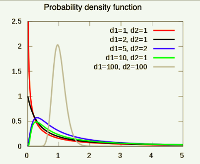

```{r setup_pres, include=FALSE, echo=FALSE}
#devtools::install_github("ropenscilabs/icon")
#devtools::session_info('rmarkdown')

rm(list=ls())
library('tidyverse')
library('gridExtra')
library('broom')
library('cowplot')

library("RefManageR")
library("DT")

#setwd("~/Google Drive Swat/Swat docs/Stat 21/Class9_files")
#setwd("~/Drive/Swat docs/Stat 21/Class9_files")
options(htmltools.dir.version = FALSE)
knitr::opts_chunk$set(fig.height=6, fig.path='Figs/',
                      echo=TRUE, warning=FALSE, message=FALSE)
hc_employer_2013 <- read_table2("health_care_2013_cleaned.txt", col_names = TRUE)
SLR_hc_employer_2013 <- lm(prop_coverage~spending_capita, data=hc_employer_2013)
SLR_hc2013_summary <- SLR_hc_employer_2013 %>% summary
```

```{css, echo=FALSE}
pre {
  background: #FFBB33;
  max-width: 100%;
  overflow-x: scroll;
}

.scroll-output {
  height: 80%;
  overflow-y: scroll;
}
   
.red{color: #ce151e;}
.green{color: #26b421;}
.blue{color: #426EF0;}
```


```{r, echo=FALSE, fig.align='center', out.height=600}

```

---
## Some notes on Homework 3 

 - The QQ plots are not normal probability plots

 - The question about weight and height requires knowledge of how to standardize a value to then plot it on a Normal density curve and find the correct area under the curve, it also requires an understanding that the estimated regression line produces the average/mean estimate for the response variable 

---
## The problem of .blue[estimation]

Regression model assumption:
$$Y = \beta_0 + \beta_1 x + \epsilon$$
together with:
$$E[\epsilon]=0;\text{ }Var[\epsilon]=\sigma^2; \text{ and each }\epsilon\text{ are independent of each other}$$

---
## The problem of .blue[estimation]

From the linear model assumption we derive a regression equation such that: 
$$E[Y|x] = E[\hat{\beta_0} + \hat{\beta_1} x + \epsilon] = \beta_0 + \beta_1 x$$

--
Our *estimated* version of that regression equation:
$$E[y_i|x_i] = \hat{y}_i = \hat{\beta_0} + \hat{\beta_1}x_i$$
together with:
$$\hat{\sigma} = \sqrt{\frac{SSres}{n-2}}$$
where $\hat{\beta}_0$ and $\hat{\beta}_1$ are the *least squares estimates* for $\beta_0$ and $\beta_1$.


--
**FYI** a note on terminology: In R, $\hat{\sigma}$ is called the *residual standard error*. Often we may instead want to refer to $\hat{\sigma}^2=\frac{SSres}{n-2}$ which is called the *mean squared error* and so textbooks may refer to $\hat{\sigma}$ as the *root mean squared error*.

---
## The problem of .blue[estimation]

We also have estimated the *coefficient of determination* for our regression model:
$$R^2 = 1 - \frac{SSres}{SStot} = \frac{SSreg}{SStot}.$$

--
Ideally, $R^2$ will lie between $[0,1]$ since it represents the proportion of variability in our observed response that is accounted for by our linear model. Thus if $R^2$ is closer to $1$, this means our model does a good job at explaining the variability of our observed response data.


**Q:** What if $R^2$ is close to $0$? 


--
This indicates that we may be better off using $\bar{y}_{obs}$ as our "regression line" unless there are important additional predcitor variables that can be included in our regression model. 

---
## Keeping track of what's random and when

In the regression equation: 
$$E[Y|x] = E[\hat{\beta_0} + \hat{\beta_1} x + \epsilon] = \beta_0 + \beta_1 x.$$
**Before** we have observed any random sample of data, $(x_{obs},y_{obs})$, the regression terms $\hat{\beta}_0$, $\hat{\beta}_1$, and $\hat{y}_i$ are all functions of $y_i$. So **before** any data is collected, each $y_i$ is a random variable!


$$\hat{\beta}_1 = \frac{\sum_{i=1}^{n}(x_i - \bar{x})(y_i - \bar{y})}{\sum_{i=1}^{n}(x_i-\bar{x})}$$
$$\hat{\beta}_0 = \bar{y} - \hat{\beta}_1 \bar{x}$$
$$\hat{y}_i = \hat{\beta}_0 + \hat{\beta_1}x_i$$

--
Each of the $y_i$ values above represent a **hypothetical** random sample from a population with the same distribution as the random variable $Y$; whereas, each of the $x_i$ values are "conditioned upon", (i.e. fixed), and measured without error.

---
## SLR required assumptions

Recall the assumptions for .blue[estimation] with SLR:

1. $E[\epsilon]=0$;

1. $Var[\epsilon]=\sigma^2 < \infty$;

1. Each instance of the random variable $\epsilon$ is independent of any other instance. 


What additional assumption do we need for our .red[inferential] results to be meaningful? 

--
<ol start="4">
<li>The random error, $\epsilon$ is Normally distributed.</li></ol>


--
**Q:** How can we check if this assumption holds? 


---
## SLR required assumptions for .red[inference]


To check assumption 4 we can look at a QQplot of the obsered response, $y_{obs}$.  

```{r qqPlotTempClass11, echo=TRUE, warning=FALSE, fig.height = 4, fig.width = 10, fig.align = 'center'}
plot1 <- ggplot(hc_employer_2013, aes(sample = prop_coverage))

plot1 + stat_qq() + stat_qq_line() + labs(title = "Normal probability plot", subtitle = "Employer health care coverage", y="Sample quantiles for \n proportion of people covered")
```


---
## SLR required assumptions for .red[inference]
### Central limit theorem

Another useful tool in establishing whether or not our random error is Normal is the <a href="https://en.wikipedia.org/wiki/Central_limit_theorem#Classical_CLT">Central limit theorem</a>.


**English version:**

If: for a large sample size, $n$, $X_1, X_2, \dots,X_n$ are (1)all random variables with the same distribution (e.g. all Poisson, all beta, all t-distributed) and (2)there are no statistical dependencies between any two arbitrary groups of these random variables and (3)the average and variance of these random variables are the same across different samples, 


Then: the distribution of the average of these $n$ random variables is Normal with the same mean and variance as the individual random variables. 


--
**Math version:**

If $X_1, X_2, \dots,X_n$ are all independent and identically distributed with mean $E[X_{i}]=\mu$ and variance $Var[X_{i}]=\sigma^2$, for all $i=1,\dots,n$, then as $n\rightarrow \infty$,

$$\bar{X} \sim N(\mu, \sigma).$$


---
## SLR required assumptions for .red[inference]

The central limit theorem is often used to justify the assumption that our random errors, $\epsilon$, are Normally distributed (assumption 4 above). This is only valid justification if we have a **large** sample size, $n$. 


You have demonstrated the central limit theorem already in Q1 of Homework 2!


To check whether or not the sample size is "large enough" you have to think about the problem contextually and look at a Normal probability plot of the **response** data, $y_{obs}$.


---
## The problem of .red[inference]


Now let's consider the .red[inference] results that R provides us about our linear model. 


$$Y = \beta_0 + \beta_1 x + \epsilon$$


Namely, let's see how confident we are about the performance of our estimators $\hat{\beta}_0$, $\hat{\beta}_1$ and how/when to test the summary statistic $R^2$. 

---
## The problem of .red[inference]
### Where to find this information in R? 

```{r echo=FALSE, warning=FALSE}
summary(SLR_hc_employer_2013)
```

---
## The problem of .red[inference]
### T-test

This test helps us determine if the predictor variable, *x*, is statistically significant by conducting a t-test on it's estimated regression coefficient.

--
$$H_0: \hat{\beta}_1 = 0 \\ H_1: \hat{\beta}_1 \neq 0$$
$$\text{Under }H_0: T.S. = \frac{\hat{\beta}_1 - 0}{SE(\hat{\beta}_1)} \sim t_{(n-2)}$$ 

--
To find $SE(\hat{\beta}_1)$, we will use $SS_{res}$:
$$SE(\hat{\beta}_1) = \sqrt{\frac{SS_{res}}{\sum_{i=1}^n(x_i - \bar{x})^2}}.$$

---
## The problem of .red[inference]
### F-test

This tests for the overall fit of the linear regression model. In general, the F-test for a linear regression model helps us determine if any of the predictor variables we included are statistically significant.

$$\text{Under }H_0: T.S. = \frac{\frac{SS_{reg}}{1}}{\frac{SS_{res}}{n-2}} \sim F_{(1,n-2)}$$

--
In **SLR** the F-test and the t-test for $\hat{\beta}_1$ are testing the same thing since there is only one predictor variable in the regression model. In **MLR** (multiple linear regression) we will have more than one predictor variable and so this equality does not hold. 
$$H_0: \hat{\beta}_1 = 0 \\ H_1: \hat{\beta}_1 \neq 0$$
$$\hat{y} = \hat{\beta}_0 + \hat{\beta}_1x$$

--
**Q:** Why are the degrees of freedom associated with $SS_{reg}$ equal to $1$?


---
## The problem of .red[inference]
### F-test
.pull-left[
$$\text{Under }H_0: T.S. = \frac{\frac{SS_{reg}}{1}}{\frac{SS_{res}}{n-2}} \sim F_{(1,n-2)}$$]

.pull-right[.center[If a random variable following the f-distribution, it is always positive and skewed right and, depending on the degrees of freedom, has a density curve that looks something like this:]

```{r, echo=FALSE, fig.align='center', out.height=300}

```
]


---
##The problem of .red[inference]
### Heteroskedasity and statistical inference 

**Q:** What does the presence of heteroscedasticity mean for the results of our hypothesis tests? 


---
## The problem of .red[inference]
### Confidence intervals for model coefficients

Often we are interested not just in a decision "is $x$ significant or not?" but also in the question "what range of values are good guesses for the effect of $x$ on the response? 


To answer the latter question we can use the theory behind the t-test from before to also find a confidence interval for $\hat{\beta}_1$:
$$\hat{\beta}_{1} \pm t_{\alpha/2,n-2} \times SE(\hat{\beta}_1)$$ 

**Q:** What is $t_{\alpha/2,n-2}$? 


--
**Q:** Where can we find this info in R? 


---
## The problem of .red[inference]
### Test for correlation coefficient

$$R^2 = 1 - \frac{SSres}{SStot}$$

This test is useful when you have two variables of interest $(x,y)$, but it is unclear which is the predictor and which is the response. (E.g. Homework 2 Q3, how can we tell from the problem which of vapor pressure or temperature may be measured with more error?)

.footnote[For more on this hypothesis test for R squared go <a href="https://newonlinecourses.science.psu.edu/stat501/lesson/conducting-hypothesis-test-population-correlation-coefficient-r">here</a>.]

---
## The problem of .red[inference]
### Test for correlation coefficient

```{r}
cor.test(~prop_coverage+spending_capita, data=hc_employer_2013, method="pearson")
```


