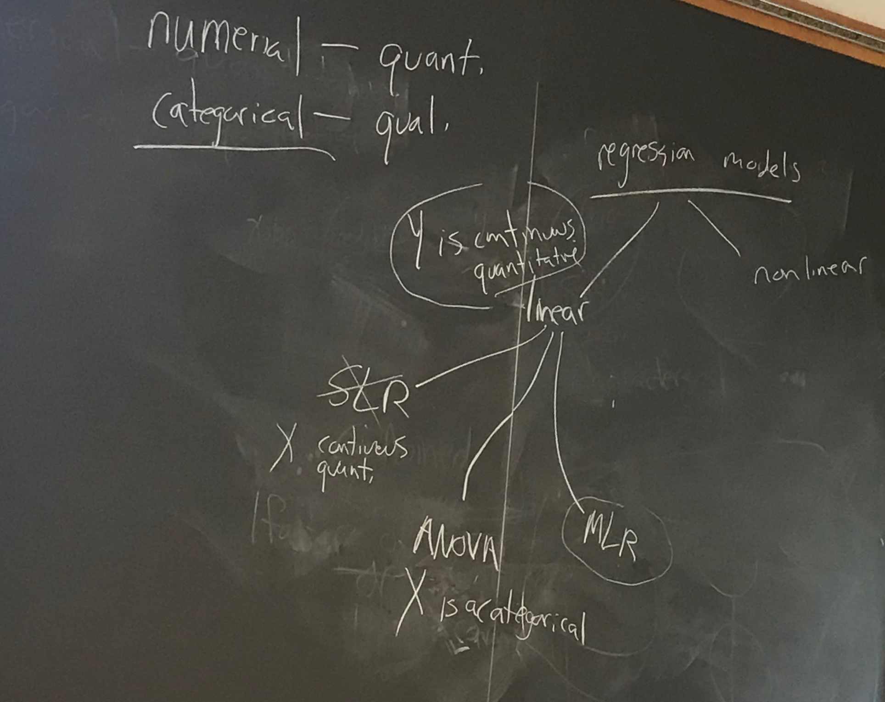
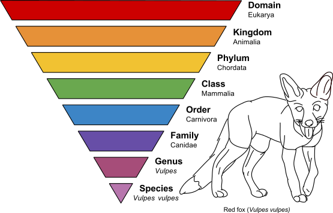

```{r setup_pres, include=FALSE, echo=FALSE}
#devtools::install_github("ropenscilabs/icon")
#devtools::session_info('rmarkdown')

rm(list=ls())
library('tidyverse')
library('gridExtra')
library('broom')
library('cowplot')

library("RefManageR")
library("DT")


#setwd("~/Google Drive Swat/Swat docs/Stat 21/Class13_files")
#setwd("~/Drive/Swat docs/Stat 21/Class9_files")
options(htmltools.dir.version = FALSE)
knitr::opts_chunk$set(fig.path='Figs/',echo=TRUE, warning=FALSE, message=FALSE)

```

```{css, echo=FALSE}
pre {
  background: #FFBB33;
  max-width: 100%;
  overflow-x: scroll;
}

.scroll-output {
  height: 75%;
  overflow-y: scroll;
}
   
.red{color: #ce151e;}
.green{color: #26b421;}
.blue{color: #426EF0;}
```


## ANOVA - analysis of variance

  > Once upon a time, a psychologist conducted a survey and gathered considerable amounts of data. However, as is the case many times, the data sat on the shelf gathering dust. But, one year, the psychologist decided to resurrect the data. Not being exactly sure of what to do though, the data was given to a few students to play with and summarize. Well, as you might expect, one student did it one way, another student did it another way, and a third student even did it entirely different from the other two. Because of this, the psychologist suddenly became interested in a new research question and proclaimed:

  > "How goes this VARIANCE OF ANALYSIS?"


.footnote[Credit: Dennis Roberts of Penn State] 

---
## What are we learning? 
### Big picture 

```{r, bigPicClass15, fig.align='center', out.height=400, out.width=600, echo=FALSE}

```
  
---
## Mammal sleeping data 

Suppose we are interested in the amount of sleep an animal gets depending on the order it belongs to. 

```{r, taxonomy15, fig.align='center', out.height=200, out.width=300, echo=FALSE}

#https://www.explainxkcd.com/wiki/index.php/Category:Statistics
```


---
## Mammal sleeping data 

```{r msleep_class15}
library("ggplot2")
data(msleep)
names(msleep)
summary(msleep$order)
```


---
## Mammal sleeping data 

```{r msleep_class15_2}
head(msleep)

msleep2 <- msleep %>% 
           mutate(order_cat = fct_infreq(order)) %>%
           select(order_cat, sleep_total)
           
```


.footnote[Source: https://forcats.tidyverse.org/]

---
## Mammal sleeping data 
.scroll-output[
```{r msleep_class15_3}
glimpse(msleep2)
msleep2 

summary(msleep2$order_cat)
```
]

---
## Mammals sleeping data 

.scroll-output[
```{r msleep_class15_lm}
SLR_msleep <- lm(sleep_total ~ order_cat, data=msleep2)
SLR_msleep
```
]


---
## Mammals sleeping data 

```{r msleep_class15_anova}
anova(SLR_msleep)
```


---
## Recall in SLR

  .center[Total variation in Y = variation due to predictor x + variation due to everything else]


Source    | Sums of sqs  | Deg of free. | Mean square | F-statistic
--------- | ------------ | ------------ | ----------- | ----------- 
Model     | $\sum_{i=1}^{n}(\hat{y}_i-\bar{y})^2$ | $1$   | $MSReg=\frac{SS_{Reg}}{1}$ | $F=\frac{MSReg}{MSE}$
Residuals | $\sum_{i=1}^{n}(\hat{y}_i - y_i)^2$ | $n-2$ | $MSE=\frac{SSE}{n-2}$   | 


---
## ANOVA and SLR compared

In ANOVA models, we are doing the same thing, only now our predictor variable is a **qualitative/categorical** variable! 


--
For an ANOVA problem, our statistical question is often: Do these different groups of experimental units vary in their response values? 


--
Assumptions (regarding the random error in our continuous, quantitative response):

1. $E[\epsilon]=0$

1. Homogeneity of variance (i.e. $Var(\epsilon)=\sigma^2$)

    - Levene's test

1. Each $\epsilon$ is independent of any other random error. 

---
## Constant variance assumption for ANOVA
### Levene's test


Note: The null hypothesis here is that all group variances are equal. So we **want** to "fail to reject"! 

```{r}
library("car")
leveneTest(SLR_msleep)
```

--
Note: This is also an F-test but it is not the same one from before! 
This F-test is looking at the ratio of the sum of squared variances *within* a particular category to the sum of squared variances *between* any two categories.  

---
## ANOVA notation

Observed data: 
$$( \boldsymbol{x}_{obs}, \boldsymbol{y}_{obs}) = (x_1, y_1), \dots, (x_n,y_n)$$
But now each $x_i$ for $i = 1,\dots,n$ are one of a finite number of possible options (e.g. color, high/medium/low, species, etc). 

So we will denote this data according to the number of different possible group options, which we'll call $k$.

For $k=1$ we have observations $y_{1,1}, \dots, y_{1, n_1}$

For $k=2$ we have observations $y_{2,1}, \dots, y_{2, n_2}$


For $k=3$ we have observations $y_{3,1}, \dots, y_{3, n_3}$


$\dots$ 


For $k=K$ we have observations $y_{K,1}, \dots, y_{K, n_K}$


--
Hence our hypothesis of interest is:

$$H_0: \mu_1 = \mu_2 = \dots = \mu_k \\ H_1: \text{ Not all }\mu_i \text{ are equal, for }i=1,\dots,k$$


---
## Some additional resources 


On degrees of freedom: 
https://statisticsbyjim.com/hypothesis-testing/degrees-freedom-statistics/


On factors within the *tidyverse*: https://r4ds.had.co.nz/factors.html


