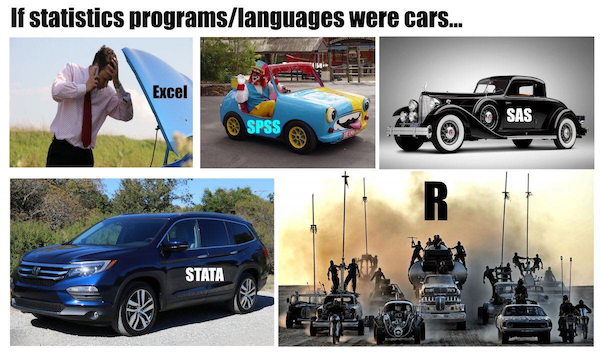

```{r setup_pres, include=FALSE, echo=FALSE}
#devtools::install_github("ropenscilabs/icon")
#devtools::session_info('rmarkdown')

rm(list=ls())
library('tidyverse')
library('gridExtra')
library('broom')
library('cowplot')

library("RefManageR")
library("DT")


#setwd("~/Google Drive Swat/Swat docs/Stat 21/Class13_files")
#setwd("~/Drive/Swat docs/Stat 21/Class9_files")
options(htmltools.dir.version = FALSE)
knitr::opts_chunk$set(fig.path='Figs/',echo=TRUE, warning=FALSE, message=FALSE)

```

```{css, echo=FALSE}
pre {
  background: #FFBB33;
  max-width: 100%;
  overflow-x: scroll;
}

.scroll-output {
  height: 73%;
  overflow-y: scroll;
}
   
.red{color: #ce151e;}
.green{color: #26b421;}
.blue{color: #426EF0;}
```


```{r, comic16, echo=FALSE, fig.align='center'}

```


.footnote[Credit:  @ statsepi  (Twitter)]


---
## Feedback post-midterm

.center[ Thank you! ]

A few common remarks I'd like to comment on further:

  - Sometimes material on the homework isn't covered until the previous Wednesday or that same Friday 
  
  - Answers to questions posed on the slides are not printed 
  
  - Midterm questions were dissimilar to the homework questions 
  
  - More emphasis on interpreting R output 
  
  - Organization/study material 

---
## ANOVA notation

Observed data: 
$( \boldsymbol{x}_{obs}, \boldsymbol{y}_{obs}) = (x_1, y_1), \dots, (x_n,y_n)$

As before, our response variable is a numerical/quantitative variable. But, now each value of the predictor variable, $x_i$ for $i = 1,\dots,n,$ is one of a finite number (say $k$) of possible options (e.g. color, high/medium/low, species, etc). 


Basically, now we are thinking of each categorical predictor variable $x$ as one of $k$ possible *labels*. 


---
## ANOVA notation

Suppose $n_1, \dots, n_k$ are such that: $\sum_{i=1}^{k}n_i = n_1 + n_2 + \dots + n_k = n.$

***
For $i=1$ we have observations $y_{1,1}, \dots, y_{1, n_1}$ and an unknown group mean $\mu_1$


For $i=2$ we have observations $y_{2,1}, \dots, y_{2, n_2}$ and an unknown group mean $\mu_2$


$\dots$ 


For $i=k$ we have observations $y_{k,1}, \dots, y_{k, n_k}$ and an unknown group mean $\mu_K$
***

Hence our hypothesis of interest is:

$$H_0: \mu_1 = \mu_2 = \dots = \mu_k \\ H_1: \text{ Not all }\mu_i \text{ are equal, for }i=1,\dots,k$$


You can think of an ANOVA model as a generalization of the t-test for the difference in means. With ANOVA, we can test if **more than two** group means are the same. 


---
## ANOVA notation

Suppose $n_1, \dots, n_k$ are such that: $\sum_{i=1}^{k}n_i = n_1 + n_2 + \dots + n_k = n.$

***
For $i=1$ we have observations $y_{1,1}, \dots, y_{1, n_1}$ and an unknown group mean $\mu_1$


For $i=2$ we have observations $y_{2,1}, \dots, y_{2, n_2}$ and an unknown group mean $\mu_2$


$\dots$ 


For $i=k$ we have observations $y_{k,1}, \dots, y_{k, n_k}$ and an unknown group mean $\mu_K$
***

Hence our hypothesis of interest is:

$$H_0: \mu_1 = \mu_2 = \dots = \mu_k \\ H_1: \text{ Not all }\mu_i \text{ are equal, for }i=1,\dots,k$$

**Q:** Why not do a bunch of t-tests instead of one ANOVA test? 


---
## Answer to question


If all our tests were independent, (this is not likely to be the case but it's the "best" of the worst case scenarios) then as the number of tests increases, so does our chance of randomly incorrectly rejecting the null hypothesis. 


$$Pr( \text{making a type I error}) = \alpha \\
Pr(\text{not making a type I error}) = 1- \alpha$$

$$Pr(\text{not making a type I error in m independent hypothesis tests}) = (1-\alpha)^m\\
Pr(\text{making at least one type I error our of m tests}) = 1 - (1-\alpha)^m$$

---
## Answer to question


```{r sigLevelClass16}
1 - (1 - 0.05)      ## a single test
1 - (1 - 0.05)^3    ## three tests
1 - (1 - 0.05)^10   ## 10 tests
```

.footnote[For more on the problem of multiple testing go <a href="https://www.stat.berkeley.edu/~mgoldman/Section0402.pdf">here</a>.

For an alternative (Bayesian) approach to avoid dealing with multiple testing problem see <a href="http://www.stat.columbia.edu/~gelman/research/published/multiple2f.pdf">this</a> paper. NOT on future test, just FYI]

---
## One-way ANOVA 

$$Y_{i,j}  = \mu_{i} + \epsilon_{i,j}$$ 

Here $i = 1,\dots, k$ and $j = 1, \dots, n_{i}$.


Assumptions (regarding the random error in our continuous, quantitative response):

1. $E[\epsilon]=0$

1. Homogeneity of variance (i.e. $Var(\epsilon)=\sigma^2$)

1. Each $\epsilon$ is independent of any other random error. 

1. The random errors, $\epsilon$ are Normally distributed. (Only necessary for inference.)


--
- Violations of assumption 2 are most problematic if the ANOVA is unbalanced (i.e. if the category sample sizes $n_1, \dots, n_k$ differ). 


 - Also, as a rule of thumb, aim to have at least a dozen or so observations within each category (otherwise the homogeneity of variance is a difficult assumption to establish). 


---
## One-way ANOVA
### As a linear regression model


<a href="http://www.biostathandbook.com/onewayanova.html">Here</a> is a helpful free resource summarizing ANOVA (and other general statistical) methods.

<a href="https://statisticsbyjim.com/anova/f-tests-anova/">Here</a> is a link to a summary on what is an F-test in an ANOVA model. 


