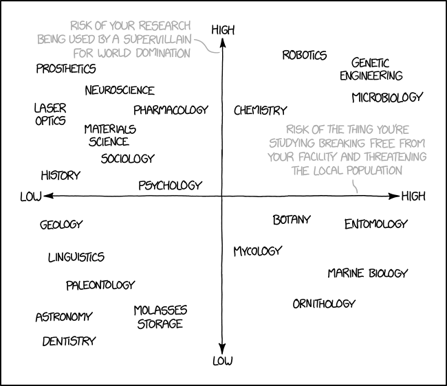
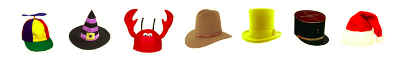

```{r setup_pres, include=FALSE, echo=FALSE}
#devtools::install_github("ropenscilabs/icon")
#devtools::session_info('rmarkdown')

rm(list=ls())
library('tidyverse')
library('gridExtra')
library('broom')
library('cowplot')

library("RefManageR")
library("DT")


#setwd("~/Google Drive Swat/Swat docs/Stat 21/Class13_files")
#setwd("~/Drive/Swat docs/Stat 21/Class9_files")
options(htmltools.dir.version = FALSE)
knitr::opts_chunk$set(fig.path='Figs/',echo=TRUE, warning=FALSE, message=FALSE)

```

```{css, echo=FALSE}
pre {
  background: #FFBB33;
  max-width: 100%;
  overflow-x: scroll;
}

.scroll-output {
  height: 75%;
  overflow-y: scroll;
}

.scroll-small {
  height: 50%;
  overflow-y: scroll;
}
   
.red{color: #ce151e;}
.green{color: #26b421;}
.blue{color: #426EF0;}
```


```{r, comic18, echo=FALSE, fig.align='center', out.height=450}

```


.footnote["The 1919 Great Boston Molasses Flood remained the deadliest confectionery containment accident until the Canadian Space Agency's 2031 orbital maple syrup delivery disaster." 

https://www.xkcd.com/1904/]

---
## What have we covered thus far?

  - Simple linear regression (SLR)
  - One-way analysis of variance (ANOVA)
  - Chi-squared tests for independence 
  
Next class we will start to put all of these together as we begin learning about **multiple linear regression** (MLR). 


  > It is **crucial** to understand each of the topics above in order to properly build MLR models. If you have any questions from a past lecture/homework/exam please ask it! 


Reminders: check your HW grades on Gradescope and submit a re-grade request if you think there is an error **and** my new office hours are every W 2-3:30 and Th 10-11:30.

---
## Post-break refresher on ANOVA

What does the data used in an ANOVA model look like?


--
What is the difference between ANOVA and chi-squared tests? Between ANOVA and SLR models? 


--
How do we mathematically write an ANOVA model? 


--
What are the assumptions for an ANOVA model? 


--
What is the ANOVA F-test? 


--
.blue[Note:] All answers to these questions can be found in previous slides.


---
## ANOVA in R 
### Mammal sleeping data 

Let's build our ANOVA model based on a new version of the data where the categorical variable has been read into R as a variable of type *factor*.
```{r msleep_class16}
library("tidyverse")
data(msleep)
msleep2 <- msleep %>% 
           mutate(order_cat = order %>% fct_infreq()) %>%
           select(order_cat, sleep_total)
ANOVA_mammals <- lm(sleep_total ~ order_cat, data=msleep2)
``` 

---
## ANOVA in R 
### Mammal sleeping data 

By default, R chooses the **reference category** alphabetically. Since we used the *fct_infreq()* function from the *forcats* package, we instead told R to use the category with the most observational units as the reference level. 

.scroll-small[
```{r msleep_class16_2}
msleep2 %>% count(order_cat)
ANOVA_mammals
```
]

---
## ANOVA in R 
### Mammal sleeping data 

If we wanted the reference category to be the factor with the fewest number of observational units we can modify the data with the *fct_rev()* function and then re-fit the model. Similarly, if we wanted the reference category to be a specific factor level we could coerce this using the function *fct_recode()*.  

.scroll-small[
```{r}
msleep3 <- msleep %>%
           mutate(order_cat = order %>% fct_infreq() %>% fct_rev()) %>% 
           select(order_cat, sleep_total)
ANOVA_mammals2 <- lm(sleep_total ~ order_cat, data=msleep3)
ANOVA_mammals2 
```
]


---
## ANOVA in R 
### Mammal sleeping data 

Compare the following output. What is the same? What is different? 

.scroll-small[
```{r msleep_class16_3}
summary(ANOVA_mammals)
anova(ANOVA_mammals)      
```
]


---
## ANOVA in R 
### Mammal sleeping data 

.scroll-output[
```{r msleep_class16_4}
g <- ggplot(msleep2, aes(x=order_cat, y=sleep_total))
g + geom_count(col="tomato3", show.legend=F) +
  labs(subtitle="Sleeping time for different mammals", 
       y="Total hours slept", 
       x="Mammal order", 
       title="Counts Plot") + 
  theme(axis.text.x = element_text(angle = 90))
```
]

---
## Sample size determination 

In HW 4 you are asked to solve a sample size problem. This is a common statistical question that is really related to the statistical concept of <a href="https://en.wikipedia.org/wiki/Power_(statistics)">power</a>. 


-  Type I error probability: $\alpha$
-  Type II error probability: $\beta$
-  Statistical power: $1 − \beta$


  > "Sample size is never large enough... just as you never have enough money, because perceived needs increase with resources, your inferential needs will increase with your sample size."<sup>[1]</sup> 


Note: Sample size determination is specific to the particular test or model, it cannote be answered as a general statistical question without understanding the context of the problem at hand.  


.footnote[[1] http://www.stat.columbia.edu/~gelman/stuff_for_blog/chap20.pdf]

---
## What are degrees of freedom? 

This is a **good question** but the answer is hardly understood by many people (including statisticians)! 

  > "[T]his is a case where the mathematical notion is simpler than any non-mathematical interpretation of it"... but understanding the mathematical notion requires understanding linear algebra and geometry in $n$-dimensional space.<sup>[2]</sup> 

Degrees of freedom are often broadly defined how many independent pieces of information in the data are free to vary when estimating statistical parameters or calculating summary statistics.


--
**Example 1:**<sup>[3]</sup> Wearing a different hat every day of the week, when you only have $7$ hats available. You have 7-1 = 6 days of “hat” freedom—in which the hat you wore could vary but on the last day you're down to only one option.

```{r, hats18, echo=FALSE, fig.align='center', out.height=100}

```

.footnote[<a href="https://blog.minitab.com/blog/statistics-and-quality-data-analysis/what-are-degrees-of-freedom-in-statistics">Here</a><sup>[3]</sup> is a very approachable and intuition-based explanation of degrees of freedom. And here is a very mathematically thorough summary on <a href="https://en.wikipedia.org/wiki/Degrees_of_freedom_(statistics)">Wikipedia</a>. And finally, <a href="http://www.nohsteachers.info/pcaso/ap_statistics/PDFs/DegreesOfFreedom.pdf">this</a> <sup>[2]</sup> is a great paper on degrees of freedom written by the first female president of the American Statistical Association.]

---
## What are degrees of freedom? 


**Example 2:** Residual standard error 

$$\hat{\sigma} = \sqrt{\frac{SS_{res}}{n-2}} = \sqrt{\frac{\sum_{i=1}^{n}(\hat{y}_i - y_i)^2}{n-2}}$$

We have a sample of $n$ observational units. In order to calculate $\hat{y}_i$ however, we have to estimate two parameters: $\beta_0$ and $\beta_1$. Once we compute $\hat{\beta}_0$ and $\hat{\beta}_1$, we are essentially imposing two linear constraints on our observational units. 


--
I think the hardest degrees of freedom question we have faced thus far is: why are the degrees of freedom associated with the $SS_{reg}$ (in SLR) equal to $1$? 


*However* it is easy to see that the degrees of freedom associated with $SS_{res}$ is $n-2$ and the degrees of freedom associated with $SS_{tot}$ is $n-1$ (because we must calculate $\bar{y}$ which corresponds to a linear constraint). So if the degrees of freedom are additive (which they are), then by deduction we have that the degrees of freedom associated with $SS_{reg}$ are $1$. 