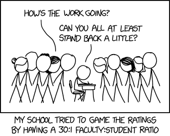
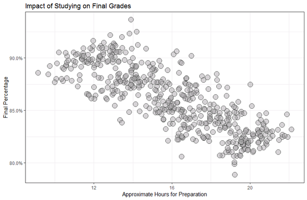
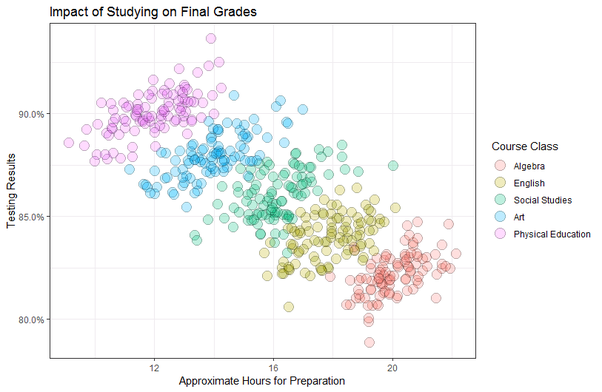

```{r setup_pres, include=FALSE, echo=FALSE}
#devtools::install_github("ropenscilabs/icon")
#devtools::session_info('rmarkdown')

rm(list=ls())
library('tidyverse')
library('gridExtra')
library('broom')
library('cowplot')

library("RefManageR")
library("DT")


#setwd("~/Google Drive Swat/Swat docs/Stat 21/Class13_files")
#setwd("~/Drive/Swat docs/Stat 21/Class9_files")
options(htmltools.dir.version = FALSE)
knitr::opts_chunk$set(fig.path='Figs/',echo=TRUE, warning=FALSE, message=FALSE)

```

```{css, echo=FALSE}
pre {
  background: #FFBB33;
  max-width: 100%;
  overflow-x: scroll;
}

.scroll-output {
  height: 75%;
  overflow-y: scroll;
}

.scroll-small {
  height: 50%;
  overflow-y: scroll;
}
   
.red{color: #ce151e;}
.green{color: #26b421;}
.blue{color: #426EF0;}
```


```{r, comic22, echo=FALSE, fig.align='center', out.height=450}

#https://www.explainxkcd.com/wiki/index.php/882:_Significant
```

.footnote[Source: https://www.xkcd.com/2215/]

---
## Topics covered today: 

- Review Class 21 and 21 notes 
  
    - Effects of adding more variables to a MLR 
    
    - Visualizing MLR in 3D

- Some comments about R squared

- Simpson's paradox

- ~~Interaction terms~~

- ~~Colinearity~~

---
##R squared
### Why does adding predictor variables increase $R^2$? 

$$R^2 = \frac{SS_{reg}}{SS_{tot}} = 1 - \frac{SS_{res}}{SS_{tot}}$$ 

What is $SS_{res}$? 


--
Recall $Var(\epsilon) = \sigma^2$ and $\hat{\sigma}^2 = \frac{SS_{res}}{n-2}.$


The way we determine the coefficients of our linear model (i.e. the $\hat{\beta}$'s) is by minimizing $SS_{res}$. Mathematically, minimizing $SS_{res}$ is equivalent to maximizing $R^2$. 


So this question can be rephrased as: .red[why does adding more predictor variables decrease] $SS_{res}$?

---
##R squared
### Why does adding more predictor variables decrease $SS_{res}$?

Because we define the regression estimates as the "least squares" estimates. That is, by definition, (in SLR for example)

$$\hat{\beta_0} = \bar{y} + \hat{\beta_1} \bar{x} \\
\hat{\beta_1} = \frac{\sum_{i=1}^{n}(x_i - \bar{x})(y_i - \bar{y})}{\sum_{i=1}^{n}(x_i - \bar{x})^2}$$

are the values that minimize $SS_{res}$, the squared distance between the data and the line. So as we have to estimate more and more $\hat{\beta}$'s, we continue to minimize $SS_{res}$, but we are able to make $SS_{res}$ even smaller than before. The main reason why is the logical fact stated below. 

--
  > If set $S$ has $n$ elements in it, we can find the minimum and the maximum of this set. If we add $t>0$ more elements to the set, it is possible that both the minimum and maximum values are more extreme than they were before. 


---
## R squared
### R - the programming language - output 

In the linear regression output of R we have 

- multiple R squared is the R squared that we define as $R^2 = \frac{SS_{reg}}{SS_{tot}}$; 
  
- adjusted R squared this imposes a penalty on the multiple R squared value that accounts for adding more predictor variables to the model.
  


---
## Simpson's paradox 


Mathematically what's going on here is an actual example of where 
$$\frac{a_1}{b_{1}} < \frac{c_1}{d_1} \text{ and } \frac{a_2}{b_2} < \frac{c_2}{d_2}$$
but for the sums of these fractions
$$\frac{a_1 + a_2}{b_{1} + b_2} > \frac{c_1 + c_2}{d_1 + d_2}.$$


---
## Simpson's paradox

.pull-left[
.center[Correlation=−0.7981]
```{r, simpsons_pre22, echo=FALSE, fig.align='center', out.height=350}

```
]

.pull-right[
.center[Each individual correlation is positive]
```{r, simpsons_post22, echo=FALSE, fig.align='center', out.height=350}

```
]

---
## Sources 


[1] https://math.stackexchange.com/questions/83756/more-examples-of-simpsons-paradox-barring-the-ones-on-wikipedia-titanic-and

[2] https://www.quora.com/What-is-Simpsons-paradox/answer/Jon-Wayland


