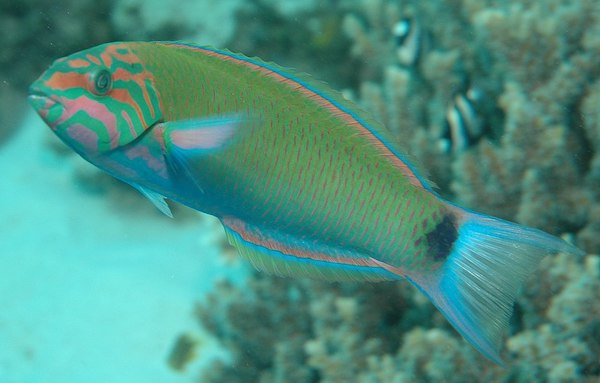

```{r setup_pres, include=FALSE, echo=FALSE}
#devtools::install_github("ropenscilabs/icon")
#devtools::session_info('rmarkdown')

rm(list=ls())
library('tidyverse')
library('gridExtra')
library('broom')
library('cowplot')

library("RefManageR")
library("DT")


#setwd("~/Google Drive Swat/Swat docs/Stat 21/Class13_files")
#setwd("~/Drive/Swat docs/Stat 21/Class9_files")
options(htmltools.dir.version = FALSE)
knitr::opts_chunk$set(fig.path='Figs/',echo=TRUE, warning=FALSE, message=FALSE)

```

```{css, echo=FALSE}
pre {
  background: #FFBB33;
  max-width: 100%;
  overflow-x: scroll;
}

.scroll-output {
  height: 75%;
  overflow-y: scroll;
}

.scroll-small {
  height: 50%;
  overflow-y: scroll;
}
   
.red{color: #ce151e;}
.green{color: #26b421;}
.blue{color: #426EF0;}
```


.center[Tomorrow is Nov 5th, voting day!]

```{r, comic24, echo=FALSE, fig.align='center'}
knitr::include_graphics("Figs/Ivoted.jpg")
```

For voting assitence and resource check out: https://www.swarthmore.edu/voter-information/learn-about-swarthmores-commitment-to-voting 


---
## Topics covered today: 

- Review of HW 5 important concepts 

- Finish Class 23 notes

  - Example of real world interaction effects 


---
## Let's talk about interaction terms some more 
### Mood wrasse Fish example 

There are many animals that are have what are called "polygynous mating systems". They are all born with female reproductive systems but as they age some change to a male reproductive system. 


Let $Y=$ weight, $x_1 =$age, and $x_2=$sex and consider the following model:

$$Y = \beta_0 + \beta_1 x_1 + \beta_2 x_2 + \beta_3 x_1 x_2 + \epsilon.$$ 

Note: Interactions terms some collinearity, we can't get around that, but the main consequence of including interaction terms is in the **interpretation** of the statistical model. 


```{r, fish, echo=FALSE, fig.align='center', out.height=200}

```


---
## Interaction terms and collinearity (multicollinearity)

Broadly speaking, there are two main types of collinearity: 

  1. Structural multicollinearity which occurs when we create a model term using other terms in the model (e.g. including interaction terms). This is a (unfortunately unavoidable) byproduct of the model that we specify.
  
  2. Data multicollinearity which occurs when the data itself for different predictor variables are highly correlated. Some ways we can address this data-inherent multicollinearity is to collect more data or see if it makes sense to drop a variable from the model.  


.footnote[Source: https://statisticsbyjim.com/regression/multicollinearity-in-regression-analysis/]


---
## Some things to think about 

- What are the effects of incorporating interaction terms in your linear model? 

- What are the effects of severe multicollineary among some predictor variables in your model? 


---
## For Wednesday's class we will start to cover 

- Understanding ANOVA models as MLR models

- When/why to include interaction terms in ANOVA models 

- Estimation vs. inference with ANOVA models

