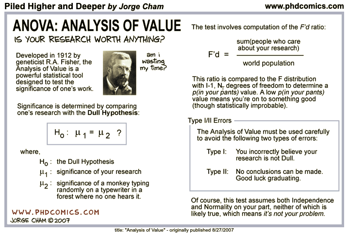
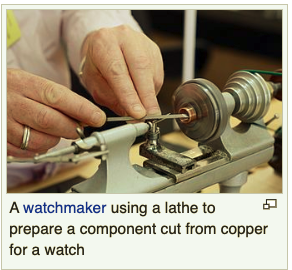

```{r setup_pres, include=FALSE, echo=FALSE}
#devtools::install_github("ropenscilabs/icon")
#devtools::session_info('rmarkdown')

rm(list=ls())
library('tidyverse')
library('gridExtra')
library('broom')
library('cowplot')

library("RefManageR")
library("DT")


#setwd("~/Google Drive Swat/Swat docs/Stat 21/Class13_files")
#setwd("~/Drive/Swat docs/Stat 21/Class9_files")
options(htmltools.dir.version = FALSE)
knitr::opts_chunk$set(fig.path='Figs/',echo=TRUE, warning=FALSE, message=FALSE)

```

```{css, echo=FALSE}
pre {
  background: #FFBB33;
  max-width: 100%;
  overflow-x: scroll;
}

.scroll-output {
  height: 75%;
  overflow-y: scroll;
}

.scroll-small {
  height: 50%;
  overflow-y: scroll;
}
   
.red{color: #ce151e;}
.green{color: #26b421;}
.blue{color: #426EF0;}
```


```{r, comic25, echo=FALSE, fig.align='center', out.height=550}

```

---
## Today's class 

- Finish review of HW 5 

- Understanding ANOVA models as a MLR model

- Interaction terms in ANOVA models 


---
## ANOVA as a MLR model 

In an ANOVA model, the predictor variable is categorical. Recall we write 
$$Y_{i,j}  = \mu_{i} + \epsilon_{i,j}$$

where $k$ is the number of categories and $i = 1,\dots, k$ and $j = 1, \dots, n_{i}$ and $\sum_{i=1}^{k}n_i = n$. 

***

Assumptions for inference:

1. $E[\epsilon]=0$

1. Homogeneity of variance (i.e. $Var(\epsilon)=\sigma^2$)

1. Each $\epsilon$ is independent of any other random error. 

1. The random errors, $\epsilon$ are Normally distributed. (Only necessary for inference.)


---
## Dummy varables (aka indicator variables)

If we have a variable with $k$ unique categories, we only need $k-1$ indicator variables to uniquely identify each data point as belonging to one category. 

Mechanical engineer needs to know the effective life of a cutting tool ( $Y$ ) to the speed of the lathe used on it ( $x_1$ in revolutions per minute) and the tool type (type A or type B). 

```{r, lathe, echo=FALSE, fig.align='center', out.height=300}

```


---
## Dummy varables (aka indicator variables)

If we have a variable with $k$ unique categories, we only need $k-1$ indicator variables to uniquely identify each data point as belonging to one category. 

Mechanical engineer needs to know the effective life of a cutting tool ( $Y$ ) to the speed of the lathe used on it ( $x_1$ in revolutions per minute) and the tool type (type A or type B). 

We can define a predictor variable for tool type by
$$x_2 = \begin{cases}0, \text{ if type A}\\ 1, \text{ if type B} \end{cases}.$$


.blue[2 groups], .red[1 predictor variable]


---
## Dummy varables (aka indicator variables)

If we have a variable with $k$ unique categories, we only need $k-1$ indicator variables to uniquely identify each data point as belonging to one category. 

Mechanical engineer needs to know the effective life of a cutting tool ( $Y$ ) to the speed of the lathe used on it ( $x_1$ in revolutions per minute) and the tool type. 

Suppose we have four different types of tools A,B,C, and D. We can uniquely identify the tool type of each observational unit with these three dummy variables:

$$x_2 = \begin{cases}0, \text{ if type A}\\ 1, \text{ if type B} \end{cases},
x_3 = \begin{cases}0, \text{ if type A}\\ 1, \text{ if type C} \end{cases},
x_4 = \begin{cases}0, \text{ if type A}\\ 1, \text{ if type D} \end{cases}.$$


.blue[4 groups], .red[3 predictor variables]


---
## Matrix notation for ANOVA 

Suppose we have a categorical predictor variable with $k$ different groups. Let $Y$ be the continuous response variable. The ANOVA model for these two variables is:
$$y_{j} = \beta_0 + \beta_1 x_{1,j} + \beta_2 x_{2,j} + \cdots + \beta_{k-1}x_{(k-1),j} + \epsilon_{j}$$
for $j = 1, \dots, n$ and 

$$x_{i,j} = \begin{cases} 1, \text{ if individual j is from category (i+1)} \\
	0, \text{ otherwise}
	\end{cases}.$$
	
Holding all other variables fixed, $\beta_1$ (for example) represents the average change in $y$ we expect to see when we switch categories from the reference group to the next group of the *factor variable* in R. 
