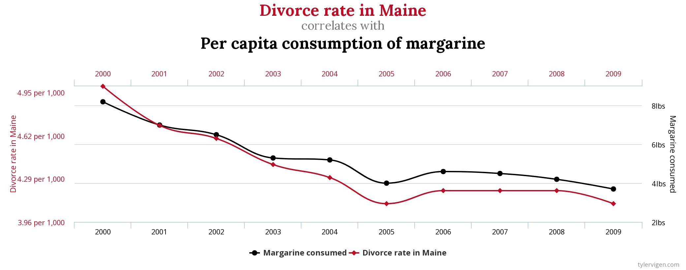

```{r setup_pres, include=FALSE, echo=FALSE}
#devtools::install_github("ropenscilabs/icon")
#devtools::session_info('rmarkdown')

rm(list=ls())
library('tidyverse')
library('gridExtra')
library('broom')
library('cowplot')

library("RefManageR")
library("DT")


#setwd("~/Google Drive Swat/Swat docs/Stat 21/Class13_files")
#setwd("~/Drive/Swat docs/Stat 21/Class9_files")
options(htmltools.dir.version = FALSE)
knitr::opts_chunk$set(fig.path='Figs/',echo=TRUE, warning=FALSE, message=FALSE)

```

```{css, echo=FALSE}
pre {
  background: #FFBB33;
  max-width: 100%;
  overflow-x: scroll;
}

.scroll-output {
  height: 75%;
  overflow-y: scroll;
}

.scroll-small {
  height: 50%;
  overflow-y: scroll;
}
   
.red{color: #ce151e;}
.green{color: #26b421;}
.blue{color: #426EF0;}
```

## Todays topics 


Spurrious correlations 

Estimation and prediction with MLR models


```{r, comic28, echo=FALSE, fig.align='center', out.width=800}

```

.footnote[https://www.tylervigen.com/spurious-correlations]


---
## Wine data example 

.scroll-output[
```{r wine28_data, echo=TRUE}
wine <- read_csv("~/Google Drive Swat/Swat docs/Stat 21/Data/red_wines.csv", skip=1, col_names = TRUE, cols(x1 = col_character()))
head(wine)

wine <- wine %>% mutate(type = as_factor(x1))  ##Note the use of as_factor() rather than fct_infreq()
head(wine)
#let's just double check the levels of our factor variable
wine$type
```
]


---
## Wine data example


Let's consider modeling the wine quality as a linear function of three predictor variables: (1) the degree of ionization of anthocyanins, (2) the pH level, (3) the type of wine. 

- Response variable - y, wine quality from 0-20

- Predictor variable - type, wine type as a factor, categorical (0=Cabernet Sauvignon, 1=Shiraz)

- Predictor variable - x<sub>2</sub>, pH level, numerical (0-14, 7 being neutral)

- Predictor variable - x<sub>9</sub>, percent of ionization, numerical (0-100 %)


First step (after making sure the data is read into R correctly)?


---
## Wine data example


Let's consider modeling the wine quality as a linear function of three predictor variables: (1) the degree of ionization of anthocyanins, (2) the pH level, (3) the type of wine. 

- Response variable - y, wine quality from 0-20

- Predictor variable - type, wine type as a factor, categorical (0=Cabernet Sauvignon, 1=Shiraz)

- Predictor variable - x<sub>2</sub>, pH level, numerical (0-14, 7 being neutral)

- Predictor variable - x<sub>9</sub>, percent of ionization, numerical (0-100 %)


First step (after making sure the data is read into R correctly)? 

.center[.blue[**Plot the data**!]] 


---
## Wine data example
.scroll-output[
```{r plot28bw}
wine %>% select(y,x2,x9) %>% pairs(labels=c("Quality","pH","% Ionization"),pch=16) 
```
]

What can we do to visualize the data according to different levels of the categorical predictor? 


---
## Wine data example

.scroll-output[
```{r plot28color}
wine %>% 
  select(y,x2,x9) %>%
  pairs(col=c("red","blue")[wine$type], pch=16, labels=c("Quality","pH","% Ionization"), main="Wine data by type") 
```
]


---
## Wine data example
### Fitting a MLR model 

Now let's (without looking at the individual t-tests!) examine some possible relationships among the predictors and the response. 

.scroll-output[
```{r}
# Correlations among all possible pairs of numerical variables
cor(wine$x2, wine$x9)
cor(wine$y, wine$x2)
cor(wine$y, wine$x9)
```
]

---
## Wine data example
### Fitting a MLR model 

Now let's (without looking at the individual t-tests!) examine some possible relationships among the predictors and the response. 


**Q1:** Is there any evidence of collinearity? 


--
**A1:** Not among the predictor variables. **Furthermore**, if we're just looking at problems of .blue[estimation], then collinearity is not something to be concerned about. When we move on to inference however, this becomes a more important issue. 


--
**Q2:** Is it possible to have collinearity with a categorical predictor variable? 


--
**A2:** In short, yes, and there are some different measures of correlation to use in this case. We may get into these later but it's not our emphasis right now because it is a concept that is difficult to define, let alone to understand. 


---
## Wine data example
### Fitting a MLR model 

Let's consider a few different possible models based on their adjusted R-squared values. 


.scroll-small[
```{r}
# Adjusted R squared values for a few different possible MLR models
summary(lm(y ~ type + x2 + x9, data=wine))$adj.r.squared
summary(lm(y ~ x2 + x9, data=wine))$adj.r.squared
summary(lm(y ~ type + x2 + x9 + type*x2, data=wine))$adj.r.squared
summary(lm(y ~ type + x2 + x9 + type*x9, data=wine))$adj.r.squared
summary(lm(y ~ type + x2 + x9 + x2*x9, data=wine))$adj.r.squared
```

**Q:** What model would you choose given the info on this slide and on the previous one? 
]
