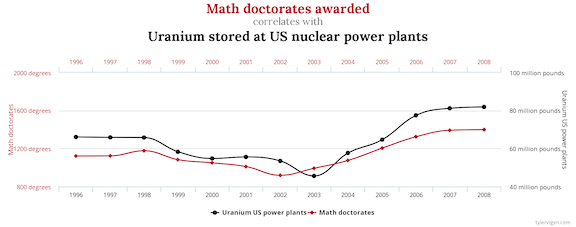

```{r setup_pres, include=FALSE, echo=FALSE}
#devtools::install_github("ropenscilabs/icon")
#devtools::session_info('rmarkdown')

rm(list=ls())
library('tidyverse')
library('gridExtra')
library('broom')
library('cowplot')

library("RefManageR")
library("DT")


#setwd("~/Google Drive Swat/Swat docs/Stat 21/Class13_files")
#setwd("~/Drive/Swat docs/Stat 21/Class9_files")
options(htmltools.dir.version = FALSE)
knitr::opts_chunk$set(fig.path='Figs/',echo=TRUE, warning=FALSE, message=FALSE)

```

```{css, echo=FALSE}
pre {
  background: #FFBB33;
  max-width: 100%;
  overflow-x: scroll;
}

.scroll-output {
  height: 75%;
  overflow-y: scroll;
}

.scroll-small {
  height: 50%;
  overflow-y: scroll;
}
   
.red{color: #ce151e;}
.green{color: #26b421;}
.blue{color: #426EF0;}
```


## Today's topics

- Discussion on types of collinearity

- Finish up with .blue[estimation] for MLR models


```{r, comic29, echo=FALSE, fig.align='center', out.width=800}

```

.footnote[https://www.tylervigen.com/spurious-correlations]

---
## Wine data example 
### Recall the wine quality data we looked into last class

.scroll-output[
```{r wine28_data, echo=TRUE}
wine <- read_csv("~/Google Drive Swat/Swat docs/Stat 21/Data/red_wines.csv", 
                 skip=1, col_names = TRUE, cols(x1 = col_character()))
wine <- wine %>% mutate(type = fct_inorder(x1, ordered=TRUE))  
head(wine)
```
]


---
## Wine data example

Before, we modeled the wine quality as a linear function of three predictor variables: (1) the degree of ionization of anthocyanins, (2) the pH level, (3) the type of wine and discussed the performance of several different MLRs. 

- Response variable - $y$, wine quality from 0-20

- Predictor variable - $w$ (type), dummy variable for wine type, categorical (0=Cabernet Sauvignon, 1=Shiraz)

- Predictor variable - $x_2$, pH level, numerical (0-14, 7 being neutral)

- Predictor variable - $x_9$, percent of ionization, numerical (0-100 %)


Recall we didn't see a strong indication of collinearity between the numerical predictor variables. 


---
## Wine data example
### Fitting a MLR model 

Without doing any hypothesis testing or statistical inference we can also examine model fit with **residual plots**! 


Recall the assumptions needed to fit a linear regression model: 

[1.] $E[\epsilon]=0$

[2.] $Var[\epsilon]= \sigma^2$

[3.] All $\epsilon$ are independent of each other  


Residual plots help us understand how reasonable assumption 2 seems to be for our model(s).


---
## Wine data example - model 1

Lets look at a residual plot for the regression model: 
$\hat{y}_i = \hat{\beta}_0 + \hat{\beta}_1 w_i + \hat{\beta}_2 x_{2,i} + \hat{\beta}_3 x_{9,i},$ 


where $y_i=$ quality score for observation $i$, $x_2=$pH level for observation $i$, $x_9 =$percent of ionization for observation $i$, and 
$$w_i = \begin{cases} 1, \text{ if observation }i \text{ is a Shiraz} \\ 0, \text{ otherwise} \end{cases}.$$
.scroll-small[
```{r eval=FALSE}
MLR_wine1 <- lm(y ~ type + x2 + x9, data=wine)
MLR_wine1_sum <- summary(MLR_wine1)
residual_plot_data1 <- wine %>% 
                       mutate(residuals = MLR_wine1_sum$residuals,
                              fitted_vals = MLR_wine1$fitted.values)
ggplot(residual_plot_data1, aes(x=fitted_vals, y=residuals)) +
  geom_segment(aes(x=fitted_vals, xend=fitted_vals , y=rep(0, length(residuals)), yend = residuals)) + 
  geom_point(aes(color=abs(residuals), size=abs(residuals))) + 
  scale_color_continuous() +  
  guides(color = FALSE, size = FALSE) +  
  geom_hline(yintercept=0) +
  labs(title="Fancy residual plot", subtitle="First MLR model for wine data",
       x="Predicted quality score", y="Residuals")

```
]

---
## Wine data example - model 1

```{r class29firstA, echo=FALSE, fig.align='center',out.height=500}
MLR_wine1 <- lm(y ~ type + x2 + x9, data=wine)
residual_plot_data1 <- wine %>% 
                       mutate(residuals = MLR_wine1$residuals,
                              fitted_vals = MLR_wine1$fitted.values)

ggplot(residual_plot_data1, aes(x=fitted_vals, y=residuals)) +
  geom_segment(aes(x=fitted_vals, xend=fitted_vals , y=rep(0, length(residuals)), yend = residuals)) + 
  geom_point(aes(color=abs(residuals), size=abs(residuals))) + 
  scale_color_continuous() +  
  guides(color = FALSE, size = FALSE) +  
  geom_hline(yintercept=0) +
  labs(title="Fancy residual plot", subtitle="First MLR model for wine data",
       x="Predicted quality score", y="Residuals")
```

---
## Wine data example - model 1

Lets compare to a not-so-fancy residual plot: 

.scroll-output[
```{r eval=FALSE}
MLR_wine1 <- lm(y ~ type + x2 + x9, data=wine)
MLR_wine1_sum <- summary(MLR_wine1)
residual_plot_data1 <- wine %>% 
                       mutate(residuals = MLR_wine1_sum$residuals,
                              fitted_vals = MLR_wine1$fitted.values)
ggplot(residual_plot_data1, aes(x=fitted_vals, y=residuals)) +
#  geom_segment(aes(x=fitted_vals, xend=fitted_vals , y=rep(0, length(residuals)), yend = residuals)) + 
  geom_point() + 
  geom_hline(yintercept=0) +
  labs(title="Residual plot", subtitle="First MLR model for wine data",
       x="Predicted quality score", y="Residuals")
```
]


---
## Wine data example - model 1

$\hat{y}_i = \hat{\beta}_0 + \hat{\beta}_1 w_i + \hat{\beta}_2 x_{2,i} + \hat{\beta}_3 x_{9,i},$

```{r class29firstB,  echo=FALSE, fig.align='center',out.height=450}
MLR_wine1 <- lm(y ~ type + x2 + x9, data=wine)
MLR_wine1_sum <- summary(MLR_wine1)
residual_plot_data1 <- wine %>% 
                       mutate(residuals = MLR_wine1_sum$residuals,
                              fitted_vals = MLR_wine1$fitted.values)
ggplot(residual_plot_data1, aes(x=fitted_vals, y=residuals)) +
#  geom_segment(aes(x=fitted_vals, xend=fitted_vals , y=rep(0, length(residuals)), yend = residuals)) + 
  geom_point() + 
  geom_hline(yintercept=0) +
  labs(title="Residual plot", subtitle="First MLR model for wine data",
       x="Predicted quality score", y="Residuals")
```


---
## Wine data example - model 2

$\hat{y}_i = \hat{\beta}_0 + \hat{\beta}_1 x_{2,i} + \hat{\beta}_2 x_{9,i},$

```{r class29second, echo=FALSE, fig.align='center',out.height=450}
MLR_wine2 <- lm(y ~ x2 + x9, data=wine)
MLR_wine2_sum <- summary(MLR_wine2)
residual_plot_data2 <- wine %>% 
                       mutate(residuals = MLR_wine2_sum$residuals,
                              fitted_vals = MLR_wine2$fitted.values)
ggplot(residual_plot_data2, aes(x=fitted_vals, y=residuals)) +
#  geom_segment(aes(x=fitted_vals, xend=fitted_vals , y=rep(0, length(residuals)), yend = residuals)) + 
  geom_point() + 
  geom_hline(yintercept=0) +
  labs(title="Residual plot", subtitle="Second MLR model for wine data",
       x="Predicted quality score", y="Residuals")
```

---
## Wine data example - model 3

$\hat{y}_i = \hat{\beta}_0 + \hat{\beta}_1 w_i + \hat{\beta}_2 x_{2,i} + \hat{\beta}_3 x_{9,i} + \hat{\beta}_4(w_i \times x_{2,i})$

```{r class29third, echo=FALSE, fig.align='center',out.height=450}
MLR_wine3 <- lm(y ~ type + x2 + x9 + type*x2, data=wine)
MLR_wine3_sum <- summary(MLR_wine3)
residual_plot_data3 <- wine %>% 
                       mutate(residuals = MLR_wine3_sum$residuals,
                              fitted_vals = MLR_wine3$fitted.values)
ggplot(residual_plot_data3, aes(x=fitted_vals, y=residuals)) +
#  geom_segment(aes(x=fitted_vals, xend=fitted_vals , y=rep(0, length(residuals)), yend = residuals)) + 
  geom_point() + 
  geom_hline(yintercept=0) +
  labs(title="Residual plot", subtitle="Third MLR model for wine data",
       x="Predicted quality score", y="Residuals")
```


---
## Wine data example - model 4

$\hat{y}_i = \hat{\beta}_0 + \hat{\beta}_1 w_i + \hat{\beta}_2 x_{2,i} + \hat{\beta}_3 x_{9,i} + \hat{\beta}_4(w_i \times x_{9,i})$

```{r class29fourth, echo=FALSE, fig.align='center',out.height=450}
MLR_wine4 <- lm(y ~ type + x2 + x9 + type*x9, data=wine)
MLR_wine4_sum <- summary(MLR_wine4)
residual_plot_data4 <- wine %>% 
                       mutate(residuals = MLR_wine4_sum$residuals,
                              fitted_vals = MLR_wine4$fitted.values)
ggplot(residual_plot_data4, aes(x=fitted_vals, y=residuals)) +
#  geom_segment(aes(x=fitted_vals, xend=fitted_vals , y=rep(0, length(residuals)), yend = residuals)) + 
  geom_point() + 
  geom_hline(yintercept=0) +
  labs(title="Residual plot", subtitle="Fourth MLR model for wine data",
       x="Predicted quality score", y="Residuals")
```

---
## Wine data example - model 5
$\hat{y}_i = \hat{\beta}_0 + \hat{\beta}_1 w_i + \hat{\beta}_2 x_{2,i} + \hat{\beta}_3 x_{9,i} + \hat{\beta}_4(x_{2,i} \times x_{9,i})$

```{r class29fifth, echo=FALSE, fig.align='center',out.height=450}
MLR_wine5 <- lm(y ~ type + x2 + x9 + x2*x9, data=wine)
MLR_wine5_sum <- summary(MLR_wine5)
residual_plot_data5 <- wine %>% 
                       mutate(residuals = MLR_wine5_sum$residuals,
                              fitted_vals = MLR_wine5$fitted.values)
ggplot(residual_plot_data5, aes(x=fitted_vals, y=residuals)) +
#  geom_segment(aes(x=fitted_vals, xend=fitted_vals , y=rep(0, length(residuals)), yend = residuals)) + 
  geom_point() + 
  geom_hline(yintercept=0) +
  labs(title="Residual plot", subtitle="Fifth MLR model for wine data",
       x="Predicted quality score", y="Residuals")
```


---
## Wine example 
### Class discussion

**Q:** Given all of the estimation properties that we have considered for each of these five models, which model do you think looks the best so far? 
 
 
 
--
 **A:** Model 5 looks the best in terms of having constant error variance and highest adjusted R-squared value. 


---
## Wine data example

For the remainder of class, we are (somewhat arbitrarily) going to restrict our attention to the following two models:


Main effects model (model 1): 
$$\hat{y}_i = \hat{\beta}_0 + \hat{\beta}_1 w_i + \hat{\beta}_2 x_{2,i} + \hat{\beta}_3 x_{9,i}$$


Interaction effects model (model 4): 
$$\hat{y}_i = \hat{\beta}_0 + \hat{\beta}_1 w_i + \hat{\beta}_2 x_{2,i} + \hat{\beta}_3 x_{9,i} + \hat{\beta}_4w_{i} x_{9,i}.$$


---
## Wine data example
### The fitted regression models based on our data 

The coefficients for each of our models are: 

.scroll-output[
```{r}
MLR_wine1 <- lm(y ~ type + x2 + x9, data=wine)
MLR_wine1_sum <- summary(MLR_wine1)
MLR_wine1_sum$coefficients[,1] 

MLR_wine4 <- lm(y ~ type + x2 + x9 + type*x9, data=wine)
MLR_wine4_sum <- summary(MLR_wine4)
MLR_wine4_sum$coefficients[,1] 
```
]


---
## Wine data example
### The fitted regression models based on our data 

In fact, we can also look at the standard error's associated with each model coefficient. (This is still .blue[estimation] not .red[inference]! ... .red[in contrast to something I may have indicated earlier...]

.scroll-small[
```{r}
MLR_wine1_sum$coefficients[,1:2] 

MLR_wine4_sum$coefficients[,1:2] 
```
]


---
## Wine data example
### The fitted regression models based on our data 

**Q1:** What would happen here if $x_2$ and $x_9$ were highly correlated? 


--
**A1:** The standard errors for these two coefficients would be much larger. 


--
**Q2:** Based on this output, which variable seems to have the greatest effect on wine quality?


---
## Wine example 

From the previous output, it's difficult to tell which variable has the largest relative effect on the wine quality. To make the answer to this question more obvious, let's standardize the .red[numerical predictor variables]. 

.scroll-small[
```{r}
wine_standard <- wine %>% mutate_at(vars("x2", "x9"), list(scale)) 

MLR_wine1_standard <- lm(y ~ type + x2 + x9, data=wine_standard)
MLR_wine1_standard_sum <- summary(MLR_wine1_standard)
MLR_wine1_standard_sum$coefficients[,1:2] 

MLR_wine4_standard <- lm(y ~ type + x2 + x9 + type*x9, data=wine_standard)
MLR_wine4_standard_sum <- summary(MLR_wine4_standard)
MLR_wine4_standard_sum$coefficients[,1:2]
```
]


---
## Wine example 

For the model built with the unitless predictor variables, what are the estimated effect sizes? Which variables seem to be the most important based on what we've looked at so far?


Main effects model: $\hat{y}_i = 15.41 - 0.63 w_i + 0.51 x_{2,i} + 1.19 x_{9,i}$


Interaction effects model: $\hat{y}_i = 15.46 - 0.64 w_i + 0.53 x_{2,i} + 1.20 x_{9,i} - 0.51 w_{i} x_{9,i}$


.red[**Note:**] The coefficients of these models are very similar. This means that if we compare the overall fit of each model, the overall F test will probably produce the same results. Essentiall, this is an example where we see that the only real improvement in model fit (seen in the adjusted R squared value) is simply due to the fact that we've added more predictor terms (the interaction effect). 


--
**Q2:** What is the average difference in wine quality between a Cabernet and a Shiraz based on each of these two models? 


--
**A2:** Let's work through this on the board.


--
**Q3:** What is the average effect on wine quality when the pH of the wine drops by 3 points? 


--
**A3:** We'll also work through this on the board. Note that to answer this question, we have to first de-convert the coefficient of interest back into it's original units! 


---
## Wine example 
### Does standardizing the predictors affect the R-squared values?

.center[.blue[**No!**]]


.pull-left[
**Model 1** 

```{r}
MLR_wine1_standard_sum$adj.r.squared

MLR_wine1_sum$adj.r.squared
```
]

.push-right[
**Model 4**

```{r}
MLR_wine4_standard_sum$adj.r.squared

MLR_wine4_sum$adj.r.squared
```
]

---
## Wine example 
### Does standardizing the predictors affect the residual plot of the main effects model? 


```{r class29model1A,  echo=FALSE, out.width=400}
resid_plot_data1 <- wine %>% mutate(residuals = MLR_wine1$residuals,
                              fitted_vals = MLR_wine1$fitted.values)

ggplot(resid_plot_data1, aes(x=fitted_vals, y=residuals)) +
  geom_segment(aes(x=fitted_vals, xend=fitted_vals , y=rep(0, length(residuals)), yend = residuals)) + 
  geom_point() + 
  geom_hline(yintercept=0) +
  labs(title="Residual plot", subtitle="Main effects model",
       x="Predicted quality score", y="Residuals")
```

---
## Wine example 
### Does standardizing the predictors affect the residual plot of the main effects model? 

```{r class29model1B,  echo=FALSE, out.width=400}
resid_plot_data1_standard <- wine %>% mutate(
  residuals = MLR_wine1_standard_sum$residuals, 
  fitted_vals = MLR_wine1_standard$fitted.values)

ggplot(resid_plot_data1_standard, aes(x=fitted_vals, y=residuals)) +
  geom_segment(aes(x=fitted_vals, xend=fitted_vals , y=rep(0, length(residuals)), yend = residuals)) + 
  geom_point() + 
  geom_hline(yintercept=0) +
  labs(title="Residual plot", subtitle="Main effects model on standardized data",
       x="Predicted quality score", y="Residuals")
```


---
## Wine example 
### Does standardizing the predictors affect the residual plot of the interaction model? 

```{r class29model4A, echo=FALSE, out.width=400}
resid_plot_data4 <- wine %>% mutate(residuals = MLR_wine4_sum$residuals,
                              fitted_vals = MLR_wine4$fitted.values)

ggplot(resid_plot_data4, aes(x=fitted_vals, y=residuals)) +
  geom_segment(aes(x=fitted_vals, xend=fitted_vals , y=rep(0, length(residuals)), yend = residuals)) + 
  geom_point() + 
  geom_hline(yintercept=0) +
  labs(title="Residual plot", subtitle="Interaction effects model",
       x="Predicted quality score", y="Residuals")
```

---
## Wine example 
### Does standardizing the predictors affect the residual plot of the main effects model? 

```{r class29model4B, echo=FALSE, out.width=400}
resid_plot_data4_standard <- wine %>% mutate(residuals = MLR_wine4_sum$residuals,
                              fitted_vals = MLR_wine4$fitted.values)

ggplot(resid_plot_data4_standard, aes(x=fitted_vals, y=residuals)) +
  geom_segment(aes(x=fitted_vals, xend=fitted_vals , y=rep(0, length(residuals)), yend = residuals)) + 
  geom_point() + 
  geom_hline(yintercept=0) +
  labs(title="Residual plot", subtitle="Interaction effects model on standardized data",
       x="Predicted quality score", y="Residuals")
```


