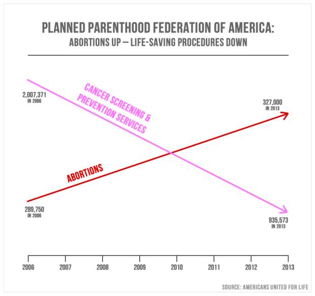
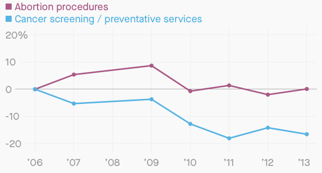
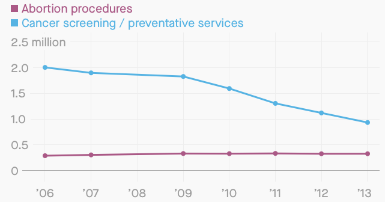

```{r setup_pres, include=FALSE, echo=FALSE}
rm(list=ls())
library('tidyverse')
library('gridExtra')
library('broom')
library('cowplot')

#setwd("~/Dropbox/z MyStuff Dropbox/Swat docs/Stat 21/Class2_files")
options(htmltools.dir.version = FALSE)
knitr::opts_chunk$set(fig.height=4, fig.path='Figs/',
                      echo=TRUE, warning=FALSE, message=FALSE)
BeefTable <- read_table2("BeefDemand.txt", col_names = TRUE) 
BeefTable2 <- BeefTable %>% rename('RDPI_transformed' = '(RDPI-Mean)^sq' )
```

```{css, echo=FALSE}
pre {
  background: #FFBB33;
  max-width: 100%;
  overflow-x: scroll;
}
```

# Topics covered in today's lecture

Laptops out! 

If you have RStudio installed then go ahead and open it, otherwise, go to https://RStudio.swarthmore.edu. 

Also go to Moodle to access the data and data description files for the beef consumption study.

 - Revisit the beef consumption data and data visualization. 
 
--
By the end of this lecture, you should be ready to start HW 1. Homework is designed to take you a handful of hours each week. (If it's much more or less, please let me know.) 


---
# US Beef Consumption Analysis from the 80s

Examine the column (i.e. variable) names in the data set:
```{r beefNames, echo=FALSE} 
BeefTable2 %>% names() 
```

What are the answers to the four **critical questions** in this example? 

1. What are the observational units?

1. What are the variables in this study, what type of variables are they, and which roles do they each play?

1. Is the study observational or is it an experiment?

1. Does the study use random sampling, random assignment, both or neither?


---
# What does no evidence of a relationship look like? 

All of the following plots show no evidence of a relationship between the predictor and the response variables.
This is because there truly is no relationship in these examples! 
The data (response and predictor variables) were generated independently

```{r figNoRelationshipClass2, echo=FALSE, warning=FALSE, message=FALSE, fig.height = 4, fig.width = 10, fig.align = 'center'}
X_unif <- runif(100, min = 140, max = 240)
Y_unif <- runif(100, min = 140, max = 240)
p11 <- ggplot() + geom_point(mapping = aes(x = X_unif, y = Y_unif)) +
  labs(title="(Independent) Uniform \n random Variables", 
       x = "X", y = "Y")

X_norm <- rnorm(100, mean = 180, sd = 3)
Y_norm <- rnorm(100, mean = 180, sd = 3)
p22 <- ggplot() + geom_point(mapping = aes(x = X_norm, y = Y_norm)) +
  labs(title="(Independent) Normal \n random variables",
       x = "X", y = "Y")

X_pois <- rpois(100, lambda = 180)
Y_pois <- rpois(100, lambda = 180)
p33 <- ggplot() + geom_point(mapping = aes(x = X_pois, y = Y_pois)) +
    labs(title="(Independent) Poisson \n random variables",
         x = "X", y = "Y")


grid.arrange(grobs=list(p11,p22,p33), widths=c(4,4,4), layour_matrix=c(1,2,3))

```


---
# A look at this model for US beef consumption

```{r figBeefDataClass2, echo=FALSE, warning=FALSE, message=FALSE, fig.height=6, fig.width=10}
p1 <- ggplot() + 
      geom_point(data=BeefTable2, aes(BeefConsump, Year)) + 
      labs(x="Year", y="Beef Consumption")
p2 <- ggplot() + 
      geom_point(data=BeefTable2, aes(BeefConsump, RealChickenPrice)) + 
      labs(x="Price of Chicken", y="Beef Consumption")
p3 <- ggplot() + 
      geom_point(data=BeefTable2, aes(BeefConsump, RealBeefPrice)) + 
      labs(x="Price of Beef", y="Beef Consumption")
p4 <- ggplot() + 
      geom_point(data=BeefTable2, aes(BeefConsump, RealDPI)) + 
      labs(x="Disposable Personal Income", y="Beef Consumption")

grid.arrange(grobs =list(p1, p2, p3, p4), 
             widths= c(4,4,4,4),
              layout_matrix=rbind(c(1,2), c(3,4))) 
```

---
# Visualizing data 

```{r figHistogramClass2, echo=FALSE, warning=FALSE, message=FALSE, fig.height = 4, fig.width = 10, fig.align = 'center'}
hist1 <- ggplot() + aes(x=X_norm) + #ylim(0, 50) +
  labs(title="Bars too narrow", x="Height (in cm)", y="Count") +
  geom_histogram(aes(y = ..count..), binwidth = 0.5, colour="black", fill="gray")

hist2 <- ggplot() + aes(x=X_norm) + #ylim(0, 50) +
  labs(title="Bars too wide", x="Height (in cm)", y="Count") +
  geom_histogram(aes(y = ..count..), binwidth = 6, colour="black", fill="gray")

hist3 <- ggplot() + aes(x=X_norm) + geom_density() + ylim(0, 1) +
  labs(title="Appropriate bin size", subtitle= "Proportions (not counts)", x="Height (in cm)", y="Density") +
  geom_histogram(aes(y=..density..), colour="black", fill="gray")

grid.arrange(#hist1, hist2, hist3, nrow=1
             grobs = list(hist1, hist2, hist3),
             widths = c(3, 3, 3),
             layout_matrix = rbind(c(1, 2, 3)))  #, c(3, NA)) ))
```

Histograms are a way of counting frequency/prevalence. The total **area** of the bars represents the total occurrences of each category/interval. Once rescaled to represent portions rather than counts, histograms are graphical approximations for the **densities** of the population under study.  


---
# Some examples of bad plots<sup>[2]</sup>


```{r, echo=FALSE, out.height = "250px", out.width = "600px"}

```

.footnote[[2] https://www.politifact.com/truth-o-meter/statements/2015/oct/01/jason-chaffetz/chart-shown-planned-parenthood-hearing-misleading-/

For more fun with bad graphs see, e.g., https://venngage.com/blog/misleading-graphs/, or do an internet search for your own examples.]

---
# Some examples of bad plots<sup>[2]</sup>


```{r, echo=FALSE, out.height = "250px", out.width = "600px"}

```

**Note:** Often, the thing that makes a plot bad is a scaling issue. 

.footnote[[2] https://www.politifact.com/truth-o-meter/statements/2015/oct/01/jason-chaffetz/chart-shown-planned-parenthood-hearing-misleading-/

For more fun with bad graphs see, e.g., https://venngage.com/blog/misleading-graphs/, or do an internet search for your own examples.]

---
# Some examples of bad plots - fixed


```{r, echo=FALSE, out.height = "250px", out.width = "600px"}



```


---
# Introduction to R Studio  

- Personalize the layout and the display

- Output 

  - Console

- Input

  - Document types

  - How to run code (Mac vs PC)
  
- Environment/History/Connections
  
  - Clear variables

- Files/Plots/Packages/Help/Viewer
  
  - Set working directory
  
  - R help documentation
  

---
# Resources for learning to program in R 

- R package *swirl()* for tutorials (part of HW 1)
- Google is your friend! (and Stack Exchange, etc.)
- R for Data Science (free online textbook) https://r4ds.had.co.nz/


# Introduction to R packages

- Installing vs calling
- The R package *tidyverse* is an "umbrella-package"" that installs several other packages that are useful for data analysis, e.g. tidyr, dplyr, ggplot2, tibble.


---
# Let's look at some data

```{r import_data, echo=TRUE, warning=FALSE}
rm(list = ls())
#install.packages("tidyverse") ##should also install the dependencies "ggplot2" (for visualizing data) and "margrittr" (for piping)
library("tidyverse")
#setwd("~/Dropbox/z MyStuff Dropbox/Swat docs/Stat 21/Class2_files")  ###NOTE: you must set this to your own directory! 
read_table2("normtemp_data.txt") 
```

---
# Let's look at some data

```{r echo=FALSE, warning=FALSE}
read_table2("normtemp_data.txt") 
```


All of the columns were imported as type "double". Is this what we want?


.footnote[https://magazine.amstat.org/blog/2019/03/01/evolutionofvariables/]


---
# Let's look at some data

Now we can create a data "object" which we will call *body_temp_dat*.

```{r import_data2, echo=TRUE, warning=FALSE}
body_temp_dat <- read_table2("normtemp_data.txt", 
                        col_types = list(col_double(),col_character(),col_double()))
body_temp_dat %>% head() 
```


