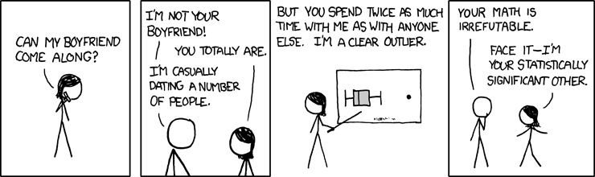
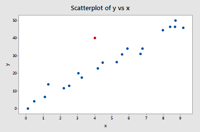
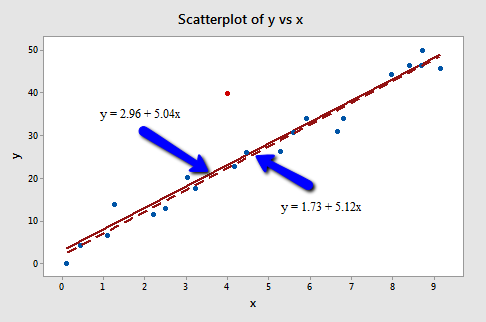
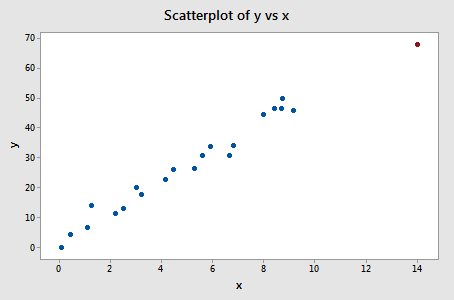
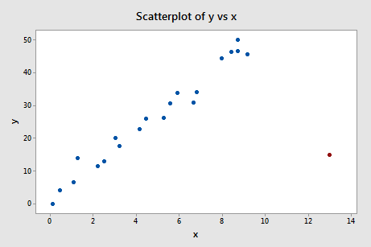
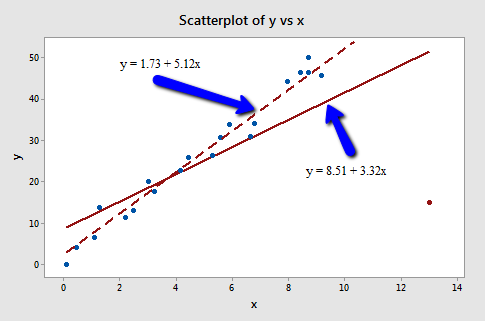

```{r setup_pres, include=FALSE, echo=FALSE}
#devtools::install_github("ropenscilabs/icon")
#devtools::session_info('rmarkdown')

rm(list=ls())
library('tidyverse')
library('gridExtra')
library('broom')
library('cowplot')

library("RefManageR")
library("DT")


#setwd("~/Google Drive Swat/Swat docs/Stat 21/Class13_files")
#setwd("~/Drive/Swat docs/Stat 21/Class9_files")
options(htmltools.dir.version = FALSE)
knitr::opts_chunk$set(fig.path='Figs/',echo=TRUE, warning=FALSE, message=FALSE)

```

```{css, echo=FALSE}
pre {
  background: #FFBB33;
  max-width: 100%;
  overflow-x: scroll;
}

.scroll-output {
  height: 75%;
  overflow-y: scroll;
}

.scroll-small {
  height: 50%;
  overflow-y: scroll;
}
   
.red{color: #ce151e;}
.green{color: #26b421;}
.blue{color: #426EF0;}
```

 
```{r, comic31, echo=FALSE, fig.align='center', out.height=350}

```

.footnote[https://xkcd.com/539/]


---
## Outline for today's class 


- Final project 

- Grading timeline 

- Outliers, leverage, and influential points

.footnote[This lesson is based heavily on the material at https://newonlinecourses.science.psu.edu/stat462/node/170/ ]


---
## Outliers

In order to justify eliminating an outlier from the data set there must
be strong non-statistical evidence that this is a "bad" observation.
It is OK to re-fit the regression model to the data with outlier(s)
omitted and compare the results to the model fit to then entire data
set for comparison.


  > An outlier is a data point whose **response** does not follow the general trend of the rest of the data.
  

---
## Dectecting outliers
### Studentized residuals 

Similar to the idea of "standardizing" data, we can transform the residuals to make any outliers more obvious to us. Studentized residuals are calculated by dividing each residual by it's standard error. (Note: just like the estimated model coefficients $\hat{\beta}$'s, the residuals also have their own standard errors!)

This is somewhat confusing because we have to keep in mind this distinction between the residuals and the random errors. The former is kind of a estimate of observations of the latter. The residuals, unlike the random errors, do not all have the same variance! (Think about the subjectivity in checking the constant variance assumption...)

One thing we can consider are residual plots with the studentized residuals. Or we can conduct a hypothesis test on the most extreme studentized residual(s), keep in mind however this would be an example of statistical .red[inference]. 

---
## Leverage points

Leverage points are similar to the idea of extrapolation. These are observed data points that seem to be far away from the other data points with respect to one or more of the predictor variables. 

  
  > A data point with high leverage is one which has extreme **predictor** values. 


---
## Influential points

Influential data points can be outliers and/or leverage points. They are *influential* because they indicate an imbalance in the amount of information contained in each data point.


  > A data point is influential if it unduly influences any part of a regression analysis (e.g. the predicted responses, the estimated slope coefficients, or  hypothesis test results).


---
## Influential points


Recall, the **constant variance** assumption necessary for both estimation and inference with linear regression. The assumption of homoscedasity implies that all observed data points are equal in the amount of information they carry.


Thus, influential points pose a **fundamental problem** in regression analysis and can lead to bizarre regression models (e.g. regression coefficients with the wrong sign, known important predictor variables not being statistically significant, poor
predictive power of a well-fitting model). 


**Q:** How do we determine if an outlier or high leverage data point is influential?


--
**A:** We need to "investigate" these data points. Let's go through a few examples to illustrate this process.


.footnote[Note that we haven't discussed how to determine predictive power yet, will we cover this in a later lecture.] 


---
## Plotting example 1  


```{r, plot131, echo=FALSE, fig.align='center', out.height=350}
knitr::include_graphics("Figs/plot1.png")
```


--
All of the data points follow the general trend of the rest of the data so there are no outliers; and, none of the data points are extreme with respect to the predictor variable, so there are no high leverage points. Therefore, no data points appear to be influential. 


---
## Plotting example 2 


```{r, plot231, echo=FALSE, fig.align='center', out.height=350}

```


--
The red data point does not follow the general trend of the rest of the data with respect to the response so it is an outlier. However, this point does not have an extreme predictor value, so it does not have high leverage. The question remains is this point influential? 


---
## Plotting example 2


```{r, plot2_line31, echo=FALSE, fig.align='center', out.height=350}

```


--
The estimated regression lines hardly change at all indicating that this point is not very influential with respect to .blue[estimation]. 


**Q:** What about influential with respect to .red[inference]?


---
## Plotting example 3


```{r, plot331, echo=FALSE, fig.align='center', out.height=350}

```


--
The red data point **does** follow the general trend of the rest of the data with respect to the response variable so it is an outlier. However, this point does have an extreme x value, so it does have high leverage. Is this point influential? 


---
## Plotting example 3


```{r, plot3_with_line31, echo=FALSE, fig.align='center', out.height=350}
knitr::include_graphics("Figs/plot3_with_lines.png")
```


--
Based on comparing the estimated regression models with and without this data point, we see little difference in the estimated regression equation. So although this point has high leverage, it is not influential. 


---
## Plotting example 4


```{r, plot431, echo=FALSE, fig.align='center', out.height=350}

```


--
The red data point in this example is both an outlier (with respect to the response variable) and has high leverage (with respect to the predictor). 


---
## Plotting example 4


```{r, plot4_with_line31, echo=FALSE, fig.align='center', out.height=350}

```


Since the estimated regression line changes pretty dramatically depending on whether or not we include the red point, this is an example of an influential point. 


---
## Quantifying influence of points 
### Dfbetas and hat values 

Often, we plot the following measures of outlier-ness and legerage versus the indecies of the observed data points to easily detect potentially influential points. 

  - *Dfbetas* - measure how much an individual coefficient changes when the $i^{th}$ data point is deleted.
  
  - *hat values* - indicate the potential for leverage.
  

<a href="http://omaymas.github.io/InfluenceAnalysis/">Here</a> is an interactive plotting tool to visualize different examples of possibly influential data points in a SLR example. 

---
## A word of caution...

  > "All discussions to this point have assumed that the least squares
assumptions of normality, common variance, and independence are valid,
and that the data are correct and representative of the intended
populations. 

  > In reality, the least squares assumptions hold only *approximately* and one can expect the data to contain either errors or observations that are somewhat unusual compared to the rest of the data."
  
  
   
- Applied regression Analysis: A Research Tool


---
## How to deal with potentially problematic data points? 

Step 1: check for an obvious data error

    - Correct possible data entry or data collection errors.
    - If the data point is not representative of the population under study it can be deleted.
    - If the data point is a procedural error and invalidates the measurement, delete it.
    
    
Step 2: If non of the above hold, next consider the possibility that you might have just misformulated your regression model:

    - Did you leave out any important predictors?
    - Should you consider adding some interaction terms?
    - Is there any nonlinearity that needs to be modeled via variable transformations?
    - If nonlinearity is an issue, one possibility is to just reduce the scope of your model. If you do reduce the scope of your model, **report** this so that readers do not misuse your model.


---
## How to deal with potentially problematic data points? 

Step 3: Finally, it's time to decide whether or not deleting a data point is warranted. 

    - Do not delete data points just because they do not fit your preconceived regression model.
    - You must have a good, objective reason for deleting data points.
    - If you delete any data after you've collected it, justify and describe it in your **report**.
    - If you are not sure what to do about a data point, analyze the data both with and without the data point and **report** the results of both analyses.
    
    
**In summary:** use your common sense and any domain knowledge about the problem, and just be transparent with the decisions you made in you analysis. 
