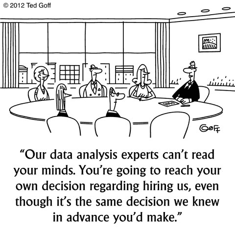

```{r setup_pres, include=FALSE, echo=FALSE}
#devtools::install_github("ropenscilabs/icon")
#devtools::session_info('rmarkdown')

rm(list=ls())
library('tidyverse')
library('gridExtra')
library('broom')
library('cowplot')

library("RefManageR")
library("DT")

#setwd("~/Drive/Swat docs/Stat 21/Class9_files")
options(htmltools.dir.version = FALSE)
knitr::opts_chunk$set(fig.path='Figs/',echo=TRUE, warning=FALSE, message=FALSE)

```

```{css, echo=FALSE}
pre {
  background: #FFBB33;
  max-width: 100%;
  overflow-x: scroll;
}

.scroll-output {
  height: 75%;
  overflow-y: scroll;
}

.scroll-small {
  height: 50%;
  overflow-y: scroll;
}
   
.red{color: #ce151e;}
.green{color: #26b421;}
.blue{color: #426EF0;}
```

 
```{r, comic32, echo=FALSE, fig.align='center', out.height=500}

```


.footnote[https://www.kdnuggets.com/2012/06/data-science-cartoon.html]
  
  
---
## Variable selection methods
### Tukey's pairwise comparisons 

To determine if the different levels of a categorical variable are significantly different with respect to the response variable, we can use Tukey's Honest Significant Difference (Tukey's HSD)

$$y_{ij}= \mu_i + \epsilon_{ij}$$
for $j=1,\dots,n_i$ and $i=1,\dots,k$

Tukey HSD tests all possible differences: $H_0:$ $\mu_{i_1} = \mu_{i_2}$, for all $i_1 \neq i_2$ in $i=1,\dots,k$.


---
## Variable selection methods
### Tukey's pairwise comparisons 

It can be confusing and even seemingly paradoxical to try to understand the output of Tukey's pairwise comparisons. What you have to keep in mind is that in statistical hypothesis tests, you never *accept the null hypothesis*, instead you "fail to reject"" it.


  - Since this is a test for a difference in means it doesn't apply if you are including an interaction term for a categorical and numerical predictor variable in your model. 
  
  - Tukey's HSD is basically just a t-test for the difference in means; but it's modified to take into account doing multiple tests on the same data set; 
  
  - This method only works if the sample sizes are about the same across each group (alternate methods exist). 


---
## Variable selection methods

**Tukey pairwise comparisons for levels of categorical variables**

.scroll-output[
```{r}
msleep2 <- msleep %>% filter(order == "Afrosoricida" |
                             order == "Artiodactyla" |
                             order == "Carnivora" ) %>% 
           mutate(order_cat = fct_infreq(order)) %>%
           select(order_cat, sleep_total)
SLR_msleep <- lm(sleep_total ~ order_cat, data=msleep2)
aov_msleep <- aov(sleep_total ~ order_cat, data=msleep2)
msleep_tukey <- TukeyHSD(aov_msleep, conf.level=0.95)
msleep_tukey

library(multcomp)
summary(glht(aov_msleep, linfct = mcp(order_cat = "Tukey")))
```
]


---
## Variable selection methods
### Tukey pairwise comparisons for levels of categorical variables

**Interpretation:** Do the Tukey HSD CIs contain zero? 

  - If so, then we do not have enough evidence to indicate that the average sleeping time for these two orders is significantly different. 
  
  - If not, then we can conclude that there is a statistically significant difference in the average sleeping time between the two orders. 


---
## Variable selection methods

**Tukey pairwise comparisons for levels of categorical variables**

.scroll-output[
```{r tukeyHSDplot, fig.align='center',fig.height=5}
plot(TukeyHSD(aov_msleep, conf.level=0.95))
```
]

---
## Variable selection methods

**Tukey pairwise comparisons for levels of categorical variables**
.scroll-output[
```{r tukeyHSDplot2, fig.align='center',fig.height=5}
Tm2 <- glht(aov_msleep, linfct = mcp(order_cat = "Tukey"))
plot(Tm2)
```
]


---
## General good practices

  - Look carefully at residual plots to verify if the required assumptions are reasonable given the observed data. 

  - It's practically always more useful to report an actual p-value or confidence interval than just reporting an "accept/reject" decision.

  - If the units of measurement are practically meaningful, then try to use unstandardized measures rather than standardized measures. 

  - "Accepting the null hypothesis" is not a valid conclusion of a hypothesis test. 

  - Always provide some effect size estimate (in useful units) when reporting a p value. 

 > "There is no substitute for graphical analysis of assumptions."[4]


---
## General good practices (continued)

If a study design is not a carefully randomized design, avoid inferring causality from your results. ("Even in randomized experiments, attributing causal effects to any one aspect of the treatment condition requires support from additional experimentation.")


If you are construing a randomized design you must explain the logic behind which predictors are included and explore rival hypotheses that might explain otherwise explain your results. 


When interpreting model effects, consider: credibility, generalizability, and robustness. 

  - Are the effects credible, given the results of previous studies and theory? 

  - Do things like the sample quality, the similarity of the study design to designs of previous studies, the similarity of the effects to those in previous studies suggest that your results are *generalizable*? 
  
  - Are the design and analytic methods robust enough to support strong conclusions?

---
## Variable selection methods
### Avoid these methods

**Stepwise regression**

Although this method is popular, easy to understand, and commonly taught in a first course in regression, it preforms very poorly and is not recommended. Generally, you're better off thinking about the problem and the data itself to select predictors than to blindly apply a streetwise selection criteria. 


**Individual t-tests**

Try to avoid making decisions about whether or not to include predictors in a model based on the individual tests for the "statistical significance" of each parameter's coefficient. Instead, consider the performance of the model overall. 


---
## References

[1] https://www.analyticsvidhya.com/blog/2016/03/practical-guide-principal-component-analysis-python/


[2] https://www.stat.cmu.edu/~cshalizi/mreg/15/lectures/21/lecture-21.pdf


[3] http://onlinestatbook.com/2/tests_of_means/pairwise.html


[4] Statistical Methods in Psychology Journals: Guidelines and Explanation by Leland Wilkinson and the Task Force on Statistical Inference. (1999) American Psychological Association. 54:8.


https://www.apa.org/pubs/journals/releases/amp-54-8-594.pdf


[CW: mentions of child sexual abuse and treats gender as a binary variable]


