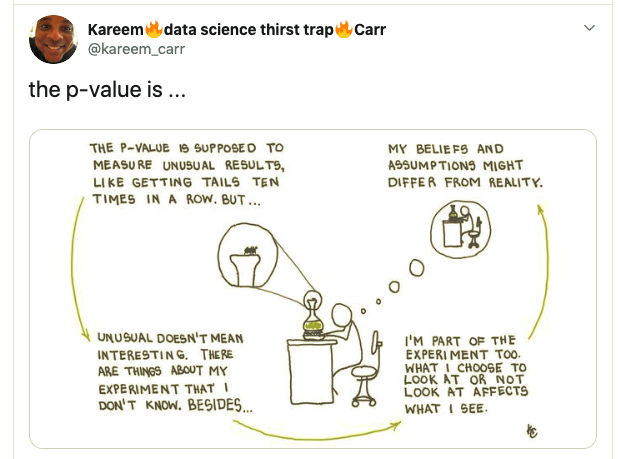

```{r setup_pres, include=FALSE, echo=FALSE}
rm(list=ls())
library('tidyverse')
library('gridExtra')
library('broom')
library('cowplot')
#library('fivethirtyeight')

#setwd("~/Dropbox/z MyStuff Dropbox/Swat docs/Stat 21/Class7_files")
options(htmltools.dir.version = FALSE)
knitr::opts_chunk$set(fig.height=4, fig.path='Figs/',
                      echo=TRUE, warning=FALSE, message=FALSE)
```

```{css, echo=FALSE}
pre {
  background: #FFBB33;
  max-width: 100%;
  overflow-x: scroll;
}
```


```{r, echo=FALSE, fig.height = 4, fig.align='center'}


#Come see me about HW 1: 
#  - Bing Tu
#  - Jose Valdivia
#  - Colin Perkins-Taylor 
```


---

# Topics covered in today's lecture

  - Determining normality with Quantile-Quantile (QQ) plots
  - Simple linear regression
  
  


```{r import_data, echo=FALSE, warning=FALSE, include=FALSE}
rm(list = ls()) ## this just makes sure that you are starting R with a fresh slate (so nothing is automatically loaded in your environment)

library("tidyverse")
coverage <- read_csv("./ocs-healthexpenditure-master/data/KFF/healthcare-coverage.csv", 
                     skip = 2, col_names = TRUE)
coverage <- read_csv("./ocs-healthexpenditure-master/data/KFF/healthcare-coverage.csv", 
                     skip = 2, col_names = TRUE,
                     n_max  = which(coverage$Location == "Notes")-1)
head(coverage)

spending <- read_csv("./ocs-healthexpenditure-master/data/KFF/healthcare-spending.csv", 
                     skip = 2, col_names = TRUE)
spending <- read_csv("./ocs-healthexpenditure-master/data/KFF/healthcare-spending.csv", 
                     skip = 2, col_names = TRUE,
                     n_max  = which(spending$Location == "Notes")-1)
head(spending)
######

coverage <- gather(coverage, "year_type", "tot_coverage", -Location)
spread(coverage, year_type, tot_coverage)
coverage %>% separate(year_type, sep="__", into=c("year", "type"))
coverage <- 
  coverage %>% 
  separate(year_type, sep="__", 
           into=c("year", "type"), 
           convert = TRUE)

coverage <- 
  coverage %>% 
  mutate_at("tot_coverage", as.integer)

# Add the abbreviation of States
coverage$abb <- state.abb[match(coverage$Location, state.name)]
coverage$region <- state.region[match(coverage$Location, state.name)]

coverage
# Add the abbreviation of States
coverage$abb <- state.abb[match(coverage$Location, state.name)]
coverage$region <- state.region[match(coverage$Location, state.name)]

coverage

spending <- gather(spending, "year", "tot_spending", -Location)
spending <- 
  spending %>% 
  separate(year, sep="__", into=c("year", "name"), convert = TRUE) %>% 
  select(-name)


coverage %>% 
  select(year:type)
coverage %>% 
  select(starts_with("t"))

coverage %>% 
  filter(Location == "Maryland", 
         year > 2014)

hc <- inner_join(coverage, spending, by = c("Location", "year"))
hc <- hc %>% 
  filter(Location != "United States")
pop <- hc %>% 
  filter(type == "Total") %>% 
  select(Location, year, tot_coverage)
hc <- hc %>% 
  filter(type != "Total") %>% 
  left_join(pop, by = c("Location", "year")) %>% 
  rename(tot_coverage = tot_coverage.x, tot_pop = tot_coverage.y)

hc.employer.2013 <- hc %>% filter(type == "Employer", year == "2013")
#plot(hc.employer.2013$tot_spending, hc.employer.2013$tot_coverage, log = "xy", xlab = "spending", ylab = "coverage")

#par(mfrow=c(1,2))
#plot(hc.employer.2013$tot_pop, hc.employer.2013$tot_coverage, log = "xy", xlab = "population size", ylab = "coverage")
#plot(hc.employer.2013$tot_pop, hc.employer.2013$tot_spending, log = "xy", xlab = "population size", ylab = "spending")

hc <- hc %>% 
    mutate(prop_coverage = tot_coverage/tot_pop) 
hc <- hc %>% 
  mutate(spending_capita = (tot_spending*1e6) / tot_pop)
hc.employer.2013 <- hc %>%
  filter(type == "Employer", year == "2013")
#plot(hc.employer.2013$spending_capita,hc.employer.2013$prop_coverage, log = "xy", xlab = "spending per capita", ylab = "proportion of Employer coverage")

#hc %>%
#  filter(type == "Employer", year == "2013") %>% 
#  ggplot(aes(x = spending_capita, y = prop_coverage)) + 
#  geom_point() + 
#  xlab("spending per capita") + 
#  ylab("coverage proportion")
```

---
# Research questions for healthcare data 

```{r }
head(hc)  ##health care data
names(hc)
```

---
# Research questions for healthcare data 

1. What does the proportion of people covered by healthcare look like across the US? Does it look Normally distributed? 

1. Is there a relationship between healthcare coverage and healthcare spending in the United States?


For now, let's restrict our investigation to healthcare coverage provided by employers in the year 2013. We have a total of 52 data points. 


.footnote[Source: 
Kuo, Pei-Lun and Jager, Leah and Taub, Margaret and Hicks, Stephanie. (2019, February 14). opencasestudies/ocs-healthexpenditure: Exploring Health Expenditure using State-level data in the United States (Version v1.0.0). Zenodo. http://doi.org/10.5281/zenodo.2565307]
---
# How to determine if the population from which you sampled is Gaussian? 


```{r hcPlot, echo=FALSE, warning=FALSE, fig.height = 4, fig.width = 10, fig.align = 'center'}
hc.employer.2013 <- hc %>%
  filter(type == "Employer", year == "2013")
ggplot() + geom_density(data=hc.employer.2013, aes(prop_coverage)) + xlim(0, 1) + labs(x="Proportion of people covered by employer")
```


---
# Normal probability plots

A visually, easier to detect comparison is to look at the <a href="https://en.wikipedia.org/wiki/Quantile">quantiles</a> of the observed data and compare them to some hypothetical quantiles of a Gaussian<sup>[1]</sup> distribution. To do this, we plot the *standardized and ordered* data (from smallest to largest), $$(x^{(1)}, x^{(2)}, \dots, x^{(n)})$$
against $E[X^{(i)}],$ the expected value of the order statistics from a *standard* (mean 0 and s.d. 1) Gaussian distribution. 


Such **QQ plots (Quantile-quantile plots)** generalize to other distributions as well (e.g. Gamma, Beta, etc). These plots help us answer the question: "Is the distribution of the data similar to a Gaussian (or Gamma, etc) distribution?" 


***
.footnote[[1] Gaussian is just another name for the Normal distribution. (Sometimes it's used because we just the word "normal" so often in English that it can be confusing when talking about Statistics.)]


---
# What are <a href="https://en.wikipedia.org/wiki/Quantile">quantiles</a>?


R can find the quantiles for any common distribution functions very easily:

```{r findQuantiles, echo=TRUE, warning=FALSE}
?qnorm
normal_quantiles <- qnorm(p=seq(0,1,0.1), mean=0, sd=1, lower.tail=TRUE)
t_quantiles <- qt(p=seq(0,1,0.1), df=129, lower.tail=TRUE)
normal_quantiles; t_quantiles
```

.footnote[Here is a useful guide to all the base R density, distribution, quantile, and random generating functions: http://www.stat.umn.edu/geyer/old/5101/rlook.html]

---
# Example of finding a sample quantile

Find the number in the following set of data where 20 percent of values fall below it, and 80 percent fall above:

1 3 5 6 9 11 12 13 19 21 22 32 35 36 45 44 55 68 79 80 81 88 90 91 92 100 112 113 114 120 121 132 145 146 149 150 155 180 189 190
***

**Step 1:** Order the data from smallest to largest. The data in the question is already in ascending order.


**Step 2:** Count how many observations you have in your data set. this particular data set has 40 items.


**Step 3:** Convert any percentage to a decimal for “q”. We are looking for the number where 20 percent of the values fall below it, so convert that to .2.


**Step 4:** Insert your values into the formula:

ith observation $= q (n + 1)$

ith observation $= .2 (40 + 1) = 8.2$


---
# Example of finding a sample quantile

Find the number in the following set of data where 20 percent of values fall below it, and 80 percent fall above:

1 3 5 6 9 11 12 13 19 21 22 32 35 36 45 44 55 68 79 80 81 88 90 91 92 100 112 113 114 120 121 132 145 146 149 150 155 180 189 190
***

Or, just use R! Because R can also very easily find sample quantiles. 

```{r findQuantiles2, echo=TRUE, warning=FALSE}
?quantile
my_samp <- c(1, 3, 5, 6, 9, 11, 12, 13, 19, 21, 22, 32, 35, 36, 45, 44, 55, 68, 79, 80, 81, 88, 90, 91, 92, 100, 112, 113, 114, 120, 121, 132, 145, 146, 149, 150, 155, 180, 189, 190)
quantile(my_samp, probs = 0.2)
```


.footnote[https://www.statisticshowto.datasciencecentral.com/quantile-definition-find-easy-steps/]


---
# Interpreting Normal probability plots 
## (I.e. QQ plots for Normality)

Interpretation: A linear relationship close to the diagonal line $x=y$ indicates a close matching of your observed data with a Normal distribution. 


For example, let's create a fake data set from a Normal distribution and view a QQ plot for this data (in-class change sample size 50 to 500):

```{r qqPlotFakeClass7, echo=TRUE, warning=FALSE, results='hide'}
set.seed(100)
fake_dat <- tibble(observedData = rnorm(n=50,mean=3,sd=1.2))  ##fake ddata that is reprodcible becase I set the random seed
plot1 <- ggplot(data = fake_dat) +
         labs(title = "Normal probability plot", 
              subtitle = "Fake data from a Normal distribution",
              x = " ") #Here I greate the plot object (and give it a name) 

plot1 + aes(sample=observedData) + stat_qq() + stat_qq_line()  ##this line calls the plot object into view and adds to it a QQ plot of the sample and line.
```

---
# Interpreting Normal probability plots 
## (I.e. QQ plots for Normality)

Interpretation: A linear relationship close to the diagonal line $x=y$ indicates a close matching of your observed data with a Normal distribution. 


For example, let's create a fake data set from a Normal distribution and view a QQ plot for this data:

```{r qqPlotFakeClass7_2, echo=FALSE, warning=FALSE}
set.seed(100)
fake_dat <- tibble(observedData = rnorm(n=500,mean=3,sd=1.2))  ##fake ddata that is reprodcible becase I set the random seed
plot1 <- ggplot(data = fake_dat) +
         labs(title = "Normal probability plot", 
              subtitle = "Fake data from a Normal distribution",
              x = " ") #Here I greate the plot object (and give it a name) 

plot1 + aes(sample=observedData) + stat_qq() + stat_qq_line()  ##this line calls the plot object into view and adds to it a QQ plot of the sample and line.
```


---
# Interpreting Normal probability plots 
##(I.e. QQ plots for Normality)

Now lets investigate the health care data to see if the proportion of people covered is Normally distributed (over all 52 states).  

```{r qqPlotHCclass7, echo=TRUE, warning=FALSE}
plot1 <- ggplot(hc.employer.2013, aes(sample = prop_coverage))

plot1 + stat_qq() + stat_qq_line() + labs(title = "Normal probability plot", subtitle = "Employer health care coverage")
```


---
# Interpreting Normal probability plots 
##(I.e. QQ plots for Normality)


```{r qqPlotHCclass7_2, echo=FALSE, warning=FALSE, fig.height = 4, fig.width = 10, fig.align = 'center'}
plot1 <- ggplot(hc.employer.2013, aes(sample = prop_coverage))

plot1 + stat_qq() + stat_qq_line() + labs(title = "Normal probability plot", subtitle = "Employer health care coverage")
```


**Q:** What do the deviations in the tails mean? 

---
# Interpreting Normal probability plots 
##(I.e. QQ plots for Normality)


```{r qqPlotTempClass7, echo=FALSE, warning=FALSE, fig.height = 4, fig.width = 10, fig.align = 'center'}
plot1 <- ggplot(hc.employer.2013, aes(sample = prop_coverage))

plot1 + stat_qq() + stat_qq_line() + labs(title = "Normal probability plot", subtitle = "Employer health care coverage")
```


**A:** The most deviation from Normality seems to be that the upper quantiles of the sample are smaller than we'd expect. That means, our data may have *lighter tails* to the right than what we'd expect from a truly Normal distribution. (I.e. the data may be skewed.) Does this make sense? 


---
# QQ plot to test for t-distributed data

Even though a t-distribution has **heavier** tails than a Normal distribution, for illustrative purposes, let's build a QQ-plot that  compares the data to a t-distribution.

```{r qqPlotHCclass7_3, echo=TRUE, warning=FALSE, fig.height = 4, fig.width = 10, fig.align = 'center'}
deg_of_free = list(df = length(hc.employer.2013$prop_coverage)-1)
plot2 <- ggplot(hc.employer.2013, aes(sample = prop_coverage))
plot2 + stat_qq(distribution = qt, dparams = deg_of_free) + #Note: the default option for distribution is "qnorm" and dparas is a list of "0" and "1"
  stat_qq_line(distribution = qt, dparams = deg_of_free) + 
  labs(title = "T-distribution probability plot", subtitle = "Employer health care coverage")
```


---
# Comment about statistical significance 


  1. Statistical significance does not equal practical significance. (E.g. if we examine the relationship between height and salary for adults, finding that every additional inch of height has a predictive effect on salary of about &#36;10 per inch, with a standard error of about &#36;2) this isn't as practically useful as say, finding a predictive effect of &#36;10,000 per inch with a standard error of &#36;5000.)
  
  1. Changes in statistical significance are not themselves significant. (E.g. the actual difference between a p-value of 0.051 and 0.049 is very small, even though with an $\alpha$ level of $0.05$ they differ in statistical significance.)


.footnote[Reading reference: pg 22 Gelman and Hill ]


