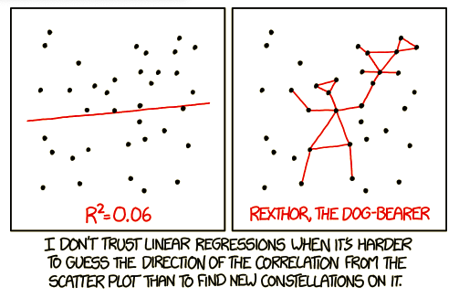

```{r setup_pres, include=FALSE, echo=FALSE}
rm(list=ls())
library('tidyverse')
library('gridExtra')
library('broom')
library('cowplot')

setwd("~/Google Drive Swat/Swat docs/Stat 21/Class8_files")
options(htmltools.dir.version = FALSE)
knitr::opts_chunk$set(fig.height=4, fig.path='Figs/',
                      echo=TRUE, warning=FALSE, message=FALSE)
```

```{css, echo=FALSE}
pre {
  background: #FFBB33;
  max-width: 100%;
  overflow-x: scroll;
}
```
```{r import_data, echo=FALSE, warning=FALSE, include=FALSE}
rm(list = ls()) 

library("tidyverse")
coverage <- read_csv("healthcare-coverage.csv", 
                     skip = 2, col_names = TRUE)
coverage <- read_csv("healthcare-coverage.csv", 
                     skip = 2, col_names = TRUE,
                     n_max  = which(coverage$Location == "Notes")-1)
head(coverage)

spending <- read_csv("healthcare-spending.csv", 
                     skip = 2, col_names = TRUE)
spending <- read_csv("healthcare-spending.csv", 
                     skip = 2, col_names = TRUE,
                     n_max  = which(spending$Location == "Notes")-1)
head(spending)
######

coverage <- gather(coverage, "year_type", "tot_coverage", -Location)
spread(coverage, year_type, tot_coverage)
coverage %>% separate(year_type, sep="__", into=c("year", "type"))
coverage <- 
  coverage %>% 
  separate(year_type, sep="__", 
           into=c("year", "type"), 
           convert = TRUE)

coverage <- 
  coverage %>% 
  mutate_at("tot_coverage", as.integer)

# Add the abbreviation of States
coverage$abb <- state.abb[match(coverage$Location, state.name)]
coverage$region <- state.region[match(coverage$Location, state.name)]

coverage
# Add the abbreviation of States
coverage$abb <- state.abb[match(coverage$Location, state.name)]
coverage$region <- state.region[match(coverage$Location, state.name)]


spending <- gather(spending, "year", "tot_spending", -Location)
spending <- spending %>% separate(year, sep="__", into=c("year", "name"), convert = TRUE)# %>% select(-name)


coverage %>% select(year:type)
coverage %>% select(starts_with("t"))

coverage %>% filter(Location == "Maryland", year > 2014)

hc <- inner_join(coverage, spending, by = c("Location", "year"))
hc <- hc %>% 
  filter(Location != "United States")
pop <- hc %>% 
  filter(type == "Total") %>% 
  select(Location, year, tot_coverage)
hc <- hc %>% 
  filter(type != "Total") %>% 
  left_join(pop, by = c("Location", "year")) %>% 
  rename(tot_coverage = tot_coverage.x, tot_pop = tot_coverage.y)

hc_employer_2013 <- hc %>% filter(year == "2013")#filter(type == "Employer", year == "2013")

hc <- hc %>% mutate(prop_coverage = tot_coverage/tot_pop) 
hc <- hc %>% mutate(spending_capita = (tot_spending*1e6) / tot_pop)
hc_employer_2013 <- hc %>% filter(type == "Employer", year == "2013")
```


```{r, echo=FALSE, fig.height = 4, fig.align='center'}

```


.footnote[https://xkcd.com/1725/]

---
## A simple statistical model 

$$Y = f(x) + \epsilon$$

- $f$ is a smooth function.
  
  - In linear regression, we consider functions with linear coefficients. These coefficients are our model parameters. (I.e. $f$ is just the equation for a line.)

- $x$ is a fixed/known covariate. 

- $\epsilon$ is some random measurement error. Note that, against convention, even though this is a Greek letter, $\epsilon$ represents a **random variable**!


---
## Simple linear regression


Statistical convention represents this line with a intercept, $\beta_0$, and a slope $\beta_1$ so that we have the following **simple linear regression model**:
$$Y = \beta_0 + \beta_1 x + \epsilon.$$


- $Y$ is the response (output) variable. We assume that there is some random error associated with our observations of $Y$.
- $x$ is a predictor (explanatory, covariate, input) variable. We assume there is **no** random error associated with $x$, i.e. that all values of $x$ are fixed, so it's not a random variable.  
- $\beta_{i}$ for $i=\{1,2\}$ are the regression model coefficients 

***

Compare this to the the typical algebraic notation for the equation of a line: 
$$Y = ax + b.$$

---
## Example with diamond data

```{r diamondEx0, echo=TRUE, warning=FALSE}
diamond_dat <- read_table2("diamond_dat.txt", col_names = FALSE)
colnames(diamond_dat) <- c("size", "price")
head(diamond_dat)
```


.footnote[Source: Singfat Chu. National University of Singapore. Journal of Statistics Education v.4, n.3 (1996).]


---
## Example with diamond data

```{r diamondEx, echo=TRUE, warning=FALSE, fig.height=4, fig.width=8, fig.align='center'}
ggplot(diamond_dat, aes(x=size, y=price)) +
  geom_point() + 
  geom_smooth(method = "lm", se=FALSE) +
  labs(title="Simple Linear Reguression", subtitle="Diamond size as a predictor of diamond price",
       x="Size \n (carats)", y="Price \n (Singapore dollars") 
```

---
## Simple linear regression 

$$Y = \beta_0 + \beta_1 x + \epsilon.$$

It's called a linear model because $f$ is linear with respect to the coefficients $\beta_{i}$, for $i=1,2$. 


**Question:** Which of the following are linear models? 

1. $Y = \beta_{0} + \beta_{1}x^2 + \epsilon$ 

1. $Y = \sqrt{\beta_{0} + \beta_{1}}x + \epsilon$

---
## Simple linear regression 

$$Y = \beta_0 + \beta_1 x + \epsilon.$$

It's called a linear model because $f$ is linear with respect to the coefficients $\beta_{i}$, for $i=1,2$. 


**Question:** Which of the following are linear models? 

1. $Y = \beta_{0} + \beta_{1}x^2 + \epsilon$ (this is!)

1. $Y = \sqrt{\beta_{0} + \beta_{1}x} + \epsilon$ (not this!)


---
## Simple linear regression

$$Y = \beta_0 + \beta_1 x + \epsilon.$$

For now, we are only going to consider the case where $x$ and $Y$ both represent **quantitative, continuous** random variables.


We will be generalizing this SLR (simple linear regression) model to cases where 

  - X is a discrete and quantitative variable; 
  
  - X is a discrete and qualitative variable (ANOVA);

  - We have more than just one predictor variable (MLR); 

  - Y is a binary variable (logistic regression) - time permitting.
  
---
## Diamond data example


```{r diamondEx2, echo=TRUE, warning=FALSE}
SLR_diamonds <- lm(price~size, data=diamond_dat)
summary(SLR_diamonds)
```

---
## Diamond data example

```{r diamondEx3, echo=TRUE, warning=FALSE, fig.height=4, fig.width=8, fig.align='center'}
ggplot(diamond_dat, aes(x=size, y=price)) +
  geom_point() + 
  geom_smooth(method = "lm", se=FALSE) +
  labs(title="Simple Linear Reguression", subtitle="Diamond size as a predictor of diamond price",
       x="Size \n (carats)", y="Price \n (Singapore dollars") +
  xlim(0, max(diamond_dat$size)) + ylim(0,max(diamond_dat$price))
```
--

For more information on interpreting negative intercept values <a href="https://statisticsbyjim.com/regression/interpret-constant-y-intercept-regression/">go here</a>.


---
## Simple linear regression

In SLR, the data we observe are pairs $(x_{1},y_{1}), \dots, (x_{n},y_{n})$, of continuous, quantitative variables. 

The model $Y = \beta_0 + \beta_1 x + \epsilon$ means that we are assuming 
$$y_{i} = \beta_0 + \beta_1 x_{i} + \epsilon_{i},$$
for each data point we observe where $\epsilon_{i}$ represents an (unobserved) measurement error associated with our response variable. 


---
## Simple linear regression

$$Y = \beta_0 + \beta_1 x + \epsilon$$

**Assumptions**

- For estimation: The measurement error has mean $E[\epsilon]=0$ and (unknonw) variance $Var[\epsilon]=\sigma^2$ and all measurement errors are independent of each other.

- For inference: If we wish to conduct statistical inference, we must also assume that the measurement error, $\epsilon$, is Normally distributed.


--
**Question:** What do theses assumptions imply about $Y$? 


--
**Another question:** What if there was no random error in our observations of $Y$? How do we find the line of best fit in this case?


---
## SLR for health care data 


```{r hcRegressionClass8, echo=FALSE, warning=FALSE, fig.height = 4, fig.width = 10, fig.align = 'center'}
hc_employer_2013 <- hc %>% filter(type == "Employer", year == "2013")
names(hc_employer_2013)
class(hc_employer_2013)

ggplot(hc_employer_2013, aes(x=spending_capita, y=prop_coverage)) +
  geom_point() + 
  geom_smooth(method = "lm", se=FALSE) +
  labs(title="Simple Linear Reguression", subtitle="Cost of health care a predictor of proportion of people with coverage",
       x="Per capita cost", y="Proportion of people covered") 
```

---
## SLR for health care data 

```{r hcRegressionClass8_2, echo=TRUE, warning=FALSE}
SLR_hc_employer_2013 <- lm(prop_coverage~spending_capita, data=hc_employer_2013)
summary(SLR_hc_employer_2013)
```


---
## <a href="https://en.wikipedia.org/wiki/Central_limit_theorem#Classical_CLT">Central limit theorem</a>

**English version:**

If: $X_1, X_2, \dots,X_n$ are (1)all random variables with the same distribution (e.g. all Poisson, all beta, all t-distributed) and (2)there are no statistical dependencies between any two arbitrary groups of these random variables and (3)the average and variance of these random variables are all the same 


Then the distribution of the average of these $n$ random variables is Gaussian with the same mean and variance as the individual random variables 


**Math version:**

If $X_1, X_2, \dots,X_n$ are all random variables with the same distribution, if they are all independent of one another, and if $E[X_{i}]=\mu$ and $Var[X_{i}]=\sigma^2$ for all $i=1,\dots,n$ then

$$\bar{X} \sim N(\mu, \sigma).$$
