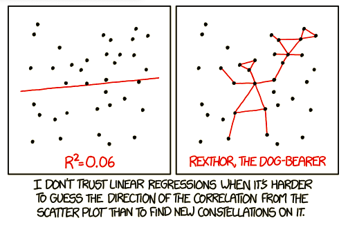

```{r setup_pres, include=FALSE, echo=FALSE}
rm(list=ls())
library('tidyverse')
library('gridExtra')
library('broom')
library('cowplot')

#setwd("~/Google Drive Swat/Swat docs/Stat 21/Data")
options(htmltools.dir.version = FALSE)
```

```{css, echo=FALSE}
pre {
  background: #FFBB33;
  max-width: 100%;
  overflow-x: scroll;
}
```


\begin{flushright}Name: $\underline{\hspace{5cm}}$ \end{flushright}


**Instructions:** 

There are seven questions on this exam. The points allotted for each question are given at the end of the problem. Please don't write an entire page response for any of the answers. Rather, answer these questions to the best of your ability with succinct, informative statements or observations. You may or may not use the following formulas and definitions.  


**Formulas and Definitions**
Linear model: $Y = \beta_0 + \beta_1 x + \epsilon$  or, equivalently, $E[Y] = \beta_0 + \beta_1 x$.


In the model(s) above, if we assume that the mean of $\epsilon$ is $0$ and the variance of $\epsilon$ is some unknown number, $\sigma^2$, then the mean of the random variable $Y$ is $\beta_0 + \beta_1x$ and the variance of $Y$ is $\sigma^2$.


Fitted/estimated model: $\hat{y}_{i} = \hat{\beta}_0 + \hat{\beta}_1x_i$


In the fitted model above, we solve for the least squares estimates of the parameters using these equations: 
$$\hat{\beta}_1 = \frac{\sum_{i=1}^n(x_i-\bar{x})(y_i-\bar{y})}{\sum_{i=1}^n(x_i-\bar{x})}$$ 

$$\hat{\beta}_0 = \bar{y} - \hat{\beta}_1\bar{x}$$


Definition of residuals: $\hat{y}_{i} - y_{i} = e_i$


Regression model sums of squares: $\sum_{i=1}^{n}(\hat{y}_i-\bar{y})^2$ 


Residual sums of squares: $\sum_{i=1}^{n}(y_i - \hat{y}_i)^2$ 


Total sums of squares: $\sum_{i=1}^{n}(y_i - \bar{y})^2$ 


Relationship among the sums of squares terms: $SS_{tot} = SS_{reg} + SS_{res}$

The sums of squares terms are used to calculate the following statistics: 

$$\hat{\sigma} = \sqrt{\frac{SS_{res}}{n-2}}$$ 

$$R^2 = 1-\frac{SS_{res}}{SS_{tot}} = \frac{SS_{reg}}{SS_{tot}}$$ 

\newpage

**Problem 1** Suppose that the observational units in a study are patients who entered the emergency room at French Hospital in the previous week.  For each of the following, indicate whether it is a categorical (i.e. qualitative) variable, a numerical (i.e. quantitative) variable, **or** not a variable with regard to these observational units. (10 points)


a) How long the patient waits to be seen by a medical professional 
\vspace{1in}

b) Day of the week on which the patient arrives 
\vspace{1in}

c) Average wait time before the patient is seen by a medical professional 
\vspace{1in}

d) Whether or not wait times tend to be longer on weekends than weekdays 
\vspace{1in}
 

**Problem 2** Consider the transactions at the Science Center coffee bar to be the observational units in a statistical study. In a paragraph of less, state a research question that involves two quantitative variables for these observational units. Also clearly identify  what roles the two variables would play in the study and why. (10 points)
\newpage


**Problem 3** Suppose a professor has a paper titled: *Estimation and hypothesis testing in regression in the presence of nonhomogeneous error variances* lying out on her desk.<sup>[1]</sup> In 1-2 sentences, explain what you think this paper is about? (10 points)
\vspace{3in}


**Problem 4** Based on the data shown in the scatter plot of this comic<sup>[2]</sup>, what can you tell me about the relationship between the $SS_{reg}$ and $SS_{res}$ terms? (10 points) 
```{r, echo=FALSE, out.width='60%', fig.align='center'}

```
\newpage

**Problem 5** Suppose we have observed a small data set (say $n=5$) without any significant measurement error (e.g. we are collecting data on vapor pressure and temperature but our instruments to measure each are exact). How do we find the line of best fit? (10 points)
\vspace{2in}


**Problem 6** Recall the diamond data that we discussed in class. For this data, we have a simple random sample of Singaporean diamonds and are interested in how the size of the diamond (in carats) can predict (or explain) what the cost of the diamond will be. Below is the R code for fitting this simple linear regression model. (25 points)
```{r echo=FALSE, warning=FALSE, message=FALSE}
diamond_dat <- read_table2("~/Google Drive Swat/Swat docs/Stat 21/Data/diamond_dat.txt",skip=2, col_names = FALSE)
colnames(diamond_dat) <- c("size", "price")
#-------
#diamond_dat_trans <- diamond_dat %>% mutate(grams = size*.2)
#diamond_mod_trans <- lm(price~grams, data=diamond_dat_trans)
#diamond_mod_summary_trans <- summary(diamond_mod_trans)

#ggplot() + aes(sample=diamond_mod_summary_trans$residuals) + stat_qq() + stat_qq_line()  
#ggplot() + aes(sample=diamond_mod_trans$fitted.values) + stat_qq() + stat_qq_line()  
#ggplot() + aes(sample=diamond_dat_trans$price) + stat_qq() + stat_qq_line()  

#ggplot() + aes(x=diamond_dat_trans$grams, y=diamond_mod_summary_trans$residuals) +
#  geom_point() + labs(x="Size \n (grams)", y="Residuals") 

#ggplot() + aes(x=diamond_mod_trans$fitted.values, y=diamond_mod_summary_trans$residuals) +
#  geom_point() + labs(x="Predicted price", y="Residuals") 
```
```{r diamondPlots1, echo=TRUE, warning=FALSE, message=FALSE, fig.align='center', out.height=300}
diamond_mod <- lm(price~size, data=diamond_dat)
diamond_mod_summary <- summary(diamond_mod)
```

Analyse the following three plots based on this regression model to answer the next two questions. 


```{r diamondPlots2, echo=FALSE, warning=FALSE, message=FALSE, fig.align='center'}
ggplot(diamond_dat, aes(x=size, y=price)) +
  geom_point() + 
  geom_smooth(method = "lm", se=FALSE) +
  labs(title="Simple Linear Reguression", subtitle="Diamond size as a predictor of diamond price",
       x="Size \n (carats)", y="Price \n (Singapore dollars") 

ggplot() + 
  aes(sample=diamond_mod_summary$residuals) + 
  stat_qq() + 
  stat_qq_line() +
  labs(title = "Residual plot", subtitle="Normal probability plot", x="Theoretical", y="Residuals")

ggplot() + 
  aes(x=diamond_mod$fitted.values, y=diamond_mod_summary$residuals) +  
  geom_point() + 
  labs(title = "Residual plot", subtitle="Fitting diamond prices as a linear function of size", x="Predicted price", y="Residuals") 

```


a) Based on these plots, what conclusions can we make about the presence of a linear relationship, if the random errors are constant, and if the random errors are Normally distributed?
\vspace{2in}


b) Say instead of the size of the diamond measured in carats, we'd like to look at the size in grams (1 carat $=$ 0.2 grams). Would we expect the behavior of any of the plots above to change? Briefly explain your answers. 
\newpage

**Problem 7** The data that appear in the data set "Four-Mile-Run-data.txt" were collected by a GPS watch worn by the runner of a four-mile course. Using heart rate measurements after each run, an analysis of the runner's post-exercise heart rate recovery provides an indication of cardiovascular fitness. We are interested in answering the question: is the speed of the run (in mph) related to the number of calories burned. Below is the R code and output for fitting such a linear model to this data.<sup>[3]</sup> (25 points)

```{r runOutput, echo=TRUE, warning=FALSE, message=FALSE}
run_dat <- read_table2("~/Google Drive Swat/Swat docs/Stat 21/Data/Four-Mile-Run-data.txt")
summary(lm(calories~aveSpeed, run_dat))
```


a) What is the estimate for the standard deviation of the number of calories burned based on this linear model?
\vspace{2in}


b) On average, how many more (or fewer) calories can our runner expect to burn for each mph increase in average running speed? 
\vspace{2in}


c) Suppose, on average, for any person within the same age group as our runner, every mph increase in running speed corresponds to $100$ additional calories burnt. How can we determine if our runner's rate of burning calories is different from this average for all people in the age group?  
\vspace{2in}


d) What numbers in the R output above can help us determine if this model is a good fit for the data? Explain briefly. (There are at least two.)
\vspace{2in}


***

[1] Michael L. Deaton, Mation R. Reynolds Jr. & Raymond H. Myers (1983) Estimation and hypothesis testing in regression in the presence of nonhomogeneous error variances, Communications in Statistics - Simulation and Computation, 12:1, 45-66, DOI: 10.1080/03610918308812299 


[2] https://xkcd.com/1725


[3] Paul J. Laumakis & Kevin McCormack (2014) Analyzing Exercise Training Effect and Its Impact on Cardiorespiratory and Cardiovascular Fitness, Journal of Statistics
Education, 22:2, , DOI: 10.1080/10691898.2014.11889702]