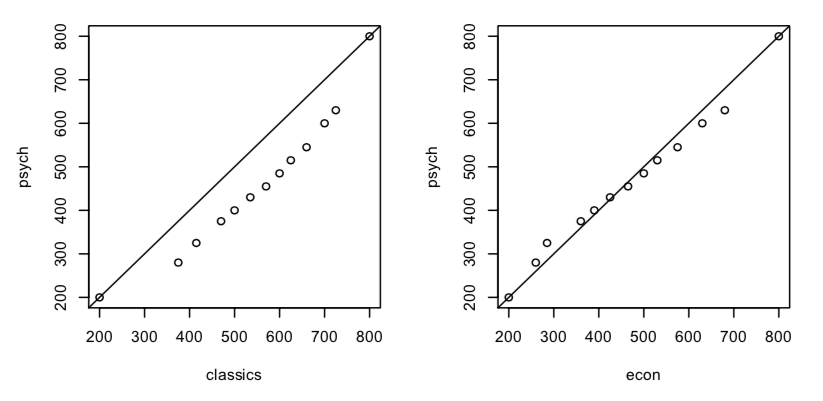

```{asis, directions=TRUE}

This assignment is due on to be submitted on Gradescope on __October 27__ by __12:00pm ET__. Please use the `homework-q-and-a` channel on Slack to post any related questions or error messages. 

***General instructions for all assignments***: 

You must submit your completed assignment as a single __PDF__ document uploaded to __Gradescope__. For instructions on how to do this, please watch this 2 minute video: https://youtu.be/KMPoby5g_nE. You must use R markdown to write up your solutions. For any homework problems that involve coding in R, you must provide __both__ the code and the requested output. You can find a R markdown homework template here: http://www.swarthmore.edu/NatSci/sthornt1/Stat021/Stat21.html. Please make sure each problem is __clearly labeled__ and that any handwritten components (such as pictures or equations) are easily readable as pictures within the R markdown document. You may want to use a service like CamScanner (https://www.camscanner.com/) to help you upload handwritten pages. 

You are allowed to work with your classmates on this homework assignment but you must disclose the names of anyone you collaborate with at the top of your solutions. Each homework assignment is worth 20 points. One problem will be chosen at random to be graded for correctness and the other problems will be graded for completion. At the end of the semester, your lowest homework grade will be dropped. No homework solutions will be provided.  
  
+ Use this file as the template for your submission. You can delete unnecessary text (e.g. these instructions) but make sure to keep the nicely formatted "Problem 1", "Problem 2", "a.", "b.", etc
+ Upload your knitted HTML or PDF file to the Homework 1 submission section on Gradescope.  
Name this file as: [SwatID]_stat21_hw03.pdf (e.g.  and "sthornt1_stat21_hw05.pdf"). You only need to upload one file, but please make sure that your graphs, code, and answers to each question appear in the appropriate place. If we cannot see your code/graphs/answers, we cant give you credit for your work!
+ Your file should contain the code to answer each question in its own code block. Your code should produce plots/output that will be automatically embedded in the output file.
+ Each answer must be supported by written statements (unless otherwise specified).
+ Include the name of anyone you collaborated with at the top of the assignment.
+ In order to knit this document, make sure you have installed the following packages in your version of RStudio: `ggplot2`, `tidyverse`, `gridExtra`, `gcookbook`, `knitr`

***
```


```{r setup, include=FALSE}
###########################
# DEFAULT SETTINGS
###########################
knitr::opts_chunk$set(message = FALSE) # include this if you don't want markdown to knit messages
knitr::opts_chunk$set(warning = FALSE) # include this if you don't want markdown to knit warnings
knitr::opts_chunk$set(echo=TRUE) # set echo=FALSE to hide code from html output

###########################
# LIBRARIES
###########################
library(ggplot2)
library(tidyverse)
library(gridExtra)
library(gcookbook)
library(knitr)
```

## Problem 1

In a survey of $988$ men aged $18–24$, the regression equation for predicting height from weight was: 
$$height = 62.4 + (0.047)(weight),$$
where height is measured in inches and weight is measured in lbs. 

(a) Is the following statement a correct interpretation of the regression line: “If someone gains $10$ pounds, he will get taller by $(0.047)(10) = 0.47$ inches”? If not, provide a better explanation for the meaning of the slope.

(b) Suppose the variance of our model errors is $\sigma^2=2$. What percentage of all $200$-pound men are taller than $74$ inches? (Assume the regression model assumptions are met.)


## Problem 2

Below are two Quantile-quantile plots of GRE General Test Verbal scores for students intending graduate study in psychology, classics, and economics. Here we are comparing the psychology test scores to the classics and to economics. We are interested in how the population psychology students compares to the population of classics students and to the population of economics student. How do you interpret the patterns (deviations from the diagonal lines) in these plots? Explain in 2-3 sentences.

```{r, echo=FALSE, fig.align='center'}

##Note: You must comment out this line of code (above) in order for your homework document to successfully knit to a PDF or HTML file. 
```


## Problem 3

Suppose we are interested in studying the effectiveness of the recycling/composting programs at Swarthmore. I.e. we are investigating the waste that is disposed in the trash/recycle/compost bins across campus. Use your imagination to come up with three different research questions related to this topic in the case where 

  1. We have two numerical variables of interest; 
  
  1. We have one numerical variable of interest and one categorical variable of interest; 
  
  1. We have two categorical variables of interest. 
  
For each setting clearly state the variables of interest, the roles of the variables (predictor/response), and the statistical research question you wish to answer. Each research question you come up with should be answerable by one of: a simple linear regression, an ANOVA model, or a chi-squared test. 


## Problem 4

Let's consider the data set called *msleep* which is contained in the R package `ggplot2`. 

```{r}
library(ggplot2)
head(msleep)
```

This data set looks at the amount of time spent sleeping for different mammals and records other factors such as brain and body weight of these animals. Suppose we are interested in the total amount of sleep an animal gets (variable name `sleep_total`) as predicted by the total body weight of the animal (variable name `bodywt`).


a) There is a qualitative variable named *order* in this data set. Fit two separate linear regression models for the animals of *order* "Carnivora" and of *order* "Primates". Report the estimated regression equations and print the summary of the two linear models.


b) What is the estimate of the variance of the random error for each of these two models? 


c) Do you think we should combine the data and just fit a single linear regression model to both *orders* Carnivora and Primates? Justify your answer with 1-2 sentences and (possibly) a supporting plot.

***

The following data set was collected in 2018-2019 and recorded different attributes of skyscrapers in NYC. In Problems 5-10 we are going to investigate how the height (in meters) $(Y)$ of a skyscraper depends on the number of stories (i.e. floors) it has $(x)$. 

```{r}
skyscrapers <- read_csv(url("http://www.swarthmore.edu/NatSci/sthornt1/DataFiles/skyscraper_data.csv"))
head(skyscrapers)
```


## Problem 5

Make a scatter plot of the observed predictor and response variables and report

(a) The estimated regression equation.

(b) The value of the standard deviation of height.

(c) The value of R-squared.


## Problem 6

(a) Make a residual plot for the regression model you fit in Problem 5. Are there any apparent violations of the regression model assumptions? Explain your answer in four sentences or less. 


(b) Make a Normal probability plot of the standardized residuals to determine if the residuals look like they come from a Normal distribution. Interpret the plot in three sentences or less.  


## Problem 7

(a) Calculate a $95\%$ confidence interval for the model parameter $\beta_1$, the slope of the variable `floors`. How would you explain the meaning of this confidence interval, in the specific context of this data set, to an architect who has never taken a statistics class?


(b) Test the hypothesis that $\beta_1 = 0$ at an $\alpha=0.05$ significance level. State your null and alternative hypotheses and report the test statistic and p-value. Interpret, in the context of the problem, the results of this test in two sentences or less. 


## Problem 8

(a) Suppose a developer is working on a new building that has taken the 15 years to get the go-ahead. Suppose they are cheekily designing the building to have 15 floors, one for each year of struggle to get the building approved. If the architect needs to know how tall this building may be, would you report to them a prediction interval or a confidence interval? Justify your answer in three sentences or less. 


(b) Create a scatter plot of the observed data and overlay on this plot the estimated regression line and the confidence and prediction bands. 


## Problem 9

Note that there is a categorical variable called "purpose" included in the data set. Suppose we are interested in determining if there is a significant difference in the average height of a building depending on its purpose. Using `height` (in meters) as the response and purpose as the explanatory variable, fit an ANOVA model to this data after excluding the data point for the only hospital (see code below). What does the result of the ANOVA F-test indicate? 

```{r}
skyscrapers_edit <- skyscrapers %>% filter(!(purpose=="hospital"))
```


## Problem 10

We know that the significance level ($\alpha$) represents the probability of a false positive (i.e. a type I error) in a hypothesis test. Related to this concept is the probability of correctly detecting a positive. In statistics, this probability is called the **power** of a test and is often denoted as $1-\beta$ where $\beta$ is the probability of a type II error. (Hence the power of a test is the probability of NOT making a type II error.) What if we wanted to collect more skyscraper data to increase the power of our test in Problem 9? Using this example as a guide: https://stats.idre.ucla.edu/r/dae/one-way-anova-power-analysis/ and assuming we can collect enough data so that all categories for the variable `purpose` have the same number of observations (i.e. we have a balanced ANOVA design), how many more observations of hospitals, hotels, offices, and residential buildings specifically do we need to achieve 85% power? 

