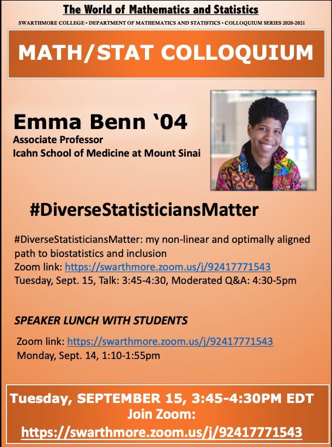

```{r setup_pres, include=FALSE, echo=FALSE}
#devtools::install_github("ropenscilabs/icon")
#devtools::session_info('rmarkdown')

rm(list=ls())
library('tidyverse')
library('gridExtra')
library('broom')
library('cowplot')

library("RefManageR")
library("DT")


#setwd("~/Google Drive Swat/Swat docs/Stat 21/Class13_files")
#setwd("~/Drive/Swat docs/Stat 21/Class9_files")
options(htmltools.dir.version = FALSE)
knitr::opts_chunk$set(fig.path='Figs/',echo=TRUE, warning=FALSE, message=FALSE)

```

```{css, echo=FALSE}
pre {
  background: #FFBB33;
  max-width: 100%;
  overflow-x: scroll;
}

.scroll-output {
  height: 75%;
  overflow-y: scroll;
}

.scroll-small {
  height: 50%;
  overflow-y: scroll;
}
   
.red{color: #ce151e;}
.green{color: #26b421;}
.blue{color: #426EF0;}
```

# Welcome back to (virtual) class! 

Here's the agenda for today's class: 

- Quick introduction

- Meet your group and assign rolls 

- Discussion question 

- Intro to RStudio 


Don't forget to read the syllabus and complete the accessibility needs information! 


--
**Disclaimer:** In this class we will study real data sets across a variety of topics. Some of the topics will be personal and probably evoke some sort of emotional response. I do not expect you to be a heartless, computing machine in this class. If there is a topic we cover that is particularly sensitive to you, please feel free to bring this up in the free-response section of the comprehension quiz for that class. I will look at your responses before each class and I will do my best to accommodate your needs and address any concerns you may have in class. 


In class today, we will be referencing a study that was conducted to analyze the media response to the 2015 protests against the murder of Freddie Gray. 

---
# But first... an announcement! 

```{r, echo=FALSE, fig.align='center', out.height=400}

```

Link: http://www.swarthmore.edu/NatSci/sthornt1/Stat021/Class1_files/BENN.pdf 

---
# Quick Introduction

Here are some check-lists to help you stay organized with this class.  

**Each week you need to complete the following** 

- Submit your homework solutions to Gradescope 

- Respond to the Slack check-in prompt 

- Submit your group evaluation on Moodle


**Before every class you need to complete the following** 

- View the lecture videos for the next class

- Complete the comprehension quiz for the next class 


**During class time you need to be prepared to**

- Arrive to Zoom class meetings on-time 

- Speak up in group discussions 

- Complete your "roll" in group discussions 

---
# Meet your group! 

- Introductions: name, pronouns, location, major, year

- Assign group rolls and determine the rotation order 

  - Note-taker - this is the person creating the presentation item on the Zoom whiteboard

  - Presenter - this is the person who will report the presentation materials and general discussion

  - Recorder - this is the person who takes notes on who is in attendance, who is participating, and keeps track of the time

  - Questioner - this person will push back when the group comes to consensus too quickly, without considering a number of options or points of view

- Determine a group name to report back to the class - I'll use this to create a Slack channel for each group 

---
# Discussion Question 

In 2015, widespread protests by largely Black crowds against police brutality occurred in Baltimore after the killing of Freddie Gray by police. In an article for Linguistic Pulse in April 2015, Nic Subtirelu compared different media outlet's use of "protest" versus "riot" to describe the Baltimore protests.

Take a look at the study here:
https://linguisticpulse.com/2015/04/29/covering-baltimore-protest-or-riot/


Then, work with your group to answer the following questions
1. What are the observational units in this study? 
2. What are the variables of interest in this study and what type of variables are they? 
3. Is this an experiment or observational study?

Be prepared to report back to the class your answers. Save a text document with your group's answers to these questions to submit to me via email after class. 


---
# Introduction to R Studio  

- Output 

  - Console

- Input

  - R Script file (compile)
  
  - R Markdown files (knit)

  - How to run code 
  
- Environment/History/Connections

  - Defined variables
  
  - Erase variables

- Files/Plots/Packages/Help/Viewer
  
  - Set working directory
  
  - Access shared folder: /home/stat021f20
  
  

---
# Resources for learning to program in R 

- R package *swirl()* for tutorials (part of HW 1)
- Google is your friend! (and Stack Exchange, etc.)
- R for Data Science (free online textbook) https://r4ds.had.co.nz/


# Introduction to R packages

- Installing vs calling packages: the library analogy
- The R package *tidyverse* is an "umbrella-package"" that installs several other packages that are useful for data analysis, e.g. tidyr, dplyr, ggplot2, tibble.
- The functions and data that loads whenever you open R is called "Base R"
