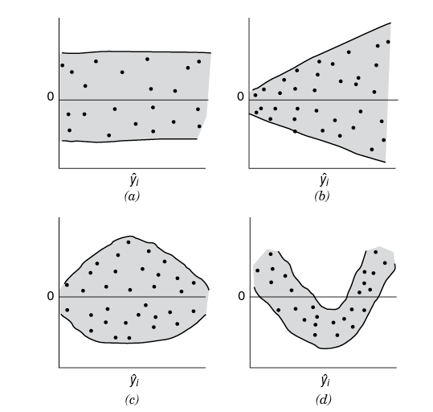

```{r setup_pres, include=FALSE, echo=FALSE}
#devtools::install_github("ropenscilabs/icon")
#devtools::session_info('rmarkdown')

rm(list=ls())
library('tidyverse')
library('gridExtra')
library('broom')
library('cowplot')

library("RefManageR")
library("DT")


#setwd("~/Google Drive Swat/Swat docs/Stat 21/Class13_files")
#setwd("~/Drive/Swat docs/Stat 21/Class9_files")
options(htmltools.dir.version = FALSE)
knitr::opts_chunk$set(fig.path='Figs/',echo=TRUE, warning=FALSE, message=FALSE)

```

```{css, echo=FALSE}
pre {
  background: #FFBB33;
  max-width: 100%;
  overflow-x: scroll;
}

.scroll-output {
  height: 70%;
  overflow-y: scroll;
}

.scroll-small {
  height: 50%;
  overflow-y: scroll;
}
   
.red{color: #ce151e;}
.green{color: #26b421;}
.blue{color: #426EF0;}
```

## SLR
### Assumptions 

$$Y\mid x = \beta_0 + \beta_1 x + \epsilon$$


**For estimation:**


[1] $E[\epsilon]=0$;

[2] $Var[\epsilon]=\sigma^2 < \infty$;

[3] Each instance of the random variable $\epsilon$ is independent of any other instance. 


**For inference:** 


[4] The random variable $\epsilon$ is normally distributed. 


**Note:** Sometimes, we will combine all four assumptions into one statement by stating, for each $i=1,\dots, n$
$$\epsilon_{i} \stackrel{IID}{\sim} N(0,\sigma^2).$$

---
## SLR Example
### Restaurant Data 

We are going to continue to use the restaurant data and model the percentage tipped as predicted by the overall cost of the bill. 

.scroll-small[
```{r}
library("tidyverse")
require(Lock5Data)  ## this is similar to the library() function but it attaches the names of the data sets contained in the package Lock5Data 
data(RestaurantTips)
head(RestaurantTips)
SLR_tips = lm(PctTip ~ Bill, data = RestaurantTips)
names(SLR_tips)
```
]

---
## SLR
### Assumptions 

**Checking assumption 1: zero mean**

$$E[\varepsilon]=0$$


- This assumption is the easiest to meet. 

- If you suspect that the mean of your $Y$ measurement errors is non-zero, you can still ensure that this model assumption is met by **standardizing the data** before you fit a regression curve. 


- When we get to MLR (multiple linear regression), it will become more important to standardize the data before fitting a regression line. 


**Note:** The mean of the residuals, $\frac{1}{n}\sum_{i=1}^{n}e_{i}$, will always be zero! Why? 

---
## Problem set-up
### Assumptions 

**Checking assumption 2: .blue[constant] variance**

$$Var[\epsilon]=\sigma^2 < \infty$$

<a href="https://en.wikipedia.org/wiki/Heteroscedasticity">Heteroscedasticity</a> often occurs when there is a large difference among the sizes of the response variable. What we are looking for here is: does our measurement error $(\epsilon)$ vary (increase or decrease) with each new observation $(y_i, x_i)$?

  - Cross sectional data 
  - Time series data 
  - Econometrics data 


1. Example: Income versus money spent on meals.

1. Example: Measuring changing distance of a rocket being launched. 

.footnote[For more reading on heteroscedacity see [this article](http://www.statsmakemecry.com/smmctheblog/confusing-stats-terms-explained-heteroscedasticity-heteroske.html). (Note that they use the terms independent and dependent variables which is confusing, though common!)]

---
## Problem set-up
### Assumptions 

**Checking assumption 2: .blue[constant] variance**

.scroll-output[
The best way to check if this assumption is reasonable is to look at a scatter plot of the residuals vs the fitted values.

We want to make sure that there is no "funneling" pattern to the spread of the residuals. That is, the amount the residuals vary about the horizontal line at zero should not have a discernible pattern such as plots (b)-(d): 

```{r, echo=FALSE, fig.align='center', out.height=400}

```
]


---
## SLR Example
### Restaurant Data 

.scroll-output[
```{r echo=TRUE, fig.align='center'}
residual_plot_data <- RestaurantTips %>% 
                      mutate(residuals = SLR_tips$residuals,
                             fitted_vals = SLR_tips$fitted.values) 
ggplot(residual_plot_data, aes(x=fitted_vals, y=residuals)) +
  geom_point() + 
  labs(title="Residual plot", subtitle="Restaurant Bill and Percentage Tipped",
       x="Predicted Bill Total", y="Residuals") + 
  geom_hline(yintercept=0)
```
]


---
## Problem set-up
### Assumptions 

**Checking assumption 3: independence**

This assumption is difficult to check. Usually you have to think critically about what are potential sources of measurement error in your observations of the response variable $Y$.

For temporal data we can check the autocorrelation of the residuals. 

Otherwise, we can look for linear relationships in scatter plots of the residuals and the predictor variables. If we find evidence of this, we may need to re-consider what predictor variables we include in our model. 


Note that the residuals $e_i$ are NOT independent, rather we want to think about whether or not the measurement error (or noise) in our observations of $Y$ are independent. 

---
## Problem set-up
### Assumptions 

**Checking assumption 4: normally distributed errors**

To check this assumption we simply need to look at a normal probability plots for standardized residuals! 


```{r echo=TRUE, eval=FALSE}
residual_plot_data <- residual_plot_data %>%
                      mutate(std_residuals = (residuals-mean(residuals))/sd(residuals)) 
ggplot(residual_plot_data, aes(sample=std_residuals)) +
  stat_qq() + 
  stat_qq_line() + 
  labs(title="Normal probability plot", subtitle="Standardized residuals for restaurant data") 

```

---
## SLR Example
### Restaurant Data 

```{r echo=FALSE, fig.align='center', out.height=450}
residual_plot_data <- residual_plot_data %>%
                      mutate(std_residuals = (residuals-mean(residuals))/sd(residuals)) 
ggplot(residual_plot_data, aes(sample=std_residuals)) +
  stat_qq() + 
  stat_qq_line() + 
  labs(title="Normal probability plot", subtitle="Standardized residuals for restaurant data") 

```
