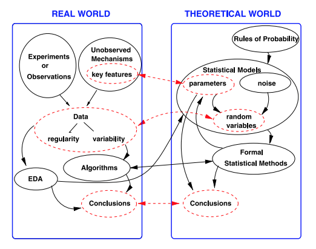

```{r setup_pres, include=FALSE, echo=FALSE}
#devtools::install_github("ropenscilabs/icon")
#devtools::session_info('rmarkdown')

rm(list=ls())
library('tidyverse')
library('gridExtra')
library('broom')
library('cowplot')

library("RefManageR")
library("DT")

library('kableExtra')

#setwd("~/Google Drive Swat/Swat docs/Stat 21/Class13_files")
#setwd("~/Drive/Swat docs/Stat 21/Class9_files")
options(htmltools.dir.version = FALSE)
knitr::opts_chunk$set(fig.path='Figs/',echo=TRUE, warning=FALSE, message=FALSE)

```


```{css, echo=FALSE}
pre {
  background: #FFBB33;
  max-width: 100%;
  overflow-x: scroll;
}

.scroll-output {
  height: 70%;
  overflow-y: scroll;
}

.scroll-small {
  height: 30%;
  overflow-y: scroll;
}
   
.red{color: #ce151e;}
.green{color: #26b421;}
.blue{color: #426EF0;}
```

## Class 21, Tuesday the 1st 
### Here's the agenda for today's class

- Check-in 

- Address any questions about syllabus or course expectations. 
  
  - How extra credit will work with final project and exam 

  - Option to share a study guide for the final exam for extra credit (as we did with Test 1)

- Review Topics 

  - Share/edit info graphics (group work)
  
  - Time to address DM'd questions and/or old homework questions
  
  - Revisit Test 1 and discuss the difference between random samples and census surveys
  
- Wrap up
  
  - Plans for next class

---
## Morning check in  
### 5 mins

.pull-left[**Instructions:** Use the "annotate" feature to put an "X" near the word(s) that most accurately describe how you are feeling this morning. 

- **Note-taker**, open this slide on your internet browser and share your screen with your group. 
- **Presenter**, take a screenshot of the page when everyone is finished marking their "X"'s and send it to me via your group's slack channel. I will verify that I have seen the image with a check mark on your Slack comment.
- **Recorder**, take notes on who is in attendance and who is performing each role for today's discussions.
- **Questioner**, make sure that everyone has a chance to check in and discuss how they are feeling today.]
.push-right[
```{r, echo=FALSE, fig.align='right', out.height=500}
knitr::include_graphics("Figs/real-feel.png")
```
]

---
## Upcoming talk 
### Activism and Transformation

Three Swarthmore students lead this teach-in on Grace Lee Boggs and her book "The Next American Revolution: Sustainable Activism for the Twenty-First Century" and discuss their roles as activists in growing their communities.

https://swarthmore.zoom.us/j/91925314260


Zoom meeting ID: 919-2531-4260

.center[**Today at 2pm EDT**] 


---
## Extra Credit and New Grading System 

The final exam and final project are worth 200 points total. Extra credit you have earned throughout the semester will be applied to these 200 points. Here is what your grade will be depending on your total points earned: $<50$ points is a C, $50-70$ points is a C+ , $71-100$ points is a B-, $101-120$ points is a B, $121-140$ points is a B+, $141-150$ points is an A-, $151-170$ points is an A, $>170$ points is an A+)

- Small typos are worth $\frac{1}{5}^{th}$ of a point. These are things like spelling errors that may be frustrating but don't ultimately change or misdirect the purpose of the statement/question.  

- Medium typos are worth $\frac{1}{2}$ of a point. These are mistakes that you caught that may have caused some confusion but ultimately didn't fundamentally change the statement or question. 

- Important typos are with $2$ points. These are mistakes that fundamentally changed the meaning of the statement or question. 

- If your test study guide was shared and selected, that is worth $2$ points. 

**You** are responsable for totalling your earned extra credit points. You must either DM me on Slack or email with your estimated total extra credit points earned. I will message you back to confirm or dispute your total extra credit points by December 14th (the date your final projects are due).  


---
## Swap and edit SLR, MLR, and ANOVA infographics
### Group work - 10 mins 


**Section 1**

Sickly Statisticians -> T.W.O

T.W.O. -> The Confidence Intervals

The Confidence Intervals -> Sickly Statisticians 


**Section 2**

Catz -> Data Detectives

Data Detectives -> Meme

Meme -> Team 2 

Team 2 -> Team 6:45am

Team 6:45am -> Catz 


---
## About random samples 
### Sampling strategies 


"Research studies are usually carried out on sample of subjects rather than whole populations. The most challenging aspect of fieldwork is drawing a random sample from the target population to which the results of the study would be generalized. In actual practice, the task is so difficult that some sampling bias occurs in almost all studies to a lesser or greater degree. In order to assess the degree of this bias, the informed reader of medical literature should have some understanding of the population from which the sample was drawn. The ultimate decision on whether the results of a particular study can be generalized to a larger population depends on this understanding."

"Similarly, in inferential statistics, it is not enough to just describe the results in the sample. One has to critically appraise the real worth or representativeness of that particular sample."


“Statistics without tears: Populations and samples
Amitav Banerjee, Suprakash Chaudhury”
Industrial Psyciatry Journal 
2010 


---
## About statistical inference 
## Moving from the sample to the population

"Note, in particular, that data should not be confused with random variables. Random variables live in the theoretical world. When we say things like, “Let us assume the data are normally distributed” and we proceed to make a statistical inference, we do not need to take these words literally as asserting that the data form a random sample. Instead, this kind of language is a convenient and familiar shorthand for the much weaker assertion that, for our specified purposes, the variability of the data is adequately consistent with variability that would occur in a random sample."

For confidence intervals and hypothesis tests "[we] are able to draw useful
conclusions as long as our theoretical world is aligned
well with the real world that produced the data."


Statistical Inference: The Big Picture. 
Robert E. Kass
Statistical Science 2011 


---
## About statistical inference 
## Moving from the sample to the population


```{r, echo=FALSE, fig.align='center', out.height=400}

```


Statistical Inference: The Big Picture. 
Robert E. Kass
Statistical Science 2011 

---
## For next class 

Read this affidavit a mathmatics professor signed the other week. Do some background research on who funded the study and how the data was collected. 


https://justthenews.com/sites/default/files/2020-11/Miller_DeclarationAndAnalyisPA_GOP_BallotRequestData_2020_Final.pdf 


Come prepared to discuss this study to next class. (My intention is that this exercise will help some of you prepare for your final project but hope this will be informative to all of you.)

---
## For next class

We will also spend time reviewing these questions next class. My review will assume that you have attempted any problems that you wish to discus and will assume that you have at least read all of the questions. 

Use the following code to install R package "MPV" that has most of the data sets from Appendix B of your textbook. 
```{r} 
packageurl <- "https://cran.r-project.org/bin/macosx/contrib/4.0/MPV_1.55.tgz"
install.packages(packageurl, repos=NULL, type="source")
library('MPV')
```

Here is a list of suggested practice problems from your textbook (which is available online through the Tripod library service). I recommend that you work through these examples to prepare for the final test. 
  - Chapter 3 (3.5, 3.7, 3.13)  
  - Chapter 4 (4.4, 4.22, 4.27)
  - Chapter 5 (5.2, 5.6, 5.20) 
  - Chapter 7 (7.2, 7.3) 
  - Chapter 8 (8.3, 8.6, 8.17) 
