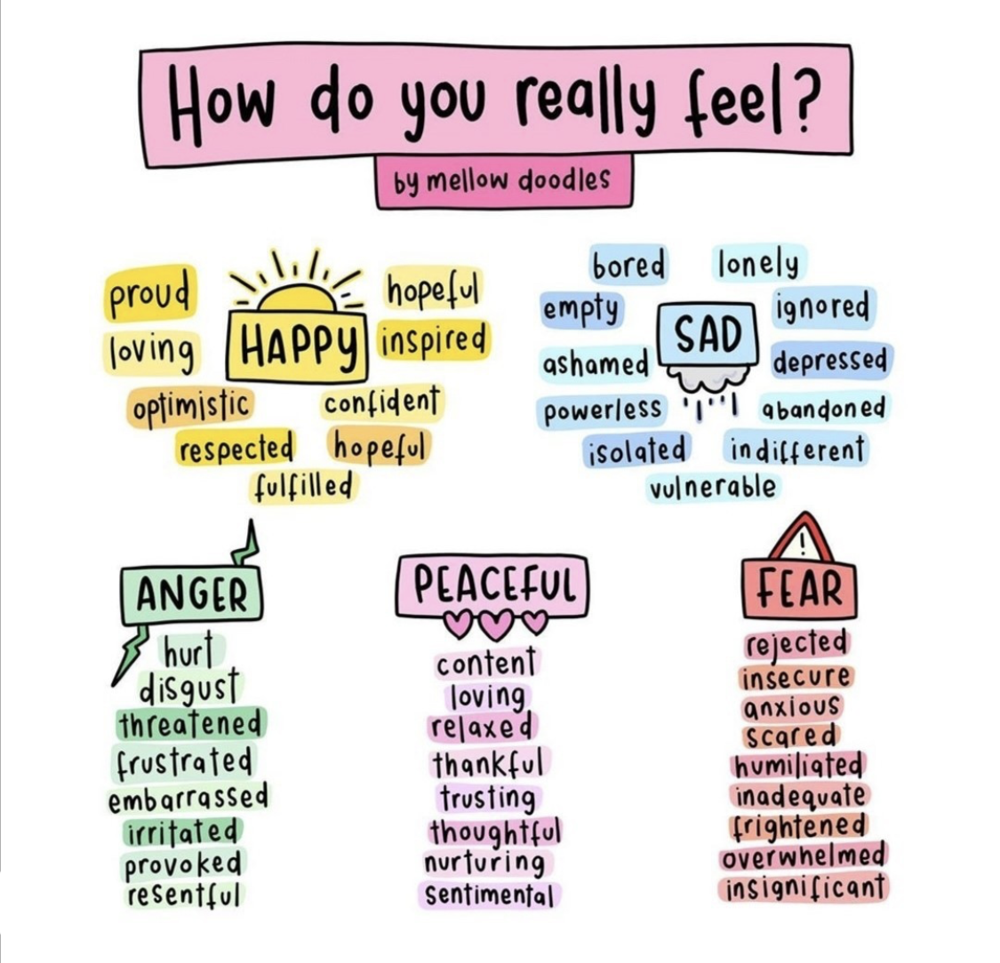

```{r setup_pres, include=FALSE, echo=FALSE}
#devtools::install_github("ropenscilabs/icon")
#devtools::session_info('rmarkdown')

rm(list=ls())
library('tidyverse')
library('gridExtra')
library('broom')
library('cowplot')

library("RefManageR")
library("DT")

library('kableExtra')

#setwd("~/Google Drive Swat/Swat docs/Stat 21/Class13_files")
#setwd("~/Drive/Swat docs/Stat 21/Class9_files")
options(htmltools.dir.version = FALSE)
knitr::opts_chunk$set(fig.path='Figs/',echo=TRUE, warning=FALSE, message=FALSE)

```


```{css, echo=FALSE}
pre {
  background: #FFBB33;
  max-width: 100%;
  overflow-x: scroll;
}

.scroll-output {
  height: 70%;
  overflow-y: scroll;
}

.scroll-small {
  height: 30%;
  overflow-y: scroll;
}
   
.red{color: #ce151e;}
.green{color: #26b421;}
.blue{color: #426EF0;}
```

## Class 22, Thursday the 3rd 

.scroll-output[Here's the agenda for today's class: 
  
- Check-in 

- Review topics

  - Answering your qestions
  
  - Example(s) from textbook   

- Wrap up

- Course evaluations (reminder will be sent after Dec 14th)
]

---
## Morning check in  
### 5 mins

.pull-left[**Instructions:** Use the "annotate" feature to put an "X" near the word(s) that most accurately describe how you are feeling this morning. 

- **Note-taker**, open this slide on your internet browser and share your screen with your group. 
- **Presenter**, take a screenshot of the page when everyone is finished marking their "X"'s and send it to me via your group's slack channel. I will verify that I have seen the image with a check mark on your Slack comment.
- **Recorder**, take notes on who is in attendance and who is performing each role for today's discussions.
- **Questioner**, make sure that everyone has a chance to check in and discuss how they are feeling today.]
.push-right[
```{r, echo=FALSE, fig.align='right', out.height=500}

```
]


---
## Upcoming Event 


.center["Women in Statistics: We've Come so Far?"

Leslie A. McClure, PhD

Professor, Chair

Department of Epidemiology and Biostatistics] 


.center[**Wednesday**, December 9, 2020

2:30 pm – 3:30 pm EDT]


The term leaky pipeline has been used to describe the disappearance of women from STEM fields, and the field of statistics is no exception. In this talk, I will describe the leaky pipeline in statistics and biostatistics, discuss some of the reasons why women leave STEM fields, and discuss strategies for helping to plug the leaky pipeline.


https://drexel.zoom.us/j/91374827254?pwd=Zk9nUmZ6VzdKQXFhY0ZvbmdRbWpyUT09


**Meeting ID:** 913 7482 7254

**Passcode:** 440601


---
## Mistaken statistical conclusions 
### (Lack of) Evidence Proving Voter Fraud

https://justthenews.com/sites/default/files/2020-11/Miller_DeclarationAndAnalyisPA_GOP_BallotRequestData_2020_Final.pdf


https://williamsrecord.com/2020/11/professor-of-mathematics-steven-miller-issues-legal-statement-suggesting-ballot-irregularities-in-pa-conclusions-repudiated-by-statisticians-and-political-scientists/

https://www.berkshireeagle.com/news/local/williams-prof-disavows-own-finding-of-mishandled-gop-ballots/article_9cfd4228-2e03-11eb-b2ac-bb9c8b2bfa7f.html

https://williamsrecord.com/2020/11/a-rebuttal-to-steven-millers-report-on-pa-gop-mail-in-ballot-requests/


---
## Homework 6 
### Problems 9 and 10


```{r}
airplanes <- read_table2(url("http://www.swarthmore.edu/NatSci/sthornt1/DataFiles/airplanes.txt"), col_names=TRUE, cols(IFR = col_factor(), DME = col_factor(), LORAN = col_factor(), ModeC = col_factor(), paint = col_factor()) ) %>% na.omit
airplanes <- airplanes %>% select(-c(IFR))


airplanes <- airplanes %>% filter(year>=1970)
```

```{r}
airplanes %>% select(c(year, TT)) %>% 
                       pairs(pch = 16)
```

---
## Homework 6 
### Problems 9 and 10

```{r}
MLR_plane <- lm(price ~ year + TT + DME + LORAN + paint, data = airplanes)
summary(MLR_plane)
```


---
## Homework 6 
### Problems 9 and 10

```{r}
MLR_plane_sum <- summary(MLR_plane)
resid_plot_data <- airplanes %>%
                   mutate(residuals = MLR_plane_sum$residuals,
                          fitted_vals = MLR_plane$fitted.values)

ggplot(resid_plot_data, aes(x=fitted_vals, y=residuals)) + 
  geom_point() +
  labs(title="Residual Plot", subtitle = "Airplane Model",
       x="Predicted Values", y="Residuals") +
  geom_hline(yintercept=0) 
```

---
## Homework 6 
### Problems 9 and 10

```{r}
ggplot(resid_plot_data, aes(sample=scale(residuals))) + 
  stat_qq() + 
  stat_qq_line() +
  labs(title="Normal probability plot", subtitle = "Airplane Model",
        y="Standardized Residuals") 
```

---
## Practice Problems 
### From your textbook 

Available on our shared RStudio folder: /shared/stat021f20


  - Chapter 3 (3.5, 3.7, 3.13)  
  - Chapter 4 (4.4, 4.22, 4.27)
  - Chapter 5 (5.2, 5.6, 5.20) 
  - Chapter 7 (7.2, 7.3) 
  - Chapter 8 (8.3, 8.6, 8.17) 

---
## Course evaulations

Are there any questions you would like me to ask about? 

