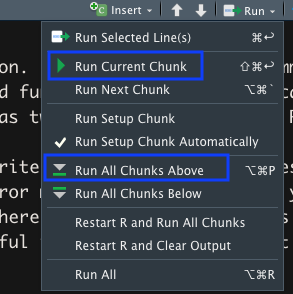

```{r setup_pres, include=FALSE, echo=FALSE}
#devtools::install_github("ropenscilabs/icon")
#devtools::session_info('rmarkdown')

rm(list=ls())
library('tidyverse')
library('gridExtra')
library('broom')
library('cowplot')

library("RefManageR")
library("DT")


#setwd("~/Google Drive Swat/Swat docs/Stat 21/Class13_files")
#setwd("~/Drive/Swat docs/Stat 21/Class9_files")
options(htmltools.dir.version = FALSE)
knitr::opts_chunk$set(fig.path='Figs/',echo=TRUE, warning=FALSE, message=FALSE)

```

```{css, echo=FALSE}
pre {
  background: #FFBB33;
  max-width: 100%;
  overflow-x: scroll;
}

.scroll-output {
  height: 70%;
  overflow-y: scroll;
}

.scroll-small {
  height: 50%;
  overflow-y: scroll;
}
   
.red{color: #ce151e;}
.green{color: #26b421;}
.blue{color: #426EF0;}
```


## Troubleshooting 
### R Script Files 

These are the files that end in `.R`. We've only used these files once so far in class (for the CLT simulations). R script files are documents containing R code **only**. You run (or compile) the code in these documents by highlighting whichever line you wish to run and then clicking the *Run* button (or using the keyboard shortcut which is "command+return").

We don't use R script files for your homework because the format is not as legible/pretty. (We'd have to write the problems and word solutions as comments within the code and that would be a nightmare to look at.)

---
## Troubleshooting 
### R Script Files 

1. Figure out which line exactly is causing the error. 

2. Make sure you have (installed and) called any necessary packages into your working library. The package we will use the most is `tidyverse`. This mistake will typically produce an error message that says something like: *could not find function "XXXX"*. 

3. Look for typos! Syntax errors are the most common. Look for a forgotten comma, and opened bracket that wasn't closed, a misspelled function name, etc. R is case sensitive so `my_vector` and `My_vector` are read as two different objects in R. 

4. Copy and past your error message into your favorite search engine! Sometimes you just need some extra help decoding what the error message means. Although you probably won't find the exact same mistake/typo (there are so many unique ways to write illogical code), you can often find some useful insight as to what might be causing a particular error message to show up. 


---
## Troubleshooting 
### R Markdown Documents 

These are the files that end in `.Rmd`, so all of your homework files. 
If you try to *knit* your document but it doesn't work and produces an unhelpful error message, here are some steps to follow to figure out where the mistake is. 

1. Determine if it is an R code error. The easiest way to do this is to use the options available in the "Run" button. You can run all R code chunks at once to see if any error messages pop up from the R compiler.  

.scroll-small[
```{r class5part2, echo=FALSE, fig.align='center', out.height=400}

```
]

---
## Troubleshooting 
### R Markdown Documents 

These are the files that end in `.Rmd`, so all of your homework files. 
If you try to *knit* your document but it doesn't work and produces an unhelpful error message, here are some steps to follow to figure out where the mistake is. 

1. Determine if it is an R code error. The easiest way to do this is to use the options available in the "Run" button. You can run all R code chunks at once to see if any error messages pop up from the R compiler.  

2. If the mistake is in the R code, then try to run each chunk of code one at a time to figure out where exactly the mistake is and follow the troubleshooting tips on the previous slide. 

3. If the R code chunks all compile without any error messages, then there is a mistake somewhere in the text part of your R Markdown document (rather than in an R code chunk). 

---
## Troubleshooting 
### R Markdown Documents 


Since I am providing you with working R Markdown templates for every homework assignment, this type of error is least likely. It's most likely to occur for students who have experience with mathematical writing in LateX. If you are one such student, you should know that the `$` is a special character in R Markdown. If you want to write any mathematical expressions (like exponents or summation symbols), you must surround the math part with `$`'s and there can be no white space between the `$` and the mathematical text. 

E.g. `$x^6$` or `$\sum_{i=1}^{n}$` will run but `$ x^6 $` will not. 

**You are not expected to know how to write mathematical equations in LateX or in R Markdown.** If you ever need to write a mathematical equation as a solution to a test question or a homework question, you can write it by hand and upload an image of your handwritten solution instead.  


---
## Variable types 

- Categorical 
    
  - Nominal - the levels of the categorical variable are arbitrary names or labels (e.g. color, state)
    
  - Ordinal - the levels of the categorical variable have an ordered meaning (e.g. low/medium/high, morning/afternoon/evening/night)
  
- Quantitative/numerical 
  
  - Discrete - there are a limited or countable number of different values (e.g. number of passengers in a car, the positive integers)
    
  - Continuous - there are an infinite number of possible values (e.g. the interval between zero and one)


---
## Categorical variables in R
### Factors

In R, the default variable type is numerical. This means that when we want to define a categorical variable we need to double check that R is interpreting it correctly. R calls categorical variables **factors**. 

If you define a vector of categorical data, make sure you put all of the different levels inside quotation marks. This makes sure that R knows the elements are not numeric. You can then use the `factor()` function in R to create a categorical variable with different levels from this non-numeric vector. 

.scroll-small[
```{r class5part2.1, echo=TRUE}
color_vector <- c("Red", "Green", "Red", "Yellow", "Green")
color_vector
color_factor <- factor(color_vector)
color_factor
```
]

---
## Categorical variables in R
### Factors

.scroll-output[
**Troubleshooting tip:** Use the `class()` function to double check a variable type. 

```{r class5part2.2, echo=TRUE}
class(color_vector)
class(color_factor) 
```


The **levels** of the categorical variable are an inherited trait from the `factor()` function. This makes it easy to create a table of our factored variable to determine the total counts within each level. 

```{r class5part2.3, echo=TRUE}
table(color_factor) 
```
]

---
## Categorical variables in R
### Factors

.scroll-output[
**Note:** Anything within quotation marks is read by R as a character, that is as as a non-numeric object. 

```{r}
num_vec <- c(1,2,2,6,2,3,5)
class(num_vec)
char_vec <- c("1","2","2","6","2","3","5")
class(char_vec)
cat_vec <- factor(char_vec)
class(cat_vec)
```

**Recall:** R is case-sensitive! So the values `"Red"` and `"red"` will be considered different levels in R.  
]
