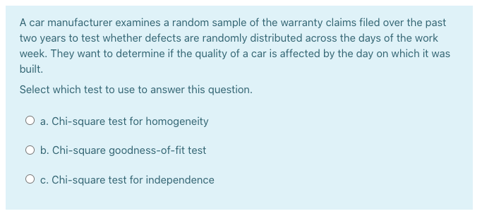

```{r setup_pres, include=FALSE, echo=FALSE}
#devtools::install_github("ropenscilabs/icon")
#devtools::session_info('rmarkdown')

rm(list=ls())
library('tidyverse')
library('gridExtra')
library('broom')
library('cowplot')

library("RefManageR")
library("DT")


#setwd("~/Google Drive Swat/Swat docs/Stat 21/Class13_files")
#setwd("~/Drive/Swat docs/Stat 21/Class9_files")
options(htmltools.dir.version = FALSE)
knitr::opts_chunk$set(fig.path='Figs/',echo=TRUE, warning=FALSE, message=FALSE)

```


```{css, echo=FALSE}
pre {
  background: #FFBB33;
  max-width: 100%;
  overflow-x: scroll;
}

.scroll-output {
  height: 70%;
  overflow-y: scroll;
}

.scroll-small {
  height: 50%;
  overflow-y: scroll;
}
   
.red{color: #ce151e;}
.green{color: #26b421;}
.blue{color: #426EF0;}
```


## Class 6
### Chi-square Procedures and Visualizing Data

Here's the agenda for today's class: 

- Housekeeping items

  - HW 3 due Thursday, the 1st by noon ET

  - Feedback from group discussion last class 
  
  - Morning check-in

- Class 5 exercise continued

- Class 6 topics 

  - Chi-square procedure examples 
  
  - Visualizing data examples 
  
---
## Morning check in - Yes we are going to make a habit of this! 
### 7 mins

.pull-left[**Instructions:**

- **Note-taker**, open this slide on your internet browser and share your screen with your group. 
- **Everyone**, use the "annotate" feature to put an "X" near the word(s) that most accurately describe how you are feeling this morning. 
- **Presenter**, take a screenshot of the page when everyone is finished marking their "X"'s and send it to me via your group's slack channel. I will verify that I have seen the image with a check mark on your Slack comment.]

.push-right[
```{r, echo=FALSE, fig.align='right', out.height=500}
knitr::include_graphics("Figs/wheel_of_emotion.jpeg")
```
]


---
## Feedback from group discussion last class 
### 5 mins 

.pull-left[**Pros** 
  - everyone works together, team collaboration, everyone participates
  - getting better at answering each others questions 
  - different stats backgrounds
  - meet new people 
  - every question gets addressed 
  - good discussions 
  - freedom to disagree with others answers 
  - question each other's assumptions 
  - rely on one another to post in Slack 
  - screenshots are helpful to review later
  - helpful to verbalize answers 
  - relaxed environment
  - like getting to know group members better
  - rotation of roles works well
  - good balance of backgrounds and perspectives
]

.push-right[
**Cons** 
  - roles are not clearly defined (what's the difference between the note-taker and recorder?)
  - not enough time in breakout rooms to finish questions 
  - more willingness to make mistakes or be wrong, share thoughts more readily 
  - ask more questions in the group Slack channel
  - attendance not great so far
  - still getting to know one another 
  - difficult to work within a single role 
  - sometimes easier to work alone 
  - wish we could be in person 
  - lots of small assignments that can be difficult to keep track of 
  - challenging to juggle many interfaces used in class 
]  

---
## Examples for Group Discussion - continued from Class 5

**Instructions:**

In each of the following situations described on the next slide, state the population of interest, the sample size, what defines one observational unit from another, what is/are the variables being collected. Then state which method/test you would use to answer each question and why. 

Create a copy of this [worksheet](https://docs.google.com/document/d/1JTXlPwwCFacUme2d0uA1x8wK-rwYQcIb5C0UfGdxxSk/edit?usp=sharing) and send it to me via your group Slack channel when complete. 

.scroll-small[
1. After field tests in 36 high schools over a three-year period, research compared the performances of students taught using a traditional mathematics curriculum to students who were taught using an innovative method developed by the Core Plus Mathematics Project (CPMP). Scores for 320 CPMP students were compared with those of a control group of 273 students in a traditional Math program. Determine if students who learn from the CPMP program have significantly higher mean scores than those in traditional programs. 

2. Data was collected on the average high temperatures in the months of January and July of 2020 for a dozen different cities. Suppose we want to determine if there is a significant difference in the mean temperatures between January and July. 

3. Many drivers of cars that can run on regular gasoline actually buy premium because they think they will get better gas mileage. To test that belief, we use 10 cars in a company fleet in which all the cars run on regular gas. Each car is filled first with either regular or premium gas, decided by a coin toss, and the mileage for that tankful is recorded. Then the mileage is recorded again for the same cars for a tankful of the other kind of gas. Drivers are not aware which type of gas is in the car at any given time. 

4. A Gallup Poll asked 105 US adults if they actively tried to avoid carbohydrates in their diet. The number of positive respondents increased from $20\%$ to $27\%$ over the course of two years. Suppose we want to determine if that is a statistically significant increase. 

5. A consumer magazine plans to poll car owners to see if they are happy enough with their vehicles that they would purchase the same model again. They randomly selected 450 owners of American-made cars and 450 owners of Japanese models and found that $76\%$ of the owners of American cars responded favorably and $78\%$ of the owners of Japanese cars responded favorably. Suppose we want to make a statistical statement quantifying the difference in owner satisfaction of American versus Japanese cars. 

6. The Masterfoods Company claims that yellow candies make up $20\%$ of its milk chocolate M&M's, red another $20\%$, orange, blue, and green $10\%$ each. The rest are brown. Suppose you purchase a bag of plain M&M's and observe 29 yellow ones, 23 red ones, 12 orange, 14 blue, 8 green, and 20 brown. You want to determine if your sample is consistent with the company's stated proportions
]

---
## Checking Assumptions 

**Moodle question:** 

I'm a little confused about the various assumptions (namely simple random sample and unimodal & symmetric). I understand what they are and represent, but I often have trouble showing if those assumptions hold or not for a certain data set. I feel as though a lot of the time it ends up being a judgement call about the overall population.

---
## Chi-square procedures 
### Correction to Comp Quiz 6 Q3

```{r, echo=FALSE, fig.align='center', out.height=300}

```

--
The either answer (a) or (b) is ok. Why might we pick one over the other? 

---
## Chi-square procedures 

Professor Lakey of the Peace and Conflict Studies department hosted a workshop last night on how to tactically prepare for a coup. In political movements and activist work in general, he identified four key roles individuals must play: the inviter, the bridge-builder, the care-giver, and the truth-teller. Participants were polled at several times during this workshop. Although there were over 400 attendees, for the purpose of this exercise, assume $n=400$. (For more info on this workshop and related information visit http://choosedemocracy.us)

**Q1:**
When asked what roles they identified with, 18% said inviter, 22% said bridge-builder, 31% care-giver, and 29% truth teller. Assuming the number of attendees was $n=400$, are all four roles equally represented in this sample? 

**Instructions:** As a group, fill in the table of observed and expected cell counts on the previous slide. Also, state the null and alternative hypotheses. Submit a screenshot of your slide to me on your group's Slack channel. 

| Role | Observed | Expected | 
|------|----------|----------|
| Inviter |    |     |
| Bridge-builder |    |     |
| Care-giver |     |     |    |
| Truth-teller |    |    |    | 


---
## Chi-square procedures 

When polled at the beginning of the workshop, workshop participants categorized themselves as identifying with a particular emoji. For the next two questions, let's pretend I have the data on which emoji people chose and which role they identified with. (I.e. This table is  made-up.)

| Emotion |   |    |  Role |    |  Total |
|---------|---|----|-------|----|--------|
|  | Inviter  | Bridge-builder |  Care-giver | Truth-teller |  |
| Type 1: nerdy smile | 23 |  14 |  8 |  43 | 88 | 
| Type 2: monocle |  33 | 37  | 6  |  16 | 92 | 
| Type 3: plain smile |  16 | 21  | 18  | 9  | 64 | 
| Type 4: barred teeth |  32 |  15 |  28 |  41 | 116 | 
| Type 5: slight frown/dismay | 12  | 8  |  11 |  9 | 40 |
| Total | 116 | 95 | 71 | 118 | 400 |

**Q2:** Is emotional state independent of activist role? 

Are either group memberships (emoji type or role) are independent of one another? 
--
No! Since each participant could only choose one emoji and one role in the poll. Hence, if someone is a bridge-builder, they can't also be a care-giver (at least in this poll - not in real life, of course). 


---
## Chi-square procedures 

Suppose we also have information on where the participants are from. 

| Region |   |    |  Role |    |  Total |
|---------|---|----|-------|----|--------|
|  | Inviter  | Bridge-builder |  Care-giver | Truth-teller |  |
| Northeast | 47 |  15 | 6  | 34   | 102 | 
| South | 30  | 47  | 30   |  30 | 137  | 
| West Coast |  22 |  13 |  9 |  11 | 55 | 
| Midwest| 17  | 20  | 26  | 43  | 106 | 
| Total | 116 | 95 | 71 | 118 | 400 |

**Q2:** Are the distribution of different roles the same across all regions of the US? 

- Test for homogeneity has a null hypothesis that all of the counts in the table are distributed as is each participant chose a role randomly according to the overall proportions of the roles, regardless of their emotional state. 

- Test for homogeneity is appropriate if the groups/levels of one of the categorical variables are independent of one another. 

---
## Chi-square procedures 

The mechanics of calculated the expected cell frequencies are exactly the same for a test of homogeneity and a test for independence. 

**Instructions:** As a group, fill in the expected cell counts for the table below. 

| Region |   |    |  Role |    |  Total |
|---------|---|----|-------|----|--------|
|  | Inviter  | Bridge-builder |  Care-giver | Truth-teller |  |
| Northeast |   |    |    |     | 102 | 
| South |    |    |   |   | 137  | 
| West Coast |    |   |    |    | 55 | 
| Mid east|    |    |   |   | 106 | 
| Total |   |   |   |   | 400 |

---
## Chi-square procedures 
### Moodle questions

.scroll-output[
- What is the criteria to look for when deciding which chi-square test to perform?

How many categorical variables are there? If there is only one, then you're looking at a gooodness-of-fit test. If there are two, then ask: are the different levels of one of the categorical variables independent of one another? If so, then this is a test for homogeneity.

- I am still a bit confused on how we should set our null hypothesis and alternative hypothesis for chi squared tests.

**Goodness-of-fit:** $H_0:$ The observed data follows [the theorized] model.  

**Homogeneity:** $H_0:$ The distribution of [the categorical variable] does not change across [different groups]. 

**Independence:** $H_0:$ The [first categorical variable] is independent of the [second categorical variable].

- How do you find the expected counts for each type of test? 

For goodness-of-fit, you have to use the theorized model. For the other tests, you have to look at the marginal totals and the overall proportions from the entire data set. 

- What should you do if the expected counts assumption is not met? (Can you combine cells so it is met?)

Yes! (At least sometimes.)] 


---
## Visualizing data

I also got a a bunch of **Moodle questions** on practicing visualizing data. To help you practice this, follow the instructions in the file linked below to produce your own plots for the `mtcars` data set.  

**Instructions:** 

- In a new *R script* file, copy and paste the code found here: http://www.swarthmore.edu/NatSci/sthornt1/Stat021/Class6_files/class6-data-visualization.R


- Practice completing the prompts by uncommenting and filling in the missing parts of the code. 

- Send me a DM on Slack if you run into any issues and I'll help you debug. 


