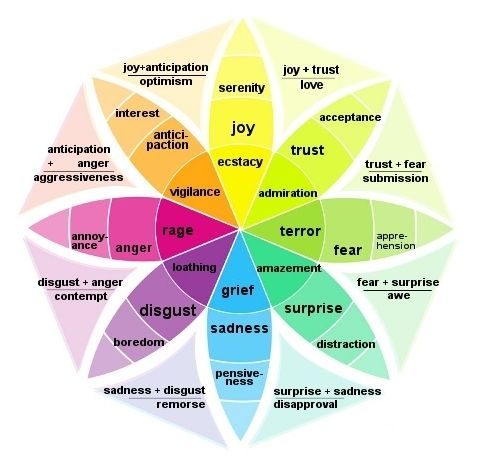

```{r setup_pres, include=FALSE, echo=FALSE}
#devtools::install_github("ropenscilabs/icon")
#devtools::session_info('rmarkdown')

rm(list=ls())
library('tidyverse')
library('gridExtra')
library('broom')
library('cowplot')

library("RefManageR")
library("DT")


#setwd("~/Google Drive Swat/Swat docs/Stat 21/Class13_files")
#setwd("~/Drive/Swat docs/Stat 21/Class9_files")
options(htmltools.dir.version = FALSE)
knitr::opts_chunk$set(fig.path='Figs/',echo=TRUE, warning=FALSE, message=FALSE)

```


```{css, echo=FALSE}
pre {
  background: #FFBB33;
  max-width: 100%;
  overflow-x: scroll;
}

.scroll-output {
  height: 70%;
  overflow-y: scroll;
}

.scroll-small {
  height: 50%;
  overflow-y: scroll;
}
   
.red{color: #ce151e;}
.green{color: #26b421;}
.blue{color: #426EF0;}
```


## Class 8
### Introducing ANOVA

Here's the agenda for today's class: 

- Housekeeping items 

  - RStudio error message
  
  - Update to the syllabus (OH time and etiquette, calendar, and final project)
  
  - HW 4 will be posted on Monday (Oct 4) and due Oct 13 by noon. 
  
  - Test 1 on Oct 15th (no class meeting but I will be available for questions about the exam - times TBD), take-hope test, due Saturday, Oct 17 by noon to Gradescope (absolutely NO late tests accepted)

- Class 8 topics 

  - Penguin data for ANOVA analysis. (Continued from Class 7)
  
  - Info-graphic study guide.
  
---
## Morning check in  
### 7 mins

.pull-left[**Instructions:**

- **Everyone**, use the "annotate" feature to put an "X" near the word(s) that most accurately describe how you are feeling this morning. 
- **Note-taker**, open this slide on your internet browser and share your screen with your group. 
- **Presenter**, take a screenshot of the page when everyone is finished marking their "X"'s and send it to me via your group's slack channel. I will verify that I have seen the image with a check mark on your Slack comment.
- **Recorder**, take notes on who is in attendance and who is performing each role for today's discussions.
- **Questioner**, make sure that everyone has a chance to check in and discuss how they are feeling today.]
.push-right[
```{r, echo=FALSE, fig.align='right', out.height=500}

```
]

---
## Continuing with Class 7 notes...
### Slide 10 


---
## Review of material 
### Group work - 15 mins 

So far, in class we have covered six different settings for statistical inference. Now you are going to create an info-graphic summarizing these different methods using this [worksheet template](https://docs.google.com/document/d/1urmRK3cGlDsVv-Az4KMkUbc07MYGwV8qnf11De3NAYc/edit?usp=sharing). 

You can either all work in the same copy of the worksheet together using Google Docs or you can all work on a Zoom whiteboard with a shared screen copy of the worksheet. 

For each of the different settings include the following information (as applicable):
  - Types of plots (e.g. histogram, box plots, ...)
Necessary assumptions (e.g. independent observations, normal population, ...)
  - Types and number of variables (e.g. 2 categorical, 1 quantitative, continuous, count, ...)
  - Functions in R (e.g. prop.test(), qnorm(), pnorm(), ...)
  - Summary statistics (e.g. mean, variance, proportions, ...)
  - Parameters of interest (e.g. $\mu$, $p$, none, ...)

Use colors to highlight similarities among the different settings.

---
## Review of material 
### Group work - 15 mins 

Assign each setting to a different group member to fill in the details for. Make sure you go over the final product together to discuss any missing parts and to highlight similarities among the settings.

**Note-taker:** You will submit either a screenshot of the final info-graphic or submit the Google doc directly to me over your group's Slack channel at the end of class. (Make sure the settings allow me to access your document!) 

**Presenter:** Be prepared to explain your group's reasoning for the different features of your info-graphic when we come together as a class to review. 

**Recorder:** Keep track of the time and alert your group when to move on to the next setting. I recommend spending the first 5 mins with each person filling in the information for a particular setting or two, the next 5 mins reviewing each others work and fixing mistakes or adding relevant points, and the last 5 mins color-coding the similar traits among the different settings.

**Questioner:** Although everyone can play this role in this activity, it is your responsibility to make sure that each person's work is reviewed before time is up and to ask any questions about missing elements or incorrect statements.

---
## Homework 3 Problem 9
### Moodle question

.scroll-output[
```{r problem9_setup, echo=TRUE, eval=TRUE}
hurricane_data <- tibble(time_pd = c(rep("1944-1969",26), rep("1970-2000",31)),
                         number_of_hurricanes = 
                      c(3,2,1,2,4,3,7,2,3,3,2,5,2,2,4,2,2,6,
                        0,2,5,1,3,1,0,3,2,1,0,1,2,3,2,1,
                        2,2,2,3,1,1,1,3,0,1,3,2,1,2,1,1,0,5,6,1,3,5,3))
## The line below just prints the first few rows of the data set so that we don't 
## end up with a really long looking homweork assignment.
head(hurricane_data)  

#ggplot(hurricane_data, aes(x=, y=)) + 
#  geom_boxplot() +
#  labs(title="Boxplot of hurricane data") + 
#  xlab("Time period") + ylab("Number of hurricanes")
```
]
