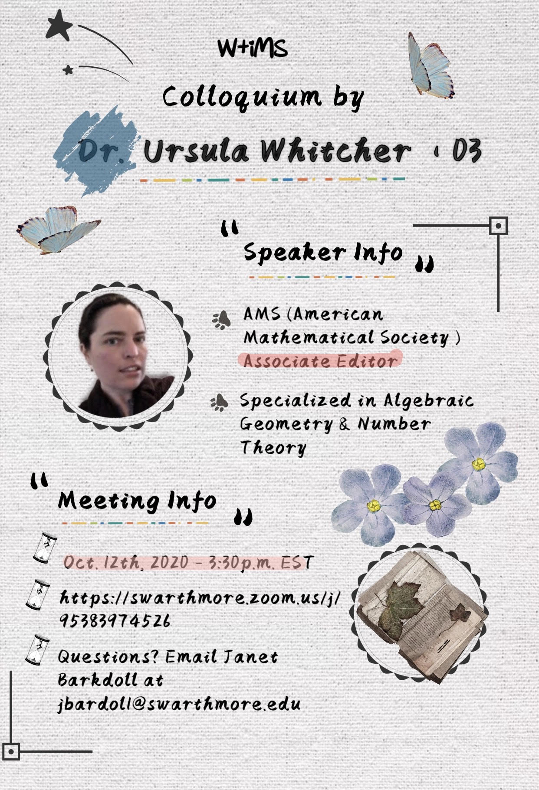

```{r setup_pres, include=FALSE, echo=FALSE}
#devtools::install_github("ropenscilabs/icon")
#devtools::session_info('rmarkdown')

rm(list=ls())
library('tidyverse')
library('gridExtra')
library('broom')
library('cowplot')

library("RefManageR")
library("DT")


#setwd("~/Google Drive Swat/Swat docs/Stat 21/Class13_files")
#setwd("~/Drive/Swat docs/Stat 21/Class9_files")
options(htmltools.dir.version = FALSE)
knitr::opts_chunk$set(fig.path='Figs/',echo=TRUE, warning=FALSE, message=FALSE)

```


```{css, echo=FALSE}
pre {
  background: #FFBB33;
  max-width: 100%;
  overflow-x: scroll;
}

.scroll-output {
  height: 70%;
  overflow-y: scroll;
}

.scroll-small {
  height: 50%;
  overflow-y: scroll;
}
   
.red{color: #ce151e;}
.green{color: #26b421;}
.blue{color: #426EF0;}
```


# Happy Tuesday!  

Here's the agenda for today's class: 

- Housekeeping items

  - HW 4 due Tuesday, the 13th by 6pm ET 
  
  - Test 1 will be released online on Thursday, the 15th
      
      - New Slack channel for Test 1
  
      - Live OHs (in Zoom): 
        
          Friday from 11:00am-12:00pm https://swarthmore.zoom.us/j/89462104560
    
      - Online time (in Slack):
      
          Thursday 10:00am - 12:00pm 
      
          Friday from 1:00pm-2:00pm

  - RStudio should be working - if not please LMK ASAP 

- ANOVA with penguins data set 
  
---
## Morning check in  
### 7 mins

.pull-left[**Instructions:**

- **Everyone**, use the "annotate" feature to put an "X" near the word(s) that most accurately describe how you are feeling this morning. 
- **Note-taker**, open this slide on your internet browser and share your screen with your group. 
- **Presenter**, take a screenshot of the page when everyone is finished marking their "X"'s and send it to me via your group's slack channel. I will verify that I have seen the image with a check mark on your Slack comment.
- **Recorder**, take notes on who is in attendance and who is performing each role for today's discussions.
- **Questioner**, make sure that everyone has a chance to check in and discuss how they are feeling today.]
.push-right[
```{r, echo=FALSE, fig.align='right', out.height=500}
knitr::include_graphics("Figs/wheel_of_emotion.jpeg")
```
]

---
## Ursula Whitcher W+iMS talk and lunch

.center[** Monday, Oct 12th at 3:30pm ET**
https://swarthmore.zoom.us/j/95383974526]

```{r, echo=FALSE, fig.align='center', out.height=500}

```


---
## Simpson's Paradox  

- Can we go over the Simpson's Paradox death penalty example? I don't understand the difference between defendants and victims.
 
- Do you have any sources for more examples of Simpson's Paradox? 

---
## Comprehension quiz questions 

- Can we go over problem 6?
   
- Can we go over how to find the degrees of freedom does the error sum of squares?
   
- When discussing the results of the ANOVA test, do we have to talk about the F statistic in particular?
     
   
---
## ANOVA 
### Moodle questions 

- How deep of an understanding should we have of the ANOVA table...
 
- More clarification on the different cells in the ANOVA table...

- Clarify error sum of squares...

- For the video in class, the anova tests was used when the number of observations was less than 12...
 
More specifically:  
 
- .blue[Can we talk more about the idea of the random error?]
 
- .blue[How can we tell when a p-value signifies a change with one level vs all levels?]
  
- .blue[Is there more specific criteria on when to use an anova test versus multiple t tests?] 

  
---
## ANOVA Table

| Source | Sums of Squares | DF | Mean Square | F-ratio | P-value | 
|--------|------------------|---|-------------|---------|---------|
| Treatment | $SS_{trt}= \sum \sum(\bar{y}_{j}-\bar{\bar{y}})^2$ | $K-1$ | $MS_{trt} = \frac{SS_{trt}}{K-1}$ | $\frac{MS_{trt}}{MSE}$ | $Pr(F \geq \frac{MS_{trt}}{MSE})$ | 
| Error | $SSE=\sum\sum(y_{ij}-\bar{y}_{j})^2$ | $n-K$ | $MSE = \frac{SSE}{n-K}$ |   |  | 
| Total | $SS_{tot}=SS_{trt}+SSE$  | $n-1$ |   |   |   |

### ANOVA Model

$$y_{ij} = \mu_{j} + \epsilon_{ij}$$ 


---
## ANOVA Table Calculations 
### Group work - 15 mins

With your group, use R to help you fill in the elements of the [ANOVA table worksheet](https://docs.google.com/spreadsheets/d/1VjWLaPq_JW8OucQDhkijlajDn8T8zUTTc6yWlcV14-I/edit?usp=sharing) for the `penguins2` data set below.

.scroll-output[
```{r echo=TRUE, eval=FALSE}
#install.packages("remotes")
#remotes::install_github("allisonhorst/palmerpenguins") 
library("palmerpenguins")
penguins2 <- penguins %>% 
  na.omit() %>% ## this is a very useful function that will omit an entire row if any of the column values are missing (NA)
  mutate(bill_length_standard = (bill_length_mm-mean(bill_length_mm))/sd(bill_length_mm),
         species_fct = factor(species))


anova_model <- aov(bill_length_mm ~ species_fct, penguins2)
summary(anova_model)


penguins2 %>% group_by(species_fct) %>% 
              summarize(mean_bill = mean(bill_length_mm),
              var_bill = var(bill_length_mm),
              samp_size = length(bill_length_mm))
```
]

---
## ANOVA Table Calculations 
### Group work - 15 mins

**Note-taker:** You will submit the completed worksheet to me over your group's Slack channel at the end of class. (Please make sure the settings allow me to access your document!) 

**Presenter:** Be prepared to answer questions based on your table when we discuss the worksheet after. 

**Recorder:** Keep track of the time and alert your group when it's time to move on. I recommend spending the last 5 mins to review the completed tables.

**Questioner:** Make sure that the work is reviewed before time is up and to ask any questions about missing elements or incorrect statements.

---
## Review of material 
### Group work - 10 mins 

We are going to revisit the info-graphic you started to create using this [worksheet template](https://docs.google.com/document/d/1urmRK3cGlDsVv-Az4KMkUbc07MYGwV8qnf11De3NAYc/edit?usp=sharing). 

Now, we are going to specifically focus on the ANOVA test. Include the following information (as relevant):
  - Types of plots (e.g. histogram, box plots, ...)
Necessary assumptions (e.g. independent observations, normal population, ...)
  - Types and number of variables (e.g. 2 categorical, 1 quantitative, continuous, count, ...)
  - Functions in R (e.g. prop.test(), qnorm(), pnorm(), ...)
  - Summary statistics (e.g. mean, variance, proportions, ...)
  - Parameters of interest (e.g. $\mu$, $p$, none, ...)

Spend some time comparing and contrasting the ANOVA model with the other methods. Use colors to highlight similarities. Be prepared to share you discussion results with the rest of the class. 

---
## Review of material 
### Group work - 10 mins 

Assign each setting to a different group member to fill in the details for. Make sure you go over the final product together to discuss any missing parts and to highlight similarities among the settings.

**Note-taker:** You will submit either a screenshot of the final info-graphic or submit the Google doc directly to me over your group's Slack channel at the end of class. (Make sure the settings allow me to access your document!) 

**Presenter:** Be prepared to explain your group's reasoning for the different features of your info-graphic when we come together as a class to review. 

**Recorder:** Keep track of the time and alert your group when to move on to the next setting. I recommend spending the last 5 mins color-coding the similar traits among the different settings.

**Questioner:** Although everyone can play this role in this activity, it is your responsibility to make sure that the work is reviewed before time is up and to ask any questions about missing elements or incorrect statements.
