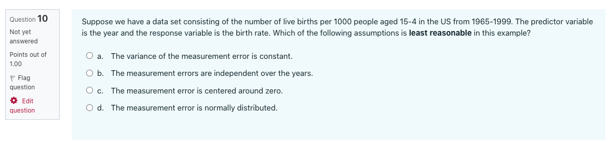

```{r setup_pres, include=FALSE, echo=FALSE}
#devtools::install_github("ropenscilabs/icon")
#devtools::session_info('rmarkdown')

rm(list=ls())
library('tidyverse')
library('gridExtra')
library('broom')
library('cowplot')
library("RefManageR")
library("DT")

#setwd("~/Google Drive Swat/Swat docs/Stat 21/Class13_files")
#setwd("~/Drive/Swat docs/Stat 21/Class9_files")
options(htmltools.dir.version = FALSE)
knitr::opts_chunk$set(fig.path='Figs/',echo=TRUE, warning=FALSE, message=FALSE)
```

```{css, echo=FALSE}
pre {
  background: #FFBB33;
  max-width: 100%;
  overflow-x: scroll;
}

.scroll-output {
  height: 60%;
  overflow-y: scroll;
}

.scroll-small {
  height: 30%;
  overflow-y: scroll;
}
   
.red{color: #ce151e;}
.green{color: #26b421;}
.blue{color: #426EF0;}
```


# Agenda

Here's the agenda for today's class: 

- Group check-ins (5 mins)

- Coding for SLR models (5 mins) 

- Homework 6 group work
  
  * Problem 4 (15 mins)
  
  * Problems 6-7 (15 mins)

- Comprehension quiz questions (10 mins)

- ANOVA for SLR models (10 mins)

- Housekeeping items and announcements (10 mins)

---
# Thursday check-in 

- Send me a screenshot of your check-in markers on Slack

- [Fill out the group roles for today's class](https://docs.google.com/spreadsheets/d/1d34JxqXQON6MyIEjN5ugkByCeTuGTTb_ovvPfSAca_g/edit?usp=sharing) 

```{r, echo=FALSE, fig.align='center', out.height=400}
knitr::include_graphics("Figs/feelings_wheel.jpg")
```

---
## Coding for SLR models 

```{r eval=FALSE}
mydata 

model <- lm(response ~ predictor, mydata)
summary(model)
```

```{r eval = FALSE}
mydata_all <- mydata %>% mutate(mod_residuals = model$residuals,
                                mod_fitted = model$fitted.values)

ggplot(mydata_all, aes(x=mod_fitted, y=mod_residuals)) + 
  geom_point() + 
  labs(title="Residual plot",
       y='Residuals',
       x='Fitted Values')
```

---
## Coding for SLR models 

To find an upper and lower bound for a single value of the predictor:
```{r eval=FALSE}
new_data_pt <- data.frame(predictor = XX)
## Confi bound 
predict(model, new_data_pt, interval="confidence", level = 0.95)
## Pred bound
predict(model, new_data_pt, interval="predict", level = 0.95)
```


---
## Coding for SLR models 

To plot the upper and lower bounds for all observed values of the predictor:
```{r eval=FALSE}
PI_bounds <- predict(modle, mydata, interval="predict", level = 0.95)%>% 
             as_tibble
mydata_interval_bounds <- bind_cols(mydata, PI_bounds) 
```


```{r eval=FALSE}
ggplot(mydata_interval_bounds, aes(x=predictor, y=response)) + 
  geom_ribbon(aes(ymin= lwr, ymax= upr, fill='prediction'),alpha=0.3) +  ## PIs
  geom_smooth(method="lm", se=TRUE, aes(fill='confidence'), alpha=0.3) +  ##CIs
  geom_point() +
  labs(title="Scatter plot of the data and the regression line",
       subtitle="Confidence and prediction intervals",
       y='Response variable',
       x='Predictor variable')
```

---
## Homework 6 
### Problem 4 - group work 


The number of pounds of steam used per month at a plant is thought to be related to the average monthly ambient temperature. The past year’s usages (per 1000 lbs) and temperatures follow.

```{r}
steam_data <- tibble(
  month = c("Jan", "Feb", "Mar", "Apr", "May", "Jun", "Jul", "Aug", "Sep", "Oct", "Nov", "Dec"), 
  temperature = c(21,24,32,47,50,59,68,74,62,50,41,30),
  usage = c(185.79,214.47,288.03,424.84,454.68,539.03,621.55,675.06,562.03,452.93,369.95,273.98))
```

**Instructions:** Work with your group to perform the following analyses. 

(a + b) Fit a simple linear regression model to the data and test for significance of regression. 

(c) Plant management believes that an increase in average ambient temperature of 1 degree will increase average monthly steam consumption by 10,000  lb. Do the data support this statement? 

(d) Construct a 99% prediction interval on steam usage in a month with average ambient temperature of 58 degrees.

---
## Homework 6 
### Problem 4 - group work 

**Group roles:**

- Recorder - Copy and paste the code above into R Studio and share your screen with your group mates. You are responsible for typing and running the code. Share a screenshot of your code with me when there is 1 minute remaining.

- Reporter - Keep track of your group's progress on the group progress check-in spreadsheet and be prepared to discuss your group's answers (or any additional questions) with the class.  

- Questioner - Ask questions as your group comes up with solutions to the problems above and make sure you understand the justification for part (c). In what circumstances would we want a prediction interval vs a confidence interval for the mean response (in part d)? 

---
## Homework 6 
### Problems 6-7 - group work 


The data shown below present the average number of surviving bacteria in a canned food product and the minutes of exposure to 300 degree Fahrenheit heat. Use this data to answer the following questions

```{r}
bacteria_data <- tibble(bacteria_count = c(175, 108, 95, 82, 71, 50, 49, 31, 28, 17, 16, 11),
                        minutes_exposure = c(1,2,3,4,5,6,7,8,9,10,11,12))
```


Create a scatter plot of this data and then fit a SLR model with the number of bacteria as the response. 

(a) What is the average effect on the bacterial growth per each additional minute of exposure based on this model? 

Use the `mutate` function to create a logarithmic transformation of the response variable, bacterial growth. The logarithm function in R is `log`. Create a scatter plot of the transformed data and then fit a SLR model with the logarithm of the number of bacteria as the response. 

(b) What is the average effect on the bacterial growth per each additional minute of exposure based on this transformed model? 

---
## Homework 6 
### Problems 6-7 - group work 

**Group roles:**

- Recorder - Copy and paste the code above into R Studio and share your screen with your group mates. You are responsible for typing and running the code. Share a screenshot of your code with me when there is 1 minute remaining.

- Reporter - Keep track of your group's progress on the group progress check-in spreadsheet and be prepared to discuss your group's answers (or any additional questions) with the class.  

- Questioner - Ask questions as your group comes up with solutions to the problems above and make sure you understand why we are using the logarithmic transformation. Are there extra steps in answering part (b) vs answering part (a)? Why? 


---
### Questions from the comprehension quiz 

```{r, echo=FALSE, fig.align='center', out.height=300}

```

---
## Analysis of variance 
### For regression models 

For both SLR and one-way ANOVA models, the code fitting the model is similar:

```{r eval=FALSE}
## One-way ANOVA
ANOVA_model <- lm(response ~ factor(predictor), mydata) 

## SLR
SLR_model <- lm(response ~ predictor, mydata) 
```

---
## Analysis of variance 
### For regression models 

The ANOVA table for a regression model is also similar except now rather than looking at the dispersion of the observed $y$ values around the group and overall means, we now consider the dispersion of the observed $y$ values about the fitted values based on our model. 

| Source | Sums of Squares | DF | Mean Square | F-ratio | P-value | 
|--------|------------------|---|-------------|---------|---------|
| Model | $SS_{reg}= \sum_{i}(\hat{y}_{i}-\bar{y})^2$ | $1$ | $MS_{reg} = \frac{SS_{trt}}{K-1}$ | $\frac{MS_{trt}}{MSE}$ | $Pr(F \geq \frac{MS_{reg}}{MSE})$ | 
| Error | $SSE=\sum_{i}(y_{i}-\hat{y}_{i})^2$ | $n-2$ | $MSE = \frac{SSE}{n-2}$ |   |  | 
| Total | $SS_{tot}=SS_{trt}+SSE$  | $n-1$ |   |   |   |

The overall F-test for model fit of a SLR model is testing the hypotheses: 

$$H_0: \text{ }\beta_1=0 \\ H_A: \text{ }\beta_1\neq 0$$
Note: this is the same hypothesis as the t-test for the significance of the predictor variable! 

---
### Planning ahead for next week  


- Watch the videos for next week 

- Special arrangements for next week 

  * No office hours on Monday, instead they will be Wednesday evening from 7:30-8:30 pm EST 
  
  * We may not have class on Tuesday, but I will release a video to watch instead 
  
  * We will have class on Thursday before the test is released, this will be a review class with the opportunity to ask clarifying questions as before 
  
  * Slack channel `test2_questions` is available as before. 

- Final project Part 1 is due Thursday, April 15th to **Moodle** (not Gradescope) by noon EST 

- Test 2 will be released on Thursday, April 15th at noon EST

  * It is due to be submitted to Gradescope by Saturday April 17th at noon EST

---
### Announcements 

[Math/Stat Career Panel](http://www.swarthmore.edu/NatSci/sthornt1/Stat021/S2021/CareerPanel.pdf)

**What can you do with a math/stat degree?**


Come meet Swarthmore math and statistics alumni. Hear about their career experiences and journeys. Ask questions and get valuable advice for your own career!


**Part 2: Today from 8-9pm (EST)**
https://swarthmore.zoom.us/j/82679149704

Panelists:

David Chudzicki, Co-founder and CTO, Decision.ai;

Andy Lee, Founder, BasisBoard;

Jason Mendoza, Economist, Moody's Analytics;

Emma Remy, Data Science Analyst, Pew Research Center;

Anastasia White-Tourrellas, Derivatives Relative Value Trader, Two Sigma
