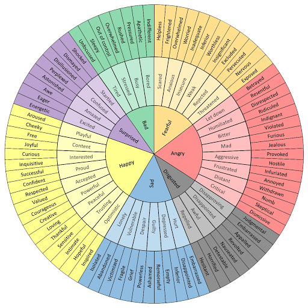

```{r setup_pres, include=FALSE, echo=FALSE}
#devtools::install_github("ropenscilabs/icon")
#devtools::session_info('rmarkdown')

rm(list=ls())
library('tidyverse')
library('gridExtra')
library('broom')
library('cowplot')
library("RefManageR")
library("DT")

#setwd("~/Google Drive Swat/Swat docs/Stat 21/Class13_files")
#setwd("~/Drive/Swat docs/Stat 21/Class9_files")
options(htmltools.dir.version = FALSE)
knitr::opts_chunk$set(fig.path='Figs/',echo=TRUE, warning=FALSE, message=FALSE)
```

```{css, echo=FALSE}
pre {
  background: #FFBB33;
  max-width: 100%;
  overflow-x: scroll;
}

.scroll-output {
  height: 80%;
  overflow-y: scroll;
}

.scroll-small {
  height: 40%;
  overflow-y: scroll;
}
   
.red{color: #ce151e;}
.green{color: #26b421;}
.blue{color: #426EF0;}
```


# Agenda

Here's the agenda for today's class: 

- Group check-ins (5 mins)

- Topics from Moodle

- Problems from homework

- Reading data into R from external sources 

- Housekeeping items and announcements (5 mins)

---
# Thursday check-in 

- Send me a screenshot of your check-in markers on Slack

- [Fill out the group roles for today's class](https://docs.google.com/spreadsheets/d/1d34JxqXQON6MyIEjN5ugkByCeTuGTTb_ovvPfSAca_g/edit?usp=sharing) 

```{r, echo=FALSE, fig.align='center', out.height=500}

```


---
## Bonus Problem 
### Homework 2

Census data for a certain country shows that 19% of the adult residents are Latinx. Suppose 72 people are called for jury duty and only 9 of them are Latinx. We want to know if this apparent under-representation of Latinx jurors calls into question the fairness of the jury selection system.

a) Clearly define the population we are studying.

b) State the unknown parameter that we are interested in estimating. (Hint: It is a proportion.)

c) What is the sample estimate for the parameter in part (b) based on the observed data? 

d) State a null and alternative hypothesis test we can conduct to answer this question and provide the formula for the test statistic. 

---
## Bonus Problem 
### Homework 2

Census data for a certain country shows that 19% of the adult residents are Latinx. Suppose 72 people are called for jury duty and only 9 of them are Latinx. We want to know if this apparent under-representation of Latinx jurors calls into question the fairness of the jury selection system.

e) If the null hypothesis is true, draw a Normal density curve representing the distribution of the sample proportion. Specify the mean and variance of this sampling distribution. Label the observed test statistic and shade the region that corresponds to the p-value for the test in part (d). 


---
## Bonus Problem 
### Homework 3 

American League baseball teams play their games with the designated hitter rule, meaning that pitchers do not bat. The league believes that replacing the pitcher, traditionally a weak hitter, with another player in the batting order produces more runs and generates more interest among fans. Below are the average numbers of runs score in American League and National League stadiums for the first half of the 2001 season. 

**American:** 11.1, 10.8, 10.8, 10.3, 10.3, 10.1,10.0, 9.5, 9.4, 9.3, 9.2, 9.2, 9.0, 8.3

**National:** 14.0, 11.6, 10.4, 10.3, 10.2, 9.5, 9.5, 9.5, 9.5, 9.1, 8.8, 8.4, 8.3, 8.2, 8.1, 7.9 


a) Estimate the mean number of runs scored in American League games with a 95% CI. 

b) How would you describe the population under study for part (a)?

c) What is the sample variance of the number of runs scored in American League games? 

```{r}
american <- c(11.1, 10.8, 10.8, 10.3, 10.3, 10.1,10.0, 9.5, 9.4, 9.3, 9.2, 9.2, 9.0, 8.3)
```


---
## Bonus Problem 
### Homework 3 


d) Estimate the mean number of runs scored in National League games with a 95% CI. 

e) How would you describe the population under study for part (c)?

f) What is the sample variance of the number of runs scored in American League games? 

```{r}
national <- c(14.0, 11.6, 10.4, 10.3, 10.2, 9.5, 9.5, 9.5, 9.5, 9.1, 8.8, 8.4, 8.3, 8.2, 8.1, 7.9)
```

---
## Bonus Problem 
### Homework 3 

g) Using the procedure for inference about an un-paired difference in means, find a 95% CI for the mean difference in runs between the two leagues. 


 
```{r} 
t.test(american, national, paired=FALSE)
``` 


---
## Bonus Problem 
### Homework 3 


h) How would you define the population under study for part (g)? 

i) What is the sample variance of the difference in the number of runs scored between the American League games and the national league games? 

---
## Homework 3 
### Problem 5


After losing several times in a street performance game, you suspect that the die used by the performer may be unfair. To check, you roll the die $60$ time, recording the number of times each face appears. Do these results case doubt on the die's fairness? If the die is fair, how many times would you expect each face to occur?

| Face | Count |
|------|-------|
| 1 | 11 |
| 2 | 8 |
| 3 | 9 |
| 4 | 15 |
| 5 | 10 |
| 6 | 7 |

To answer this question, perform a chi-squared goodness-of-fit test. Clearly state the null and alternative hypotheses, check the necessary conditions, identify the degrees of freedom and report the p-value. 


---
## Homework 3 
### Problem 5

```{r echo=FALSE}
counts <- c(11, 8, 9, 15, 10, 7)
probs <- rep(1/6, 6)
chisq.test(counts, p=probs)
```


---
## Review example
### Week 5: More Chi-square procedures


A brokerage firm wants to see whether the type of account a customer has (Silver, Gold, or Platinum) affects the type of trades that customer makes (in person, by phone, or online). It collects a random sample of trades made for its customers over the past year and preforms a chi-square test for independence.


```{r}
data_table <- matrix( c(52, 57, 220, 103, 124,104, 132, 24, 7), byrow=TRUE, ncol=3)

chisq.test(data_table)
```


---
## Reading data into R from external sources

.scroll-output[
```{r}
library("tidyverse")

body_temp_dat <- read_table2(url("http://www.swarthmore.edu/NatSci/sthornt1/Stat021/Class3_files/F2019/normtemp_data.txt"))

body_temp_dat %>% head

body_temp_dat %>% summary
```
]

---
## Announcements

Test 1 will be available on Moodle at **2pm EST** today. 

Note, office hours today are canceled. If you have any questions about Test 1, please use the `#test1-questions` channel in Slack. Do not ask questions like "is [this] the right answer?" This channel is only for questions that clarify the instructions or to check if something is a typo. I will check Slack tonight at 5pm EST and tomorrow at 2pm EST. 

**Test 1 Extra Credit:** Annie Ping, Nancy Vu, and Katie Carlson 

## Planning ahead for next week

- Watch the videos for Week 6 before Tuesday's class.  

- No homework due Monday, the 15th. 

- Enjoy your weekend! 


