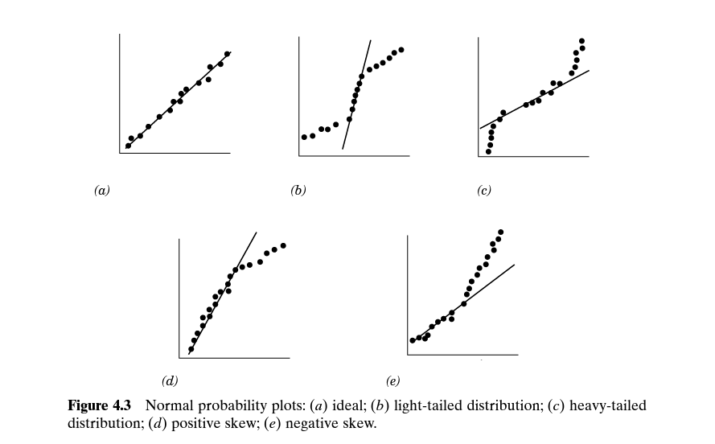
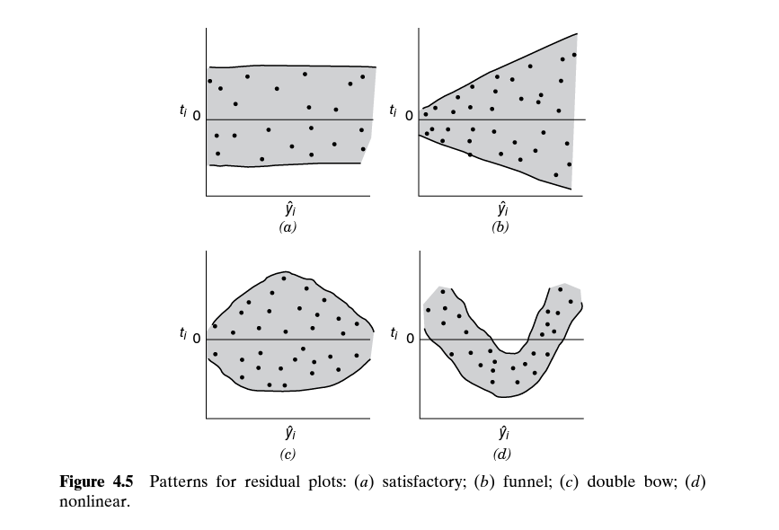

```{r setup_pres, include=FALSE, echo=FALSE}
#devtools::install_github("ropenscilabs/icon")
#devtools::session_info('rmarkdown')

knitr::opts_chunk$set(message = FALSE) # include this if you don't want markdown to knit messages
knitr::opts_chunk$set(warning = FALSE) # include this if you don't want markdown to knit warnings

rm(list=ls())
library('tidyverse')
library('gridExtra')
library('broom')
library('cowplot')

library("RefManageR")
library("DT")

library('scatterplot3d')
```

```{css, echo=FALSE}
pre {
  background: #FFBB33;
  max-width: 100%;
  overflow-x: scroll;
}

.scroll-output {
  height: 70%;
  overflow-y: scroll;
}

.scroll-small {
  height: 50%;
  overflow-y: scroll;
}
   
.red{color: #ce151e;}
.green{color: #26b421;}
.blue{color: #426EF0;}
```

## Multiple linear regression
### Assumptions 

- Relationship between the response and the set of predictor variables (the regressors) is approximately linear 

- The error term, $\epsilon$, has zero mean 

- The error term has constant variance $\sigma^2$ 

- The errors are uncorrelated 

- The errors are Normally distributed 

---
## Multiple linear regression
### Assumptions 

- Relationship between the response and the set of predictor variables (the regressors) is approximately linear $\leftarrow$ .red[Use residual plots!] 

- ~~The error term, $\epsilon$, has zero mean~~

- The error term has constant variance $\sigma^2$ $\leftarrow$ .red[Use residual plots!] 

- The errors are uncorrelated 

- The errors are Normally distributed $\leftarrow$ .red[Use Normal probability plots of the residuals!]

---
## Multiple linear regression
### (Studentized) Residuals

Residuals measure the deviation between the observed data, $y_{obs}$, and the fitted response, $\hat{y}$. Some properties of residuals are 

1. The mean of the residuals is always zero. 

2. The variance of the residuals is, on average, equal to the $MSE = \frac{SSE}{n-p}$. 

3. The residuals are correlated. (This is mainly a problem when the number of parameters $p$ is close to - or larger than - your sample size, $n$.) 

  - This is one reason we want to use studentized residuals.
  
  - This is also why we plot the residuals, $e_i$, vs the fitted values, $\hat{y}_i$, (rather than the observed $y$ values)           


--
From now on, we are going to use only use plots of the *studentized residuals* 

```{r eval=FALSE}
library("MASS")
studres(mod)  ## this is the function to calculate the studentized residuals of "mod" 
```

---
## Normal probability plots 

```{r, echo=FALSE, fig.align='center', out.height=500}

```

---
## Residual plots 
### Residuals vs fitted values 

.push-left[
- Outliers

- Non-constant variance

- Non-linearity
]
.pull-right[
```{r, echo=FALSE}

```
]


---
## Residual plots 
### Residuals vs regressors 


- Transformations of predictors (non-linear relationships) 

- Extrapolation 

- Potentially useful additional predictors 


--
### Reading along in your textbook 

Chapter 4 Sections 1 and 2
