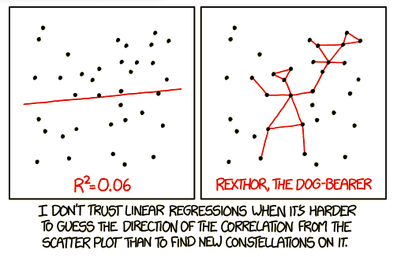

```{r setup, include=FALSE}
knitr::opts_chunk$set(echo = F, message=F, warning=F)
library(dplyr)
library(ggplot2)
library(gridExtra)
library(kableExtra)
library(knitr)
library(tidyverse)
library(png)
library('broom')
library('cowplot')

#setwd("~/Google Drive Swat/Swat docs/Stat 21/Data")
options(htmltools.dir.version = FALSE)
#options(knitr.kable.NA = '')

#vg_data <- read_csv("~/Google Drive/Swat docs/Stat11_S20/Midterm1/vgsalesGlobale.csv")
#vg_subset <- vg_data %>% filter((Publisher=="Nintendo")|
#                                (Publisher=="Namco Bandai Games")|(Publisher=="Electronic Arts")) %>% 
#                         filter(Global_Sales <= 4)
theme_set(theme_bw())
```

```{css, echo=FALSE}
pre {
  background: #FFBB33;
  max-width: 100%;
  overflow-x: scroll;
}
```

\hspace{1in} **Do not flip this page until instructed to do so.** 

\vspace{.2in}

**Instructions:** The first part of this test are multiple choice questions that do not require any additional explanation or work. No extra work will be considered in the grading of these questions but *you can get partial credit* for many of these questions.  The last part of this test involves short answer questions. For these questions, you must show all your work and/or provide enough justification and explain your reasoning in order to get full credit or be considered for partial credit. You do not need a calculator to evaluate any expressions. For any calculation problems, simply writing out the formula to find the answer will suffice. 


**Test organization:** There are $9$ questions in total on this test and they are organized into two subsections: the first **5** questions are select all that apply multiple choice questions and the last **4** questions are free response. If you need additional paper you may come to the front of the class and pick some up. There are a total of $30$ points possible on this test. 

\vspace{.2in}

**First and Last Name:** _____________________________

\vspace{.2in}

**Swarthmore Username:** ______________________________

\vspace{0.5cm}


**Take a deep breath.** 

You have prepared for this test and with a clear and well-rested mind, you are ready to show me what you have learned this semester. As with the other tests, the purpose of this test is to measure your understanding of the material we have covered. This is nothing more than a metric for me to evaluate your preparedness to think statistically at this particular moment in time and in this particular setting. This is not a perfect measure of your knowledge and does not predict your future statistical skills. 


\pagebreak

## Multiple choice problems (2 points each)

### 1 

The average prevalence of lung cancer across the entire state is 31.6 cases per 100,000 individuals. A doctor wants to determine how closely the prevalence of lung cancer for her patients from a rural area of that state aligns with the state wide average. She calculates a 90\% confidence interval of $[37.2, 40.1]$ for the average prevalence (per 100,000 individuals) of lung cancer based on a random sample of her patients and patients from nearby doctors over the last three years. Which of the following statements are valid interpretations of this confidence interval? Circle all that apply. 

**(a) This confidence interval indicates that the prevalence of lung cancer in this area is likely much higher than the state-wide average.** 

(b) If another doctor were to conduct the same study on a new random sample of patients from the region, there is a 90\% chance that he would calculate the same confidence interval.

**(c) If this study were to repeated with new random samples, the resulting confidence intervals would contain the true prevalence of lung cancer in this area 90\% of the time.** 

(d) There is a 10\% chance that the interval $[37.2, 40.1]$ does not capture the true prevalence of lung cancer (per 100,000 individuals) for this area. 

**Rubric:** Solutions for v1 are bolded. Solutions for v2 are not bolded.


### 2 

A candidate running for mayor of a town in Minnesota suspects that there is evidence of racial bias in his town and state judicial system. He investigates the incarceration rates of white and non-white offenders finding a p-value of 0.003 when testing the null hypothesis that the incarceration rates of white offenders is the same as that of non-white offenders vs the alternative that the incarceration rates of white offenders is smaller than that of non-white offenders. Which of the following statements are valid interpretations of this p-value? Circle all that apply. 

(a) There is a large difference between the incarceration rates of white offenders and non-white offenders. 

**(b) The difference between the incarceration rates of white offenders and non-white offenders is likely not due to random chance.**

(c) The probability of a randomly selected white offender being incarcerated is 0.003 times smaller than the probability of a non-white offender being incarcerated. 

**(d) For randomly selected offenders in this state, if the incarceration rates are equal, then the probability we observe a difference in incarceration rates as large or larger than observed in this data set is 0.003.**

**Rubric:** Solutions for v1 are bolded. Solutions for v2 are not bolded.

### 3

Which of the following statements are *true*? Circle all that apply. 

**(a) For the same value of the predictor, the 95\% prediction interval for a new observation is always wider than the 95\% confidence interval for the mean response.**

(b) The variability due to error (SSE) is always smaller than the variation explained by the model (SSModel).

**(c) If the correlation between a predictor $X_1$ and $Y$ is greater (in magnitude) than the correlation between another predictor, $X_2$, and $Y$, then the coefficient of determination for regressing $Y$ on $X_1$ is greater than the coefficient of determination for regressing $Y$ on $X_2$. ** 

**Rubric:** Solutions for v1 are bolded. Solutions for v2 are not bolded.


### 4

Which of the following conditions for inference in regression does a fitted-values vs. residual plot aid in assessing? Circle all that apply. 

**(a) Linearity** 

**(b) Constant variance** 

(c) Independence 

(d) Normality 

**Rubric:** Solutions for v1 are bolded. Solutions for v2 are not bolded.


### 5

In which of the following situations do we need to asses the normality and randomness conditions for inference in regression? Circle all that apply. 

(a) A scientist studying a random sample of sparrows at Kent Island wants to determine how the average weight (in grams) of the birds changes for each additional mm in wing length. 

(b) Someone interested in selling their house creates a SLR model using the list price of local houses as a predictor of the final sale price of each house once sold. They want to predict the actual sale price of their home for a list price of $189,000. 

**(c) A nutritionist wants to determine if an increase in sugar content (in grams) of breakfast cereal corresponds to a positive (non-zero) change in calories per serving while also obtaining an upper and lower bound on the size of the increase.**

**(d) A used car salesperson wants to determine if an increase in the number of miles on a car has a statistically significant impact on the sale price of the vehicle.**

**Rubric:** Solutions for v1 are bolded. Solutions for v2 are not bolded.

***

# Short answer questions 

### 6 (4 points)

We've discussed the construction of statistical models as following four general steps: 

1. Choose which relationship to model. 

2. Fit the data to your chosen model. 

3. Assess the fit of the model. 

4. Use the estimated model to answer statistical questions. 

Credit card companies are allowed to change their annual percent interest rate (APR) depending on different factors than involve your personal spending habits and decisions made by the Federal Reserve. Suppose you are interested in exploring a linear relationship between payments made on your credit card account and the APR at the time of your payment. Describe what you would do at each of the four modeling steps above in no more than 1-3 sentences per step. Make sure to provide some justification/explanation for each activity.   

**Solution:** 

(1) select predictor and response with some reason why (more measurement error in Y)

(2) use LSE to estimate slope and intercept and model variance  

(3) residual plot and quantile plot to assess conditions; overall model fit measurements (r2 or ANOVA) 

(4) CI for mean response or PI for unobserved response or CI for slope parameter 

**Rubric:** Select all Gradescope items that apply for each student's answer. Prof Suzy will review these answers to determine if full credit or partial credit. If you are unsure of anything in a student's answer please leave a comment for Prof Suzy. 


### 7 (4 points)

Based on the data shown in the scatter plot of this comic<sup>[1]</sup>, what can you tell me about the relationship between the $SS_{Mod}$ and $SSE$ terms?
```{r, echo=FALSE, out.width='60%', fig.align='center'}

```

**Solution:** Correct answers should indicate that $SS_{Mod} < SSE$ or that $SS_{Mod} \approx SSE$.

**Rubric:** Select all Gradescope items that apply for each student's answer. Prof Suzy will review these answers to determine if full credit or partial credit. If you are unsure of anything in a student's answer please leave a comment for Prof Suzy. 


### 8 (6 points)

The data below represents a simple random sample of Singaporean diamonds. Suppose we are interested in how the size of the diamond (in carats) can predict (or explain) what the cost of the diamond will be. Below is the R code for fitting this simple linear regression model.  
```{r echo=FALSE, warning=FALSE, message=FALSE}
diamond_dat <- read_table2("diamond_dat.txt",skip=2, col_names = FALSE)
colnames(diamond_dat) <- c("size", "price")
```

```{r diamondPlots1, echo=TRUE, warning=FALSE, message=FALSE, fig.align='center', out.height=300}
diamond_mod <- lm(price~size, data=diamond_dat)
diamond_mod %>% summary
```

Analyse the following plots based on this regression model to answer the next two questions. 


```{r diamondPlots2, echo=FALSE, warning=FALSE, message=FALSE, fig.align='center'}
diamond_dat2 <- diamond_dat %>% mutate(resids = diamond_mod$residuals, 
                                       fits = diamond_mod$fitted.values, 
                                       studresids = rstudent(diamond_mod))
ggplot(diamond_dat2, aes(sample=resids)) + 
  stat_qq() + 
  stat_qq_line() +
  labs(title = "Residual plot", subtitle="Normal probability plot", x="Theoretical quantiles", y="Ordered residuals")

ggplot(diamond_dat2, aes(x= fits, y=resids))+
  geom_point() + 
  labs(title = "Residual plot", subtitle="Fitting diamond prices as a linear function of size", x="Predicted price", y="Residuals") 

ggplot(diamond_dat2, aes(x=studresids))+
  geom_histogram()+
  labs(title = "Studentized residuals", x="Studentized residuals", y="Frequency")
```


a) Based on these plots, what conclusions can we make about the conditions necessary for inference with a SLR model?

**Solution:** 

linear relationship - no pattern in the residual plot and even distribution of points above and below 

constant variance - seems reasonable no severe funneling pattern to residual plot

Normality - quantile plot points fall along the line so this condition seems to be reasonable 


**Rubric:** Select all Gradescope items that apply for each student's answer. If you are unsure of anything in a student's answer please leave a comment for Prof Suzy. 


b) Say instead of the size of the diamond measured in carats, we'd like to look at the size in grams (1 carat $=$ 0.2 grams). Would we expect the behavior of any of the plots above to change? Briefly explain your answer. 

**Solution:** None of the plots above would change because this is a linear transformation

**Rubric:** Select all Gradescope items that apply for each student's answer.  If you are unsure of anything in a student's answer please leave a comment for Prof Suzy. 


### 9 (6 points)

The data that appear in the data set "Four-Mile-Run-data.txt" were collected by a GPS watch worn by the runner of a four-mile course. Using heart rate measurements after each run, an analysis of the runner's post-exercise heart rate recovery provides an indication of cardiovascular fitness. Suppose we are interested in answering the question: is the speed of the run (in mph) related to the number of calories burned? Below is the R code and output for fitting such a linear model to this data.<sup>[2]</sup>  

```{r runOutput, echo=TRUE, warning=FALSE, message=FALSE}
run_dat <- read_table2("Four-Mile-Run-data.txt")
run_reg <- lm(calories~aveSpeed, run_dat) 
run_reg %>% summary
```


a) What is the estimate for the standard deviation of the number of calories burned based on this linear model?

**Solution:** $\hat{\sigma}=30.84$


b) On average, how many more (or fewer) calories can our runner expect to burn for each mph increase in average running speed? 

**Solution:** Can expect to burn an average of $80.92$ additional calories per each increase in mph. 


c) Suppose, on average, for any person within the same age group as our runner, every mph increase in running speed corresponds to $100$ additional calories burnt. Describe a procedure to determine if our runner's rate of burning calories is different from this average for all people in the age group. Make sure you define any symbols you use. You do not need to actually determine the answer, just describe the statistical procedure you would use. 

**Solution:** Either (1)calculate a CI for $\beta_1$, the slope of our runner's model and see if it contains the value $100$ or (2)perform a hypothesis test for $H_0: \beta_1 = 100$ 


d) List two numbers in the R output above that can help us determine if this model is a good fit for the dat. Explain each briefly. 

**Solution:** Any of the following options are valid: 

  - R-squared (adjusted or multiple is fine); 

  - p-value of the F-test for model fit; 

  - p-value of the t-test for the significance of the predictor. 

**Rubric:** Select all Gradescope items that apply for each student's answer. Prof Suzy will review these answers to determine if full credit or partial credit. If you are unsure of anything in a student's answer please leave a comment for Prof Suzy. 


***

# References


[1] https://xkcd.com/1725

[2] Paul J. Laumakis & Kevin McCormack (2014) Analyzing Exercise Training Effect and Its Impact on Cardiorespiratory and Cardiovascular Fitness, Journal of Statistics
Education, 22:2, , DOI: 10.1080/10691898.2014.11889702]