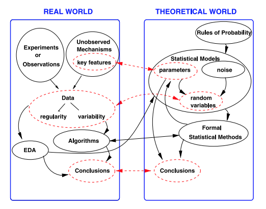

```{r setup_pres, include=FALSE, echo=FALSE}
#devtools::install_github("ropenscilabs/icon")
#devtools::session_info('rmarkdown')

rm(list=ls())
library('tidyverse')
library('gridExtra')
library('broom')
library('cowplot')
library("RefManageR")
library("DT")

#setwd("~/Google Drive Swat/Swat docs/Stat 21/Class13_files")
#setwd("~/Drive/Swat docs/Stat 21/Class9_files")
options(htmltools.dir.version = FALSE)
knitr::opts_chunk$set(echo=TRUE, warning=FALSE, message=FALSE) #fig.path='Figs/',
```

```{css, echo=FALSE}
pre {
  background: #FFBB33;
  max-width: 100%;
  overflow-x: scroll;
}

.scroll-output {
  height: 60%;
  overflow-y: scroll;
}

.scroll-small {
  height: 30%;
  overflow-y: scroll;
}
   
.red{color: #ce151e;}
.green{color: #26b421;}
.blue{color: #426EF0;}
```


## Independent samples 

There are many, many ways for errors to fail to be independent, so it's quite hard to do a general test for dependence... For more typical problems, you really need to specify what kind of dependence you might be looking for. ...[If] you can elucidate a likely source of dependence in your problem, that will tell you a great deal about what kinds of things to look for.

Independence of observations is largely a study design issue rather than something you can test for, but it is an important assumption.


In MLR specifically: 

Independence of the errors means that they are not related to one another or not somehow clustered.

Error is the deviation from the true linear relationship. Independence in error implies, independence in Y **conditioned upon** all predictors in the model. 

* Temporal

* Spatial 

* Genetic 


---
## About random variables 
### Sampling strategies 
  
"Research studies are usually carried out on sample of subjects rather than whole populations. The most challenging aspect of fieldwork is drawing a random sample from the target population to which the results of the study would be generalized. In actual practice, the task is so difficult that some sampling bias occurs in almost all studies to a lesser or greater degree. In order to assess the degree of this bias, the informed reader of medical literature should have some understanding of the population from which the sample was drawn. The ultimate decision on whether the results of a particular study can be generalized to a larger population depends on this understanding."

"Similarly, in inferential statistics, it is not enough to just describe the results in the sample. One has to critically appraise the real worth or representativeness of that particular sample."


.footnote[Source: “Statistics without tears: Populations and samples Amitav Banerjee, Suprakash Chaudhury” Industrial Psychiatry Journal 2010]


---
## Statistical Inference
### Moving from the sample to the population 
  
"Note, in particular, that data should not be confused with random variables. Random variables live in the theoretical world. When we say things like, “Let us assume the data are normally distributed” and we proceed to make a statistical inference, we do not need to take these words literally as asserting that the data form a random sample. Instead, this kind of language is a convenient and familiar shorthand for the much weaker assertion that, for our specified purposes, the variability of the data is adequately consistent with variability that would occur in a random sample."

For confidence intervals and hypothesis tests "[we] are able to draw useful conclusions as long as our theoretical world is aligned well with the real world that produced the data."


.footnote[Source: Statistical Inference: The Big Picture. Robert E. Kass Statistical Science 2011]


---
## About statistical inference 
### Moving from the sample to the population
  
  
```{r, echo=FALSE, fig.align='center', out.height=400}

```


.footnote[Source: Statistical Inference: The Big Picture. Robert E. Kass Statistical Science 2011]

---
## What does it mean to practice statistics or data science in an ethical manner? 


Some associations have established guidelines that attempt to address this question for modern statisical and computing practices: 

* American Statistical Association recently published these [Ethical Guidelines](https://www.amstat.org/your-career/ethical-guidelines-for-statistical-practice)

* Similarly, the Association for Computing Machinery published a [Code of Ethics](https://www.acm.org/code-of-ethics)

* The [Belmont Report](https://www.hhs.gov/ohrp/regulations-and-policy/belmont-report/read-the-belmont-report/index.html) is a federal document outlining ethical principles and guidelines for the protection of human subjects of research from 1979. 


--
**Q:** What measures for accountability of ethical practice exist? 


