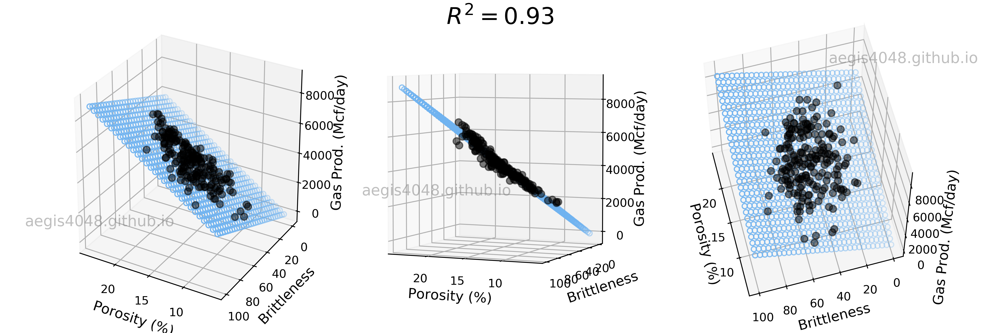

```{r setup_pres, include=FALSE, echo=FALSE}
#devtools::install_github("ropenscilabs/icon")
#devtools::session_info('rmarkdown')

rm(list=ls())
library('tidyverse')
library('gridExtra')
library('broom')
library('cowplot')
library("RefManageR")
library("DT")
library("png")

#setwd("~/Google Drive Swat/Swat docs/Stat 21/Class13_files")
#setwd("~/Drive/Swat docs/Stat 21/Class9_files")
options(htmltools.dir.version = FALSE)
knitr::opts_chunk$set(fig.path='Figs/',echo=TRUE, warning=FALSE, message=FALSE)
```

```{css, echo=FALSE}
pre {
  background: #FFBB33;
  max-width: 100%;
  overflow-x: scroll;
}

.scroll-output {
  height: 70%;
  overflow-y: scroll;
}

.scroll-small {
  height: 30%;
  overflow-y: scroll;
}
   
.red{color: #ce151e;}
.green{color: #26b421;}
.blue{color: #426EF0;}
```


### SLR 

$$Y   = \beta_0 + \beta_1 x + \epsilon, \quad\text{where } E(\epsilon)=0 \text{ and } Var(\epsilon)=\sigma^2$$

$$\mu_{Y} = E(Y) = \beta_0 + \beta_1 x$$

Estimation

  - Variance of the random error (and random response)
  
  - Average/predicted response per unit increase in predictor 

Inference 

  - Tests for the "significance of the predictor" 

  - Confidence intervals for the coefficients 
  
  - Confidence intervals for the mean response  
  
  - Prediction intervals for an unobserved response  
  
  

---
### SLR 


Interpretation 

  - Average response not exact 
  
  - Residuals as approximations to random measurement error 
  
Assumptions about the random measurement error associated with the response variable
  
  - Zero mean 

  - Constant variance  
  
    * Residual plots - residuals vs fitted values 
    
    * Transform the quantitative response or predictor variables if need be 
  
  - Independence 
  
  - Normally distributed measurement error 
    
    * Normal probability plots - of the *standardized* residuals 
    
    * Only necessary for *inference* 


---
# Multiple linear regression (MLR)

General model for $k$ predictor variables

$$Y = \beta_0 + \beta_1 x_1 + \beta_2 x_2 + \cdots + \beta_k x_k + \epsilon$$

where the following assumptions are made about the random variable  $\epsilon$

  - $E(\epsilon)=0$ and  $Var(\epsilon)=\sigma^2$;
  
  - All errors are independent of one another; 
  
  - The error is normally distributed (only necessary for *inference*). 
  
This means that on average we are describing the trend of $Y$ with a $k+1$ dimensional hyperplane...

$$\mu_Y = E(Y) = \beta_0 + \beta_1 + \beta_2 x_2 + \dots + \beta_k +x_k$$

---
# Multiple linear regression (MLR)

Some of the ways we can ASSESS the adequacy of a MLR model include:

  - Overall (ANOVA) F-test 
  
    $$H_0: \beta_1 = \beta_2 = \dots = \beta_k = 0 \quad H_A: \text{Not all }\beta_j's \text{ are equal}.$$ 

  - Adjusted R-squared value
  
    $$r^2_{adj} = 1 - \frac{SSE/(n-k-1)}{SS_{Tot}/(n-1)} = 1 - \frac{\hat{\sigma}^2}{s^2_{Y}}$$

  - (Standardized) Residuals vs fitted values plot which have the same interpretations as in SLR! 
  
---
## Visualizing a "response surface" from a three dimensional MLR model 
  
The plots below visualize a fitted hyperplane (a multi-dimensional line) for a MLR model with two predictors (brittleness and porosity) and gas produced as the response variable.* 

```{r echo=FALSE, fig.align='center', out.width=1000}  
  
```


.footnote[*https://aegis4048.github.io/mutiple_linear_regression_and_visualization_in_python]