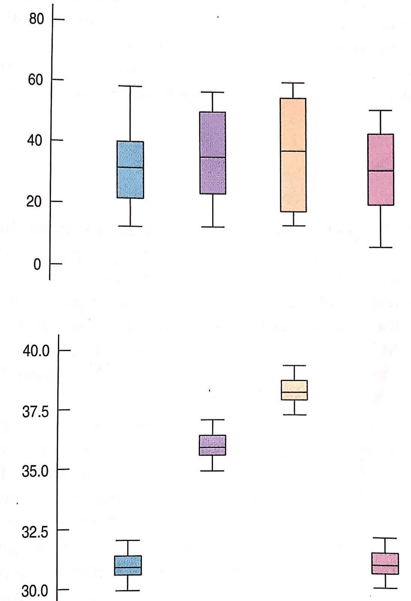

```{r setup_pres, include=FALSE, echo=FALSE}
#devtools::install_github("ropenscilabs/icon")
#devtools::session_info('rmarkdown')
rm(list=ls())
library('tidyverse')
library('gridExtra')
library('broom')
library('cowplot')
library("RefManageR")
library("DT")


options(htmltools.dir.version = FALSE)
knitr::opts_chunk$set(fig.path='Figs/',echo=TRUE, warning=FALSE, message=FALSE)
```

```{css, echo=FALSE}
pre {
  background: #FFBB33;
  max-width: 100%;
  overflow-x: scroll;
}

.scroll-output {
  height: 70%;
  overflow-y: scroll;
}

.scroll-small {
  height: 30%;
  overflow-y: scroll;
}
   
.red{color: #ce151e;}
.green{color: #26b421;}
.blue{color: #426EF0;}
```


## ANOVA Setting
### Comparing the means of more than two groups

An ANOVA, or analysis of variance, problem is one where we are interested in the relationship between two variables but one variable is categorical and the other is quantitative. 

**Population:** The population of interest is divided into independent groups according to the different levels of a categorical variable. We are interested in how the means of the quantitative variable differ according to the different levels of the categorical variable. 

**Sample:** The sample of data is a pair of points for each observational unit:
$$( \boldsymbol{x}_{obs}, \boldsymbol{y}_{obs}) = (x_1, y_1), \dots, (x_n,y_n),$$
where for $i = 1,\dots,n$, each $y_i$ is some number, representing the value of the quantitative variable and each $x_i$ is one of a finite number of possible levels representing the value of the categorical variable (e.g. low/medium/high, treatment group).  

---
## ANOVA Setting
### Visually understanding the setting 

```{r, echo=FALSE, fig.align='center', out.height=350}

```

 
---
## ANOVA Setting
### Comparing the means of more than two groups


Suppose the categorical variable has $k$ different levels.

For $k=1$ we have observations $y_{1,1}, \dots, y_{1, n_1}$

For $k=2$ we have observations $y_{2,1}, \dots, y_{2, n_2}$

For $k=3$ we have observations $y_{3,1}, \dots, y_{3, n_3}$

$\dots$ 

For $k=K$ we have observations $y_{K,1}, \dots, y_{K, n_K}$

---
## ANOVA Setting
### Comparing the means of more than two groups


Suppose the categorical variable has $k$ different levels.

For $k=1$ we have observations $y_{1,1}, \dots, y_{1, n_1}$ $\rightarrow \bar{y}_{1}$

For $k=2$ we have observations $y_{2,1}, \dots, y_{2, n_2}$ $\rightarrow \bar{y}_{2}$

For $k=3$ we have observations $y_{3,1}, \dots, y_{3, n_3}$ $\rightarrow \bar{y}_{3}$

$\dots$ 

For $k=K$ we have observations $y_{K,1}, \dots, y_{K, n_K}$ $\rightarrow \bar{y}_{K}$


---
## Quick Detour
### A simple statistical model 

$Y\mid (X = x) = f(x) + \epsilon$

- $f$ is a smooth function
  
  - In linear regression, we consider functions with linear coefficients. These are our model parameters. 

- $\epsilon$ is some random measurement error, this is what we model with a RV.

- The variable $X$ is called the predictor (or explanatory or independent) variable and the variable $Y$ is the response (or dependent) variable. We typically model $Y$ conditioned upon the predictor variable. 

  
---
## Quick Detour
### A simple statistical model 

$Y\mid (X = x) = f(x) + \epsilon$

- $f$ is a smooth function
  
  - In linear regression, we consider functions with linear coefficients. These are our model parameters. 

- $\epsilon$ is some random measurement error, this is what we model with a RV.

- The variable $X$ is called the predictor (or explanatory ~~.red[or independent]~~) variable and the variable $Y$ is the response ~~.red[(or dependent)]~~ variable. We typically model $Y$ conditioned upon the predictor variable. 
   

---
## The ANOVA Model

In an ANOVA model, the predictor variable, $X$, is categorical and the response variable, $Y$, is a continuous, quantitative variable. We can describe the relationship between the two variables with the formula
$$Y_{i,j}  = \mu_{i} + \epsilon_{i,j},$$

where $k$ is the number of categories and $i = 1,\dots, k$ and $j = 1, \dots, n_{i}$ and $\sum_{i=1}^{k}n_i = n$. 


The null and alternative hypotheses for an ANOVA test are

$$H_0: \mu_1 = \mu_2 = \dots = \mu_k \\ H_A: \text{ Not all }\mu_i \text{ are equal, for }i=1,\dots,k$$
---
## ANOVA Assumptions

1. Independence 
    - The groups of the categorical variables must be independent of one another
    - The data collected within each group must be independent too. That is, the data must be drawn independently and randomly from the same homogeneous population.  
2. Equal Variance (homogeneity of variance)
    - Side by side box plots are a useful visual tool to check this assumption. 
    - Look out for drastic changes in the widths of the box plots.
    - Systematic differences are more important than seeminly random differences in the spread.  
3. Normal Population 
    - This assumptions is only necessary if we wish to draw inferential conclusions!
    - In inference problems for ANOVA, the normal model must be reasonable for each of the different groups of data. 
    - Side by side box plots for extreme skewedness. Or look at a normal probability plot for each level of the categorical variable.  
